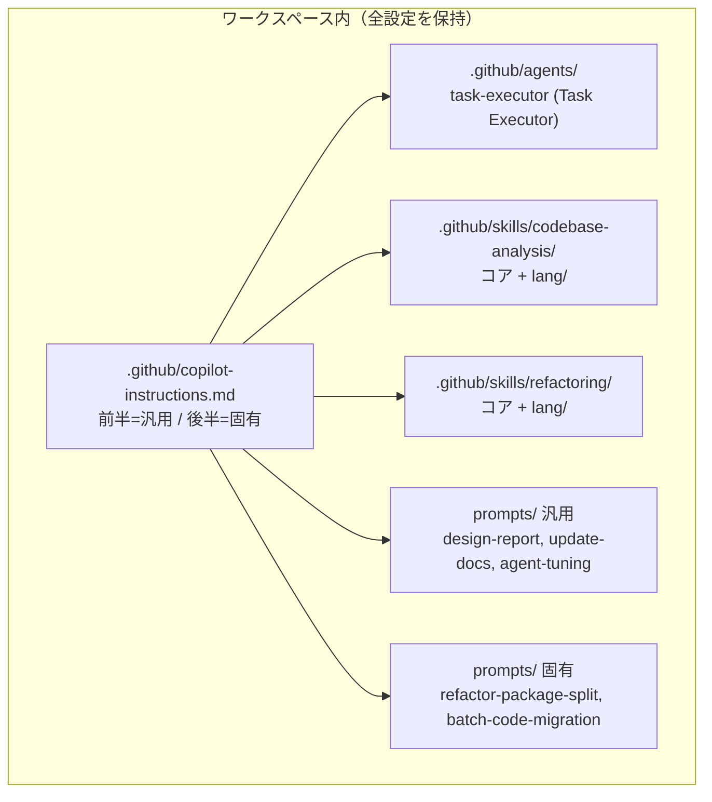
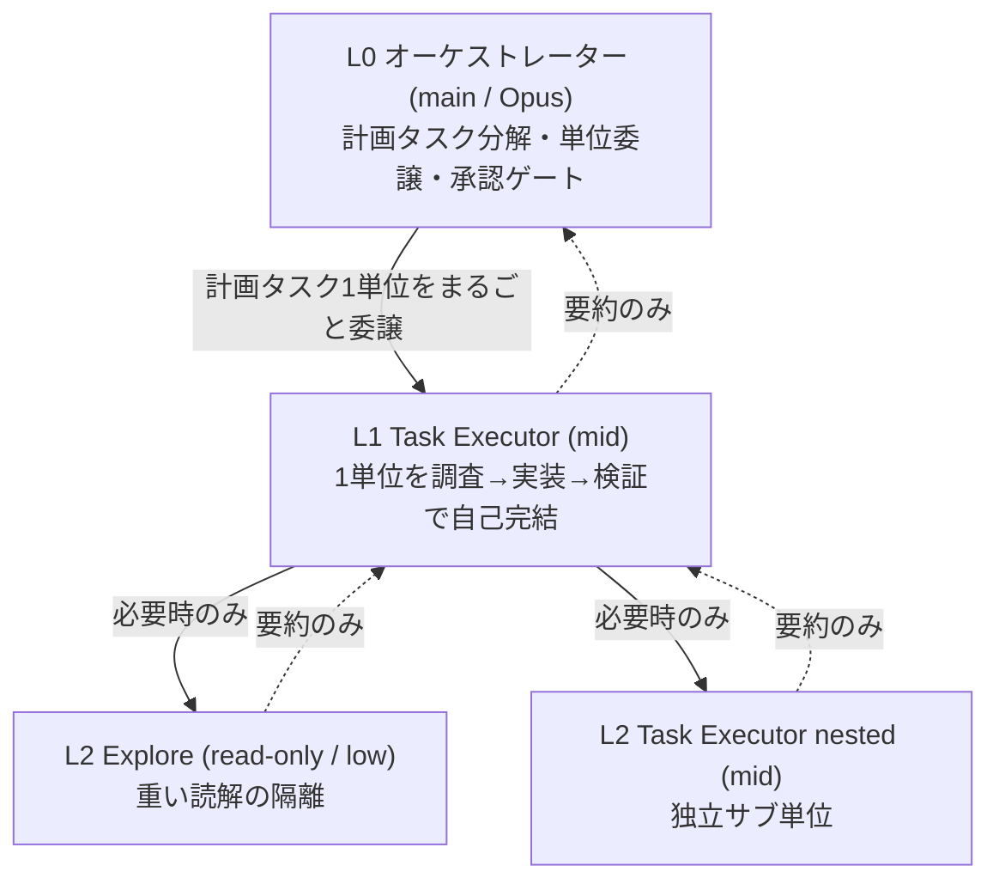

# Agent 設定 設計方針

> 本ファイルは copilot-instructions / skills / prompts の設計思想を記録する。
> 今後のブラッシュアップ時に参照し、一貫性を保つために利用する。

## 1. 設計目的

- Claude / GPT / Gemini 間で応答品質（可読性・トークン効率）を平準化する
- モデル選択を純粋に性能基準で行える状態にする
- Go / C / C++ / Rust の複数言語で再利用できる
- ワークスペース間で移植可能（ポータビリティ優先）

## 2. レイヤー構造



### オーケストレーション3層階層



## 3. 混在戦略

| 方式 | 適用条件 | 例 |
|------|---------|---|
| 並列配置 | ファイルを論理分割できる | SKILL を言語別フラグメントに分ける |
| 前半/後半 | 同一ファイルに収める必要がある | copilot-instructions.md |

### copilot-instructions.md の前半/後半規約

- 前半: 汎用ルール（プロジェクト非依存・移植可能）
- 後半: ワークスペース固有ルール（このプロジェクト専用）
- 境界はコメント `<!-- ===== ... ===== -->` で明示
- **移植時は前半セクションのみコピーする**

## 4. 言語分割方式（Skill）

### 共通コア + 言語フラグメント

- `SKILL.md` = 言語非依存の手順・判定ロジック
- `lang/{id}.md` = 言語固有のコマンド表のみ

### 言語判定テーブル

| 検出ファイル | 言語ID | フラグメント |
|------------|--------|------------|
| go.mod | go | lang/go.md |
| Cargo.toml | rust | lang/rust.md |
| CMakeLists.txt / *.cpp / *.hpp | cpp | lang/cpp.md |
| *.c / *.h（単独） | c | lang/cpp.md（C/C++共用） |

- 判定後、該当フラグメント1つのみ read_file する
- 複数該当時はユーザーに確認

### 責務分離

| 要素 | 内容 |
|------|------|
| コア | 手順・Phase・判断基準・アンチパターン |
| フラグメント | ビルド/フォーマット/依存解析コマンド表のみ |

## 5. モデル選択方針（Agent Auto）

**運用方針: Agent は Auto モードをメインとして使用する。**
Auto モードの場合、タスク種別に応じてモデルを選択する。
モデルは常に各系列の**最新版**を使用する（版名は固定しない）。

| タスク種別 | 複雑度 | 推奨モデル |
|-----------|--------|-----------|
| コード読解・検索 | 低 | GPT 最新 mini / MAI 最新 |
| サブエージェント探索 | 低 | GPT 最新 mini / MAI 最新 |
| 一括置換・機械的修正 | 低 | GPT 最新 mini / MAI 最新 |
| ドキュメント更新 | 中 | Claude 最新 Sonnet |
| ビルドエラー修正 | 中 | Claude 最新 Sonnet |
| 設計レポート生成 | 高 | Claude 最新 Opus |
| アーキテクチャ設計 | 高 | Claude 最新 Opus |

- モデルは常に各系列の最新版を使用する（版名は固定しない）
- 軽量タスクは GPT 最新 mini または MAI 最新に集約しコスト削減
- 優先順位: 品質 > トークンコスト
- オーケストレーション運用では、上表の tier 選択は **subagent 層**が担う。オーケストレーター（main）は Opus 固定とし、委譲時に推奨 tier を明示する（詳細は instructions の Orchestration Strategy）

## 6. 設計判断の根拠記録

| 判断 | 理由 | 日付 |
|------|------|------|
| `~/.config` 不使用 | ポータビリティ優先、WS 内に全設定保持 | 2026-06-06 |
| 言語フラグメント分割 | 無関係言語分のトークン削減（-45%以上）＋焦点化で品質向上 | 2026-06-06 |
| 軽量モデル=GPT mini / MAI | 最新 mini および MAI が低コスト・高速で read-only に最適 | 2026-06-06 |
| prompt は言語非依存維持 | 全文ロードされるため、言語固有部は SKILL に委譲 | 2026-06-06 |
| Opus → Sonnet （高複雑タスク） | Opus は GitHub Copilot 標準プラン対象外のため Sonnet に変更 | 2026-06-06 |
| Sonnet → Opus （高複雑タスク） | プラン変更により Opus が利用可能になったため高複雑タスクで再採用 | 2026-06-19 |
| Auto モードをメインに | Sonnet 4.6固定運用から Auto 標準に移行。今後のモデル進化に対応 | 2026-06-06 |
| clang-format CLI 不使用 | C/C++ 拡張の保存時自動フォーマットに一元化。CLI 並用は二重化と差分発生のリスク | 2026-06-06 |
| doc/ 古資料対策=update-docs 定期実行 | コード変更ごとに手動更新するよりも定期実行プロンプトで一括保全する方がトークン効率が高い | 2026-06-06 |
| カスタマイズを `.github/` 公式配置へ移設 | `.vscode/` は gitignore 対象で未共有・非標準。prompts/skills/instructions を GitHub Copilot 公式の既定配置 `.github/` に集約し、設定不要で版管理・チーム共有を両立 | 2026-06-22 |
| prompt frontmatter `mode` → `agent` | `mode` は旧式フィールド。現行仕様の `agent` に統一し公式仕様へ整合 | 2026-06-22 |
| SKILL.md に `name`/`description` 付与 | Agent Skills 仕様で必須。`name` は親ディレクトリ名と一致（小文字・ハイフン） | 2026-06-22 |
| ビルドプリセット名を小文字 `-debug` に修正 | `CMakePresets.json` の実名は小文字。`-Debug` 表記は実行失敗の原因 | 2026-06-22 |
| vcvars 検出に vswhere `-products *` 採用 | ハードコードの Community パスは BuildTools 版で不一致。vswhere 自動検出で環境非依存化 | 2026-06-22 |
| オーケストレーション運用を導入 | main(Opus) は委譲・統合・承認に専念し、実作業は subagent へ委譲。subagent が難易度別にモデルを選択し、中間情報を遮断することでコンテキスト肥大とトークンコストを抑制 | 2026-06-24 |
| 粗粒度・3層階層委譲へ移行 | 細かい単発 subagent 呼び出しは往復・要約オーバーヘッドが大きい（コスト分析で確認）。L0 は Phase/計画タスクを1単位として custom agent `Task Executor` にまるごと委譲し、executor が単位内の細粒度作業と L2（Explore / nested executor）起動を自律管理。委譲回数を削減し文脈分離を維持 | 2026-06-26 |

## 7. ブラッシュアップ手順

設定を調整する場合は `agent-tuning` プロンプトを使用する:

```
@workspace /agent-tuning
```

調整後は本ファイルの「設計判断の根拠記録」に追記すること。

## 8. 既知の未検証項目

| 項目 | 状態 | 対応予定 |
|------|------|---------|
| C/C++ プロジェクトでの動作 | 未検証 | 初回 C++ 案件で実地調整 |
| Rust プロジェクトでの動作 | 未検証 | 初回 Rust 案件で実地調整 |
| 別リポジトリへの移植 | 未検証 | 前半セクションコピー手順の確立 |
