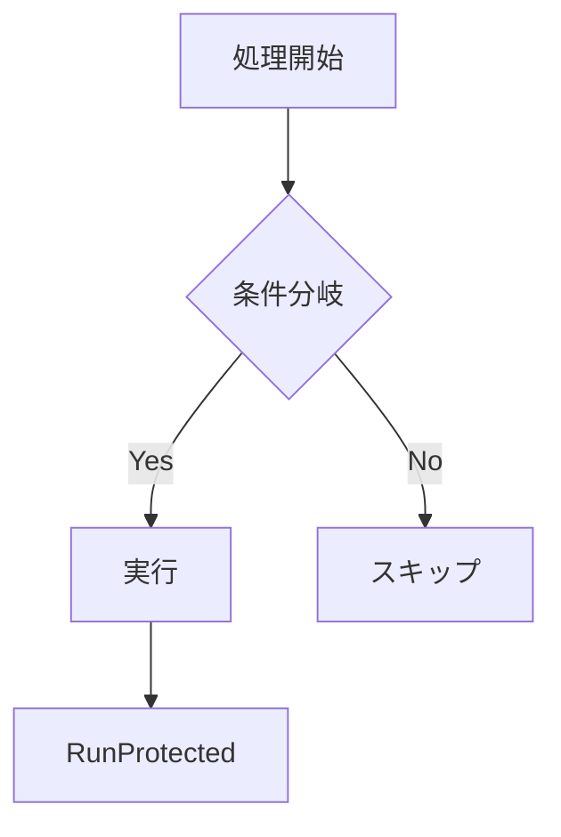

# 設計レポート生成

## フォーマット規約

以下のルールに**厳密に**従うこと。これにより Claude / GPT / Gemini 間で出力品質を平準化する。

## 必須構造

レポートは以下の節を**この順序で**含むこと。不要な節は省略可だが順序は変えない。

```markdown
## {タイトル}

### 1. 概要

{1-3文。目的・背景・スコープを簡潔に。}

### 2. 現状分析

{以下の要素を組み合わせて使用:}
- **表**: 構成要素の列挙、比較
- **Mermaid 図**: 関係性の可視化（1つ以上必須）
- **箇条書き**: 問題点や特徴の列挙（3項目以内なら箇条書き、4項目以上なら表）

### 3. 設計案 / 提案

{以下の要素を含む:}
- **Before/After 対比表** （API変更がある場合は必須）
- **判断根拠**: 箇条書き3-5項目
- **Mermaid 図**: 新しい構造（変更がある場合は必須）

### 4. 実装計画

{番号付きステップで記述:}
1. {アクション}（依存: {なし or Step N}）
2. ...

{ステップ間の依存関係が複雑な場合は Mermaid flowchart を追加}

### 5. リスク・注意点

| 項目 | リスク | 対策 |
|------|--------|------|
| ... | ... | ... |
```

## Mermaid 図のルール

### 使い分け

| 表現したいもの | 図の種類 | 例 |
|--------------|---------|---|
| パッケージ関係・処理フロー | `flowchart TD` or `LR` | アーキテクチャ図 |
| API呼出・ロック取得の時系列 | `sequenceDiagram` | 撮影シーケンス |
| 状態の遷移 | `stateDiagram-v2` | 接続状態 |
| データフロー | `graph LR` | パイプライン |

### フォーマット



### 禁止事項

- 10ノード超の巨大図（分割する）
- ラベルなしのエッジ（必ず意味を付ける）
- 同一レポート内で同じ情報を図と文章で重複説明

## 表のルール

### 構造

| ルール | 詳細 |
|--------|------|
| 列ヘッダー | 5文字以内推奨、簡潔に |
| コード片 | 必ずバッククォートで囲む |
| 行数 | 10行超えたら分割を検討 |
| 空セル | `-` で埋める（空白禁止） |

### 使い分け

- **2項目の対比** → Before/After 表
- **3項目以上の列挙** → 表（箇条書きより表を優先）
- **Yes/No の判定** → 表
- **順序ある手順** → 番号付きリスト（表ではない）

## コードブロックのルール

- 言語指定は必須: ` ```go `, ` ```mermaid `, ` ```powershell `
- 説明対象のコードのみ表示（前後の無関係なコードは省略）
- 変更点を示す場合:

```markdown
**Before:**
​```go
err := cam.ShootImage(true)
​```

**After:**
​```go
err := capture.ShootImage(cam, true)
​```
```

## 文体ルール

| ルール | 詳細 |
|--------|------|
| 語尾 | 「〜する」「〜である」（ですます調は不使用） |
| 主語 | 省略可。技術文書として簡潔に |
| 一文の長さ | 40文字以内を目標 |
| パラグラフ | 3文以内で区切る |
| 強調 | `**太字**` は節タイトルまたはキーワードのみ |
| 箇条書き深さ | 最大2レベルまで |

## アンチパターン

| やってはいけないこと | 理由 | 代替 |
|-------------------|------|------|
| 「以下に説明します」等の前置き | 冗長 | 即座に本題に入る |
| 同じ情報を文章と表で重複 | トークン浪費 | どちらか一方 |
| 5行超の箇条書き | 読みにくい | 表に変換 |
| 曖昧な表現（「など」「いくつか」） | 不正確 | 具体的に列挙 |
| 結論を最後に書く | 読み手の負担 | 概要で先に結論を述べる |
| 図の後に図の内容を文章で繰り返す | 冗長 | 図で十分なら文章不要 |
