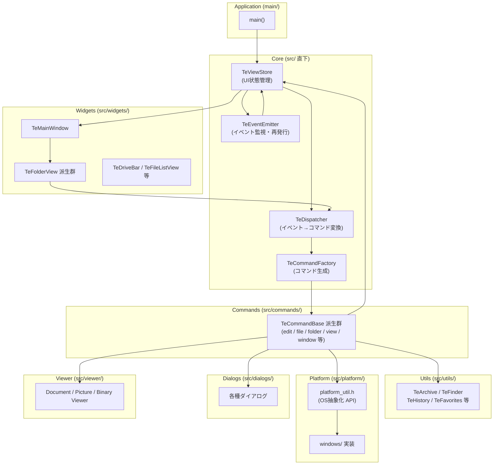

# Architecture

## Design Principles

TableEngine は以下の設計方針に基づいています。

- **イベント駆動 + コマンドパターン**: UI からのユーザー操作はすべてコマンドオブジェクトに変換されて実行されます。ウィジェットはコマンドの実行内容を知りません。
- **プラットフォーム抽象化**: OS 依存の処理（ファイル操作 / サムネイル取得 / ネイティブ右クリックメニュー等）は `platform/` 配下に隔離し、上位レイヤーは OS を意識しません。
- **疎結合な状態管理**: `TeViewStore` が UI 全体の状態（現在のフォルダビュー・表示設定・タブ構成）を一元管理します。各 Widget は `TeViewStore` 経由で状態を取得・変更します。
- **非同期コマンドのサポート**: 時間のかかる処理（ファイルコピー・アーカイブ展開・検索等）は非同期コマンドとして設計されており、UI をブロックしません。

---

## Component Overview



---

## Layer Structure

TableEngine のレイヤーを上から下に示します。

```
┌─────────────────────────────────────────────────────┐
│  UI Layer (Widgets / Dialogs)                       │
│  TeMainWindow / TeFolderView派生 / TeDriveBar 等    │
├─────────────────────────────────────────────────────┤
│  Application Core (src/ 直下)                       │
│  TeViewStore / TeDispatcher / TeEventEmitter        │
├─────────────────────────────────────────────────────┤
│  Command Layer (Commands)                           │
│  TeCommandBase 派生群 / TeCommandFactory            │
├─────────────────────────────────────────────────────┤
│  Service Layer (Utils / Viewer)                     │
│  TeArchive / TeFinder / TeDocument 等              │
├─────────────────────────────────────────────────────┤
│  Platform Abstraction Layer (Platform)              │
│  platform_util.h → windows/ 実装                   │
└─────────────────────────────────────────────────────┘
```

---

## Key Interactions

### ユーザー操作からコマンド実行までのフロー

1. ユーザーがキーボード / マウス操作を行う
2. 各 Widget の `TeEventFilter` がイベントをキャプチャし、`TeDispatchable::dispatch()` を呼ぶ
3. `TeDispatcher::dispatch()` がキーマップを参照して `CmdId` を決定し、`requestCommand` シグナルを発行
4. `TeDispatcher::execCommand()` が `TeCommandFactory` でコマンドオブジェクトを生成し、`run()` を呼ぶ
5. コマンドは `TeViewStore` を通じて UI 状態を参照・変更し、必要に応じて `Platform API` や `Utils` を利用する
6. 非同期コマンドは完了時に `finished()` を呼び、`TeDispatcher` がコマンドオブジェクトを解放する

詳細は [06_dispatcher_command.md](06_dispatcher_command.md) を参照してください。

---

## Module Responsibilities

| モジュール | 責務 |
|---|---|
| [ViewStore](05_viewstore.md) | UI 全体の構成・状態の一元管理 |
| [Dispatcher / Command](06_dispatcher_command.md) | 入力イベントとビジネスロジックの分離 |
| [EventEmitter](07_event_emitter.md) | ウィジェット間のフォーカス・クローズイベントの監視 |
| [Widgets](08_widgets.md) | UI ウィジェットの表示とユーザーインタラクションの受付 |
| [Commands](09_commands.md) | ファイル操作・ナビゲーション等のビジネスロジック実装 |
| [Utils](10_utils.md) | アーカイブ / 検索 / 履歴 / お気に入り等のデータ操作 |
| [Platform](11_platform.md) | OS 固有処理の抽象化（ファイル操作 / サムネイル / ネイティブイベント） |
| [Dialogs](12_dialogs.md) | ユーザー入力を収集するモーダルダイアログ群 |
| [Viewer](13_viewer.md) | テキスト / 画像 / バイナリの内蔵ビューワ |
