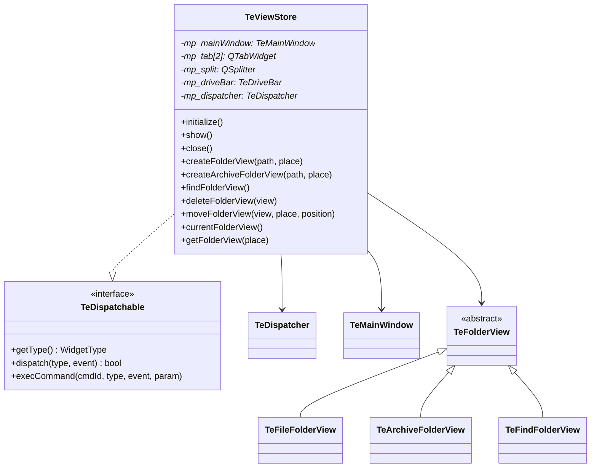

# ViewStore

## Overview

`TeViewStore` は TableEngine の **UI 構成管理の中核クラス** です。  
メインウィンドウ・タブ・フォルダビュー・各種バーの生成と保持、表示状態の一元管理を担います。  
また `TeDispatchable` インタフェースを実装し、コマンドからの UI 操作要求を受け付ける窓口にもなります。

`TeViewStore` は `main()` から生成されるアプリケーションのルートオブジェクトであり、  
その初期化・表示・終了も `TeViewStore` が制御します。

---

## Visual Layout

`TeViewStore` が構築する UI のレイアウト構成は以下のとおりです。

```
┌─────────────────────────────────────────────────────────┐
│  TeMainWindow (QMainWindow)                             │
│  ┌──────────────────────────────────────────────────┐  │
│  │  MenuBar                                         │  │
│  ├──────────────────────────────────────────────────┤  │
│  │  ToolBar                                         │  │
│  ├──────────────────────────────────────────────────┤  │
│  │  TeDriveBar (ドライブ・クイックアクセスボタン群)  │  │
│  ├────────────────────┬─────────────────────────────┤  │
│  │  QTabWidget (LEFT) │  QTabWidget (RIGHT)          │  │
│  │  ┌──────────────┐  │  ┌──────────────┐           │  │
│  │  │ TeFolderView │  │  │ TeFolderView │           │  │
│  │  │  (派生クラス) │  │  │  (派生クラス) │           │  │
│  │  └──────────────┘  │  └──────────────┘           │  │
│  ├────────────────────┴─────────────────────────────┤  │
│  │  StatusBar                                       │  │
│  └──────────────────────────────────────────────────┘  │
└─────────────────────────────────────────────────────────┘
```

- 左右の `QTabWidget` は `QSplitter` で分割されており、サイズを任意に変更できます。
- 右ペインは非表示にすることも可能です（シングルペインモード）。
- `TeFolderView` の派生クラス（`TeFileFolderView` / `TeArchiveFolderView` / `TeFindFolderView`）が各タブのコンテンツになります。

---

## Class Relationships



---

## State Properties

`TeViewStore` は Qt の `Q_PROPERTY` を用いて表示状態を保持します。  
コマンドはこれらのプロパティを変更することで、UI 全体の表示状態を統一的に制御します。

### 表示フラグ

| プロパティ | 型 | デフォルト | 説明 |
|---|---|---|---|
| `driveBarVisible` | `bool` | `true` | ドライブバーの表示・非表示 |
| `statusBarVisible` | `bool` | `true` | ステータスバーの表示・非表示 |
| `toolBarVisible` | `bool` | `true` | ツールバーの表示・非表示 |
| `navigationVisible` | `bool` | `true` | ツリービュー（ナビゲーション）の表示・非表示 |
| `detailVisible` | `bool` | `true` | 詳細情報パネルの表示・非表示 |

### ファイルリスト表示設定

| プロパティ | 型 | デフォルト | 説明 |
|---|---|---|---|
| `selectionMode` | `TeTypes::SelectionMode` | `SELECTION_NONE` | 選択スタイル（Explorer 互換 / TableEngine 独自） |
| `fileInfoFlags` | `TeTypes::FileInfoFlags` | `SIZE \| MODIFIED` | ファイルリストに表示する情報列（サイズ / 更新日時） |
| `fileTypeFlags` | `TeTypes::FileTypeFlags` | `FILETYPE_NONE` | 表示するファイル種別（隠しファイル / システムファイルの表示設定） |
| `fileOrderBy` | `TeTypes::OrderType` | `ORDER_NAME` | ソート基準（名前 / サイズ / 拡張子 / 更新日時） |
| `fileOrderReversed` | `bool` | `false` | ソート順の反転 |
| `viewMode` | `TeTypes::FileViewMode` | `FILEVIEW_SMALL_ICON` | 表示モード（小アイコン / 大アイコン / 特大アイコン / 詳細リスト） |

---

## FolderView Management

`TeViewStore` は `TeFolderView` の生成・削除・タブへの配置を管理します。

| メソッド | 説明 |
|---|---|
| `createFolderView(path, place)` | 指定パスの `TeFileFolderView` を生成し、指定タブに追加する |
| `createArchiveFolderView(path, place)` | アーカイブ用の `TeArchiveFolderView` を生成し、指定タブに追加する |
| `findFolderView()` | `TeFindFolderView` を返す（初回呼び出し時に生成。シングルトン的な扱い） |
| `deleteFolderView(view)` | 指定の `TeFolderView` をタブから除去し削除する |
| `moveFolderView(view, place, pos)` | 指定の `TeFolderView` を別のタブまたは別の位置に移動する |

`place` 引数は `TAB_LEFT`（左ペイン）または `TAB_RIGHT`（右ペイン）を指定します。  
`-1` を渡すと現在アクティブなペインが選択されます。

---

## Settings and Persistence

`TeViewStore` は起動時に `loadSetting()` / `loadKeySetting()` / `loadStatus()` を呼び出し、  
`QSettings`（`TeSettings.h` で定義されたキー文字列を使用）からウィンドウ状態・ファイル表示設定・キー割り当て等を復元します。

### TeSettings

`TeSettings.h` は `QSettings` で使用するキー文字列を定数として定義します。  
実装ではなく **定数定義専用** のヘッダファイルです。

主なキー定数：

| 定数 | キー文字列 | 用途 |
|---|---|---|
| `SETTING_STARTUP` | `"startup"` | 起動設定グループ |
| `SETTING_STARTUP_MultiInstance` | `"startup/multi_instance"` | 多重起動の許可 |
| `SETTING_STARTUP_InitialFolderMode` | `"startup/initial_folder_mode"` | 初期フォルダ設定 |
| `SETTING_KEY` | `"command_key"` | キー割り当て設定 |
| `SETTING_MENU` | `"menu"` | メニュー設定 |
| `SETTING_FAVORITES` | `"Favorites"` | お気に入りフォルダ |

---

## TeTypes

`TeTypes` は TableEngine 全体で共有される型定義を `Q_GADGET` として集約したクラスです。  
実際のデータや処理ロジックは持たず、**型定義専用クラス** です。

主な型：

| 型 | 説明 |
|---|---|
| `WidgetType` | ウィジェット種別の識別子。`TeDispatcher` がイベント発生元を識別するために使用 |
| `CmdId` | コマンドの識別子。メニューカテゴリ（`0x1000` 刻み）とコマンド番号で構成 |
| `SelectionMode` | 選択スタイル（`SELECTION_NONE` / `SELECTION_EXPLORER` / `SELECTION_TABLE_ENGINE`） |
| `FileViewMode` | ファイルリストの表示モード（小/大/特大アイコン・詳細リスト） |
| `FileInfo` | ファイルリストの表示列フラグ（サイズ / 更新日時） |
| `FileType` | 表示対象ファイル種別フラグ（隠しファイル / システムファイル） |
| `OrderType` | ソート基準（名前 / サイズ / 拡張子 / 更新日時） |
