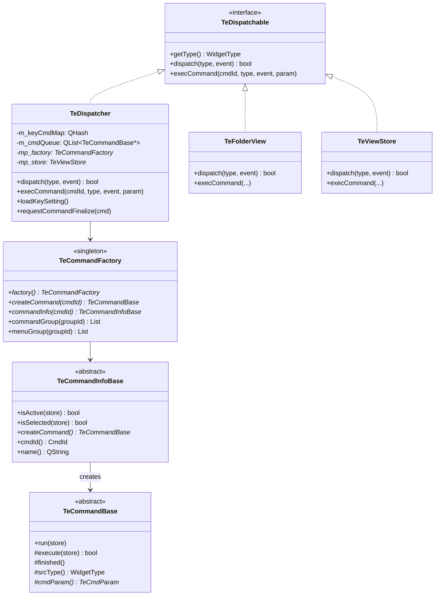
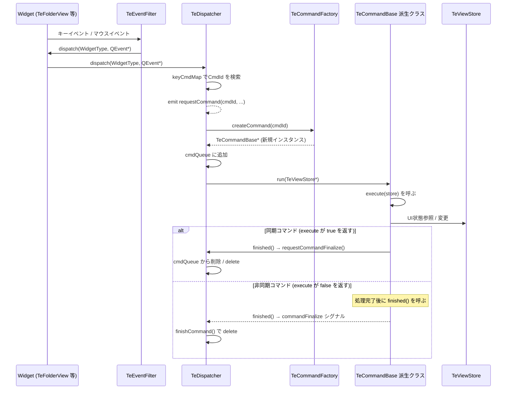

# Dispatcher / Command Pattern

## Overview

TableEngine は **Command パターン** と **ディスパッチャ** を組み合わせて、ユーザー操作とビジネスロジックを分離しています。  
ウィジェットはユーザーの入力を受け取りますが、何をするかは知りません。  
すべての操作は `CmdId` で識別されるコマンドオブジェクトに委譲されます。

---

## Class Relationships

---

## Event Dispatch Flow

ユーザー操作からコマンド実行・終了までの流れを示します。

---

## TeDispatchable Interface

`TeDispatchable` は `TeDispatcher` / `TeFolderView` / `TeViewStore` が実装するインタフェースです。

| メソッド | 説明 |
|---|---|
| `getType()` | このオブジェクトの `WidgetType` を返す |
| `dispatch(type, event)` | イベントを受け取り、必要に応じてコマンドに変換する。`true` を返すとイベントを消費済みとする |
| `execCommand(cmdId, type, event, param)` | コマンド ID を受け取って実行する |

---

## TeDispatcher

`TeDispatcher` はキーイベントを `CmdId` に変換し、コマンドオブジェクトを生成・実行します。

### キーマップ

`loadKeySetting()` が `QSettings` からキー割り当てを読み込み、  
`m_keyCmdMap`（`QPair<modifier, key>` → `CmdId` のマップ）を構築します。  
現状は **キーボードイベントのみ** が `CmdId` にマップされます。

### コマンドキュー

コマンドは `m_cmdQueue` に積まれ、**先頭のコマンドのみが実行**されます。  
非同期コマンドが完了するまで、次のコマンドは実行待ちになります。  
これにより、重複操作やレース条件を防止します。

---

## TeCommandFactory

`TeCommandFactory` はシングルトンです。  
アプリケーション起動時にすべてのコマンドを `TeCommandInfoBase` として登録し、  
`CmdId` を渡すと対応するコマンドオブジェクトを生成して返します。

---

## TeCommandBase

すべてのコマンドの基底クラスです。  
サブクラスは `execute(TeViewStore*)` を実装するだけで機能します。

| メソッド | アクセス | 説明 |
|---|---|---|
| `run(store)` | public | `TeDispatcher` から呼ばれる。内部で `execute()` を呼ぶ |
| `execute(store)` | protected (純粋仮想) | コマンドの処理本体。**同期なら `true`、非同期なら `false` を返す** |
| `finished()` | protected | 非同期コマンドが処理完了時に呼ぶ。`TeDispatcher` にキュー削除を要求する |
| `srcType()` | protected | コマンドを起動した `WidgetType` を返す |
| `cmdParam()` | protected | コマンドパラメータ（`TeCmdParam`）を返す |

### 同期コマンドと非同期コマンド

| 種別 | `execute()` の戻り値 | 説明 |
|---|---|---|
| 同期コマンド | `true` | 実行後すぐに完了。`run()` から `finished()` が自動呼び出しされる |
| 非同期コマンド | `false` | 別スレッドや非同期処理を開始し、完了時に自分で `finished()` を呼ぶ |

---

## TeCmdParam

コマンドに追加情報を渡すための型です。`QMap<QString, QVariant>` の typedef です。  
各コマンドクラスが独自のキー定数（例: `TeCmdFolderChangeRoot::PARAM_ROOT_PATH`）を定義して使用します。
