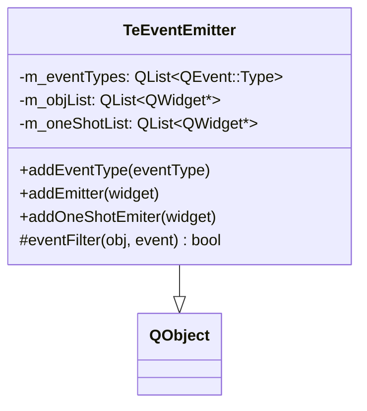

# EventEmitter

## Overview

`TeEventEmitter` は、特定の `QEvent::Type` を監視し、対象ウィジェットでそのイベントが発生したときに  
`emitEvent(QWidget*, QEvent*)` シグナルとして再発行するイベントフィルタクラスです。

主に `TeViewStore` が内部で使用しており、**フォルダビューのフォーカス変化** や **フローティングウィジェットのクローズ** を検知するために利用されます。

---

## Class: TeEventEmitter

---

## Registration Modes

`TeEventEmitter` にウィジェットを登録する方法は 2 種類あります。

| メソッド | 動作 |
|---|---|
| `addEmitter(widget)` | 継続監視。イベントが発生するたびに `emitEvent` シグナルを発行し続ける |
| `addOneShotEmiter(widget)` | 一回限り監視。最初にイベントが発生したら `emitEvent` を発行し、**自動的にフィルタを解除する** |

いずれのメソッドも、同じウィジェットの二重登録は防止されます。  
登録後に `widget->installEventFilter(this)` が呼ばれます。

---

## Event Filtering Logic

`eventFilter()` の動作：

1. 発生したイベントの型が `m_eventTypes` に含まれるか確認する
2. 含まれる場合、`m_oneShotList` にあれば除去してフィルタ解除し、`emitEvent` を発行する
3. `m_objList` にあれば `emitEvent` を発行する（登録継続）
4. 常に `false` を返す（イベントをブロックしない）

> イベントを消費（ブロック）しない点が重要です。`TeEventEmitter` はあくまで「通知」専用であり、  
> ウィジェット本来のイベント処理を阻害しません。

---

## Usage in TeViewStore

`TeViewStore` は 2 つの `TeEventEmitter` インスタンスを保持します。

| インスタンス | 用途 |
|---|---|
| `mp_focusEventEmitter` | `QEvent::FocusIn` を監視。フォルダビューにフォーカスが移ったとき、`TeViewStore::focusFolderViewChanged()` スロットで現在アクティブなビューを更新する |
| `mp_closeEventEmitter` | `QEvent::Close` を監視（one-shot 登録）。フローティングウィジェットがクローズされたとき、`TeViewStore::floatingWidgetClosed()` スロットで管理リストから除去する |

---

## Related Class: TeEventFilter

`TeEventFilter`（`src/widgets/` に配置）は `TeEventEmitter` とは別クラスです。  
`TeFileFolderView` 等のウィジェット内部で使用され、ウィジェット内の特定の子ウィジェット（ツリービュー / リストビュー）で発生したイベントを `TeDispatcher::dispatch()` に転送する役割を持ちます。

| クラス | 配置 | 役割 |
|---|---|---|
| `TeEventEmitter` | `src/` 直下 | ウィジェットのイベントを `TeViewStore` へ通知する（フォーカス・クローズ監視） |
| `TeEventFilter` | `src/widgets/` | ウィジェット内部のイベントを `TeDispatcher` へ転送する（キー/マウス操作のディスパッチ） |
