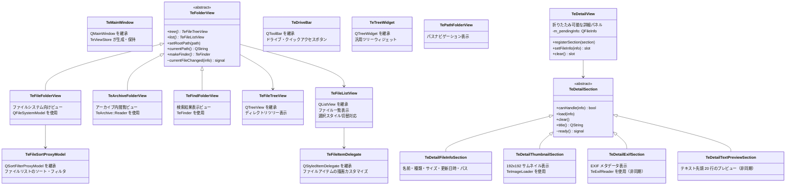

# Widgets

## Overview

`src/widgets/` は TableEngine の UI ウィジェット群です。  
ユーザーに表示される視覚要素と、ユーザーインタラクションの受付を担います。  
ビジネスロジックは持たず、操作をイベントとして `TeDispatcher` に委譲します。

---

## Widget Hierarchy



---

## Widget Descriptions

### TeMainWindow

`QMainWindow` の薄いサブクラスです。  
現時点では特別なロジックは持たず、メインウィンドウの外枠として機能します。  
メニューバー・ツールバー・ステータスバー・中央ウィジェット（スプリッタ）の構築は `TeViewStore::initialize()` が担います。

### TeFolderView (abstract)

フォルダの内容を表示するビューの抽象基底クラスです。  
左ペイン（ツリービュー）と右ペイン（リストビュー）を `tree()` / `list()` で提供し、  
ナビゲーション（`setRootPath` / `setCurrentPath` / `moveNextPath` / `movePrevPath`）の統一インタフェースを定義します。

詳細は [widgets/TeFolderView.md](widgets/TeFolderView.md) を参照してください。

### TeFileFolderView

通常のファイルシステムを表示するフォルダビューです。  
Qt の `QFileSystemModel` を内部に保持し、`TeFileSortProxyModel` 経由でソート・フィルタリングを行います。  
移動履歴は `TeHistory` で管理します。

詳細は [widgets/TeFileFolderView.md](widgets/TeFileFolderView.md) を参照してください。

### TeArchiveFolderView

アーカイブ（ZIP / 7zip / tar 等）の内部を、ファイルシステムと同様に閲覧するビューです。  
`TeArchive::Reader` でアーカイブを読み込み、エントリ情報を `QStandardItemModel` に展開して表示します。

詳細は [widgets/TeArchiveFolderView.md](widgets/TeArchiveFolderView.md) を参照してください。

### TeFindFolderView

ファイル検索の結果を表示する専用ビューです。  
複数の検索エントリ（`TeFinder` インスタンス）を管理し、非同期で到着する検索結果をリアルタイムにリストへ追加します。

詳細は [widgets/TeFindFolderView.md](widgets/TeFindFolderView.md) を参照してください。

### TeFileTreeView

`QTreeView` を継承したツリービューです。  
`setVisualRootIndex()` で表示上のルートを変更できます（モデルのルートとは独立して表示ルートを設定可能）。  
各インスタンスは親の `TeFolderView` への参照を保持します。

### TeFileListView

`QListView` を継承したリストビューです。  
`SelectionMode` に応じて選択スタイルを切り替えます（Explorer 互換 / TableEngine 独自のラバーバンド選択）。  
また `TeTypes::FileViewMode` に応じて表示モード（アイコン / 詳細リスト）を切り替えます。

詳細は [widgets/TeFileListView.md](widgets/TeFileListView.md) を参照してください。

### TeDriveBar

`QToolBar` を継承したドライブバーです。  
利用可能なドライブのボタンと、ユーザーが登録したクイックアクセスパスのボタンを表示します。  
ドライブを選択すると `driveSelected(path)` シグナルを発行し、`TeViewStore` が `CMDID_SYSTEM_FOLDER_CHANGE_ROOT` コマンドを発行します。  
クイックアクセスの追加・削除・永続化（`QSettings`）機能も持ちます。

### TeFileSortProxyModel

`QSortFilterProxyModel` を継承したプロキシモデルです。  
`TeFileFolderView` がファイルリストのソート基準（名前 / サイズ / 拡張子 / 更新日時）と  
フィルタ条件（隠しファイル / システムファイルの表示）を適用するために使用します。

### TeFileItemDelegate

ファイルアイテムの描画カスタマイズを担います。  
`QStyledItemDelegate` を継承し、ファイルリストのアイテム描画をカスタマイズします。

---

## DetailView Subsystem

`TeDetailView` は選択中ファイルのメタ情報を段階的に表示する右側パネルです。  
折りたたみ可能な「セクション」単位で情報を構成し、`TeDetailSection` の派生クラスを登録することで  
表示内容を拡張できます。

非表示状態では `setFileInfo()` が呼ばれてもI/Oは発生しません。  
表示状態に戻った際に `showEvent()` で保留情報を読み込みます。

### TeDetailView

`TeDetailSection` のコンテナウィジェットです。  
スクロール領域内に各セクションを縦方向に積み重ね、ヘッダーボタンで折りたたみ・展開を切り替えます。

| メソッド / スロット | 説明 |
|---|---|
| `registerSection(section)` | セクションを末尾に追加（所有権を取得） |
| `setFileInfo(info)` slot | ファイル情報を更新。非表示中はキャッシュのみ |
| `clear()` slot | 全セクションをクリア・非表示化 |

`TeViewStore::initialize()` が以下の順で 4 セクションを登録します：
1. `TeDetailThumbnailSection`
2. `TeDetailFileInfoSection`
3. `TeDetailExifSection`
4. `TeDetailTextPreviewSection`

### TeDetailSection (abstract)

詳細パネルの 1 ブロックを表す抽象基底クラスです。

| 仮想メソッド | 説明 |
|---|---|
| `canHandle(info)` | このファイルに対してコンテンツを提供できるか |
| `load(info)` | 情報を読み込む（非同期実装可） |
| `clear()` | 表示内容をクリアする |
| `title()` | ヘッダーに表示するセクション名 |
| `ready()` signal | 非同期ロード完了時に emit |

### TeDetailFileInfoSection

常に表示されるファイル基本情報セクションです（`canHandle()` は常に `true`）。  
`QFormLayout` で **名前 / 種類 / サイズ / 更新日時 / パス** を表示します。  
ラベル行は太字、値行は通常フォントで視覚的に区別します。

### TeDetailThumbnailSection

画像ファイル専用のサムネイルセクションです（`QImageReader::imageFormat()` で判定）。  
表示サイズは 192×192 px です。

1. `QPixmapCache` にキャッシュ済みであれば即時表示
2. なければ OS アイコンをプレースホルダとして表示しつつ `TeImageLoader` で非同期ロード
3. `imageReady` シグナルを受けてキャッシュから取得・更新

### TeDetailExifSection

画像ファイルの EXIF メタデータを表示するセクションです。  
`TeExifReader` 戦略インタフェース（`setExifReader()` で差し替え可能）を通じて非同期に読み込みます。  
デフォルト実装は `TeQImageExifReader`（`utils/` を参照）。

表示フィールド（存在する場合のみ表示）：
Width / Height / DateTimeOriginal / DateTime / Camera Make / Camera Model /  
Exposure Time / Aperture / ISO / Focal Length / Orientation / Pixel Width / Pixel Height

### TeDetailTextPreviewSection

テキストファイルの先頭 20 行をプレビューするセクションです（`getFileType() == TE_FILE_TEXT` で判定）。  
最大 16 KB を読み込み `detectTextCodec()` でエンコーディングを検出した後、スレッドプールで変換します。  
対応コーデック: UTF-8 / EUC-JP / Shift_JIS / ISO-2022-JP / UTF-16LE / UTF-16BE

### TeFolderView — currentFileChanged シグナル

コミット `c20ae0d` で `TeFolderView` に以下のシグナルが追加されました：

```cpp
void currentFileChanged(const QFileInfo& info);
```

`TeFileFolderView` の内部で `QItemSelectionModel::currentChanged` に接続し、  
リストビューのフォーカス変更時に emit されます。  
`TeViewStore::createFolderView()` が `TeDetailView::setFileInfo()` へ接続することで、  
ファイル選択と詳細パネルが自動的に同期します。
