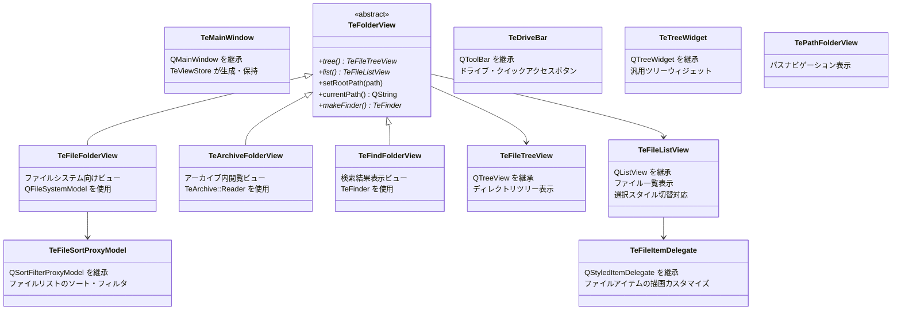

# Widgets

## Overview

`src/widgets/` は TableEngine の UI ウィジェット群です。  
ユーザーに表示される視覚要素と、ユーザーインタラクションの受付を担います。  
ビジネスロジックは持たず、操作をイベントとして `TeDispatcher` に委譲します。

---

## Widget Hierarchy

---

## Widget Descriptions

### TeMainWindow

`QMainWindow` の薄いサブクラスです。  
現時点では特別なロジックは持たず、メインウィンドウの外枠として機能します。  
メニューバー・ツールバー・ステータスバー・中央ウィジェット（スプリッタ）の構築は `TeViewStore::initialize()` が担います。

### TeFolderView (abstract)

フォルダの内容を表示するビューの抽象基底クラスです。  
左ペイン（ツリービュー）と右ペイン（リストビュー）を `tree()` / `list()` で提供し、  
ナビゲーション（`setRootPath` / `setCurrentPath` / `moveNextPath` / `movePrevPath`）の統一インタフェースを定義します。

詳細は [widgets/TeFolderView.md](widgets/TeFolderView.md) を参照してください。

### TeFileFolderView

通常のファイルシステムを表示するフォルダビューです。  
Qt の `QFileSystemModel` を内部に保持し、`TeFileSortProxyModel` 経由でソート・フィルタリングを行います。  
移動履歴は `TeHistory` で管理します。

詳細は [widgets/TeFileFolderView.md](widgets/TeFileFolderView.md) を参照してください。

### TeArchiveFolderView

アーカイブ（ZIP / 7zip / tar 等）の内部を、ファイルシステムと同様に閲覧するビューです。  
`TeArchive::Reader` でアーカイブを読み込み、エントリ情報を `QStandardItemModel` に展開して表示します。

詳細は [widgets/TeArchiveFolderView.md](widgets/TeArchiveFolderView.md) を参照してください。

### TeFindFolderView

ファイル検索の結果を表示する専用ビューです。  
複数の検索エントリ（`TeFinder` インスタンス）を管理し、非同期で到着する検索結果をリアルタイムにリストへ追加します。

詳細は [widgets/TeFindFolderView.md](widgets/TeFindFolderView.md) を参照してください。

### TeFileTreeView

`QTreeView` を継承したツリービューです。  
`setVisualRootIndex()` で表示上のルートを変更できます（モデルのルートとは独立して表示ルートを設定可能）。  
各インスタンスは親の `TeFolderView` への参照を保持します。

### TeFileListView

`QListView` を継承したリストビューです。  
`SelectionMode` に応じて選択スタイルを切り替えます（Explorer 互換 / TableEngine 独自のラバーバンド選択）。  
また `TeTypes::FileViewMode` に応じて表示モード（アイコン / 詳細リスト）を切り替えます。

詳細は [widgets/TeFileListView.md](widgets/TeFileListView.md) を参照してください。

### TeDriveBar

`QToolBar` を継承したドライブバーです。  
利用可能なドライブのボタンと、ユーザーが登録したクイックアクセスパスのボタンを表示します。  
ドライブを選択すると `driveSelected(path)` シグナルを発行し、`TeViewStore` が `CMDID_SYSTEM_FOLDER_CHANGE_ROOT` コマンドを発行します。  
クイックアクセスの追加・削除・永続化（`QSettings`）機能も持ちます。

### TeFileSortProxyModel

`QSortFilterProxyModel` を継承したプロキシモデルです。  
`TeFileFolderView` がファイルリストのソート基準（名前 / サイズ / 拡張子 / 更新日時）と  
フィルタ条件（隠しファイル / システムファイルの表示）を適用するために使用します。

### TeFileItemDelegate

ファイルアイテムの描画カスタマイズを担います。  
`QStyledItemDelegate` を継承し、ファイルリストのアイテム描画をカスタマイズします。
