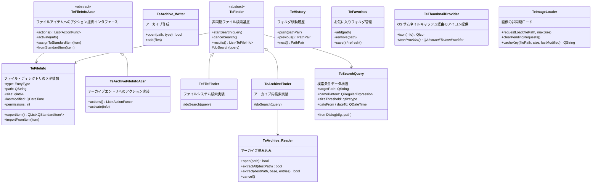

# Utils

## Overview

`src/utils/` はファイル操作・アーカイブ・検索・履歴・お気に入り等のデータ操作クラス群です。  
UI や OS 固有処理には依存せず、ビジネスロジックを純粋に実装します。  
サムネイル・画像の非同期ロード（`TeThumbnailProvider` / `TeImageLoader`）もこのモジュールに含まれます。

---

## Class Overview

---

## Class Descriptions

### TeFileInfo

ファイル / ディレクトリ / アーカイブエントリのメタ情報を統一的に表現する構造体です。  
`QStandardItemModel` との変換機能（`exportItem()` / `importFromItem()`）を持ちます。  
`ItemRole` と `ItemColumn` の定数を定義しており、モデルのデータへのアクセスキーを統一します。

詳細は [utils/TeFinder.md](TeFinder.md) のデータ型として言及されています。

### TeFileInfoAcsr

`QStandardItem` にアクション情報を関連付けるインタフェースクラスです。  
`assignToStandardItem()` で `QStandardItem` の `UserRole` にポインタを埋め込み、  
`fromStandardItem()` でアイテムからアクセサを取り出して `activate()` を呼ぶことで、  
「そのアイテムをダブルクリックしたときに何をするか」を型安全に表現します。

詳細は [utils/TeArchiveFileInfoAcsr.md](TeArchiveFileInfoAcsr.md) を参照してください。

### TeArchive (Reader / Writer)

`TeArchive::Reader` はアーカイブファイルの読み込みと展開を担います。  
`TeArchive::Writer` はファイルのアーカイブ化（圧縮）を担います。  
対応フォーマット: `AR_ZIP` / `AR_7ZIP` / `AR_TAR` / `AR_TAR_GZIP` / `AR_TAR_BZIP2`

詳細は [utils/TeArchive.md](TeArchive.md) を参照してください。

### TeFinder / TeFileFinder / TeArchiveFinder

非同期ファイル検索の基底クラスと実装クラスです。  
`TeFinder` が検索スレッドの管理・結果リストの保持・シグナル発行を担います。  
`TeFileFinder` がファイルシステム検索、`TeArchiveFinder` がアーカイブ内検索を実装します。

詳細は [utils/TeFinder.md](TeFinder.md) を参照してください。

### TeSearchQuery

ファイル検索条件を表す構造体です。  
ファイル名パターン（正規表現）/ サイズ / 更新日時の範囲フィルタを AND 結合で保持します。  
`fromDialog()` で `TeFindDialog` の入力値から変換します。

詳細は [utils/TeSearchQuery.md](TeSearchQuery.md) を参照してください。

### TeHistory

フォルダ移動履歴を管理するクラスです。  
`push()` で現在パスを積み、`previous()` / `next()` で前後に移動します。  
`TeFileFolderView` が各インスタンスを保持します。  
履歴は `(rootPath, currentPath)` のペアで管理されます。

### TeFavorites

お気に入りフォルダのリストを `QSettings` に永続化するクラスです。  
`refresh()` で設定ファイルから読み込み、`save()` で書き戻します。  
最大登録数は `TeSettings::MAX_FAVORITES`（99）です。

### TeThumbnailProvider

`QAbstractFileIconProvider` を継承し、OS のサムネイルキャッシュを利用したサムネイルアイコンを提供するクラスです。  
Platform API（`getThumbnail()`）を経由して OS のサムネイルキャッシュを利用します。  
`iconProvider()` でシングルトンインスタンスを取得できます。

### TeImageLoader

画像ファイルの非同期ロードを管理するクラスです。  
`requestLoad()` でロードリクエストをスレッドプール（`QThreadPool`）に投入し、  
ロード完了時に `imageReady(filePath)` シグナルを発行します。  
ロード済み画像は `QPixmapCache` にキャッシュされます。  
`TeFileSortProxyModel` がサムネイル表示のために使用します。

### TeUtils

コマンドやビューから頻繁に使われるユーティリティ関数群のフリー関数ファイルです。

| 関数 | 説明 |
|---|---|
| `getSelectedItemList(store, paths)` | 現在フォルダビューの選択アイテムのパスリストを返す |
| `getCurrentItem(store)` | 現在フォルダビューのカーソル位置アイテムのパスを返す |
| `getCurrentFolder(store)` | 現在フォルダビューのカレントパスを返す |
| `getFavorites()` / `updateFavorites()` | お気に入りの取得 / 更新 |
| `getFileType(path)` | ファイルの種別（フォルダ / テキスト / 画像 / アーカイブ等）を判定する |
| `detectTextCodec(data, codecList)` | バイト列からテキストエンコーディングを検出する |
