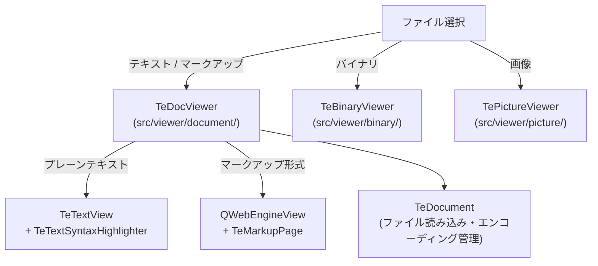

# Viewer

## Overview

`src/viewer/` はファイルの内容を表示する内蔵ビューワモジュールです。  
テキスト・マークアップ・画像・バイナリの 3 種類のビューワを提供します。  
各ビューワは独立した `QMainWindow` サブクラスとして実装されており、フローティングウィンドウとして表示されます。

対応するコマンド: `TeCmdToolFile`（テキスト・マークアップ）/ `TeCmdToolBinary`（バイナリ）/ 画像は自動判定で `TePictureViewer` が起動

---

## Viewer Types

---

## Document Viewer (TeDocViewer)

テキストファイルとマークアップファイル（HTML / Markdown 等）のビューワです。

### Components

| クラス | 役割 |
|---|---|
| `TeDocViewer` | ビューワのメインウィンドウ。テキストモードとマークアップモードを切り替える |
| `TeDocument` | ファイルの読み込みとエンコーディング管理を担うデータモデル |
| `TeTextView` | `QPlainTextEdit` を継承したテキスト表示ウィジェット。行番号表示・タブ幅設定付き |
| `TeMarkupPage` | `QWebEnginePage` を継承。WebEngine でマークアップをレンダリングする |
| `TeTextSyntaxHighlighter` | シンタックスハイライターの実装（`QSyntaxHighlighter` 継承） |
| `TeTextSyntaxLoader` | JSON 形式のシンタックス定義ファイルを読み込む |
| `TeMarkupLoader` | ファイル拡張子とマークアップコンテナ（HTML テンプレート等）の対応を管理する |

### Viewer Mode Selection

`TeDocViewer::open()` はファイルの拡張子を判定して表示モードを切り替えます。

| モード | 用途 | 使用ウィジェット |
|---|---|---|
| テキストモード | プレーンテキスト・コードファイル | `TeTextView` + `TeTextSyntaxHighlighter` |
| マークアップモード | HTML / Markdown 等 | `QWebEngineView` + `TeMarkupPage` + `QWebChannel` |

マークアップモードでは `QWebChannel` を介して JavaScript ← Qt 間の通信が行われます。  
`TeMarkupLoader` がファイル拡張子に対応するコンテナ（HTML ラッパーテンプレート）を決定し、  
コンテンツをコンテナに注入してレンダリングします。

詳細は [viewer/TeDocument.md](viewer/TeDocument.md) および [viewer/TeMarkupLoader.md](viewer/TeMarkupLoader.md) を参照してください。

### Text Syntax Highlighting

シンタックスハイライトは JSON 形式の設定ファイルで定義されます。  
`TeTextSyntaxLoader` が設定ファイルを読み込み、`TeTextSyntax` オブジェクト（キーワード / 正規表現 / 領域の定義群）を構築します。  
`TeTextSyntaxHighlighter` が `TeTextSyntax` を使用して `QPlainTextEdit` 内のテキストを着色します。

---

## Binary Viewer (TeBinaryViewer)

バイナリファイルのビューワです。  
`QHexView`（`support_package/src/QHexView-5.0`）を使用してヘキサダンプ表示を行います。

| クラス | 役割 |
|---|---|
| `TeBinaryViewer` | バイナリビューワのメインウィンドウ |
| `QHexView` | 外部ライブラリ。バイナリデータのヘキサダンプ表示ウィジェット |
| `QHexDocument` | `QHexView` のデータモデル |

---

## Picture Viewer (TePictureViewer)

画像ファイルのビューワです。同一フォルダ内の画像を前後にナビゲートできます。

| クラス | 役割 |
|---|---|
| `TePictureViewer` | 画像ビューワのメインウィンドウ |
| `QGraphicsView` + `QGraphicsPixmapItem` | 画像の表示（拡大 / 縮小 / フィット表示） |
| `QFileSystemModel` + `QListView` | サイドパネルでの同フォルダ内画像一覧表示 |

表示モード（`Strech`）：

| モード | 説明 |
|---|---|
| `StrechNone` | 原寸表示 |
| `StrechFit` | ウィンドウに合わせてアスペクト比を維持して縮小 |
| `StrechFill` | ウィンドウに合わせてアスペクト比を無視して引き伸ばし |

`TeEventEmitter` を内部で使用し、フローティングウィンドウのクローズを `TeViewStore` に通知します。
