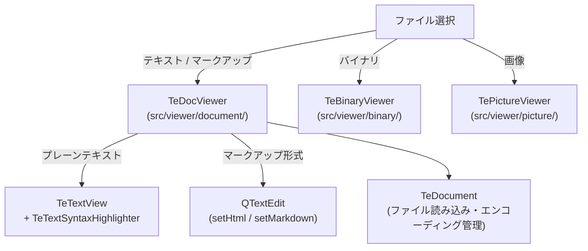

# Viewer

## Overview

`src/viewer/` はファイルの内容を表示する内蔵ビューワモジュールです。  
テキスト/マークアップ・画像・バイナリの 3 種類のビューワを提供します。  
各ビューワは独立した `QMainWindow` サブクラスとして実装されており、フローティングウィンドウとして表示されます。

対応するコマンド: `TeCmdToolFile`（テキスト・マークアップ）/ `TeCmdToolBinary`（バイナリ）/ 画像は自動判定で `TePictureViewer` が起動

---

## Viewer Types

```mermaid
graph TD
    FILE["ファイル選択"]
    FILE -->|テキスト / マークアップ| DOC["TeDocViewer\n(src/viewer/document/)"]
    FILE -->|バイナリ| BIN["TeBinaryViewer\n(src/viewer/binary/)"]
    FILE -->|画像| PIC["TePictureViewer\n(src/viewer/picture/)"]

    DOC -->|プレーンテキスト| TV["TeTextView\n+ TeTextSyntaxHighlighter"]
    DOC -->|マークアップ形式| MK["QTextEdit\n(setHtml / setMarkdown)"]
    DOC --> DM["TeDocument\n(ファイル読み込み・エンコーディング管理)"]
```

---

## Document Viewer (TeDocViewer)

テキストファイルとマークアップファイル（HTML / Markdown 等）のビューワです。

### Components

| クラス | 役割 |
|---|---|
| `TeDocViewer` | ビューワのメインウィンドウ。テキストモードとマークアップモードを切り替える |
| `TeDocument` | ファイルの読み込みとエンコーディング管理を担うデータモデル |
| `TeTextView` | `QPlainTextEdit` を継承したテキスト表示ウィジェット。行番号表示・タブ幅設定付き |
| `QTextEdit` | マークアップ表示ウィジェット（HTML/Markdown/PlainText を切替表示） |
| `TeTextSyntaxHighlighter` | シンタックスハイライターの実装（`QSyntaxHighlighter` 継承） |
| `TeTextSyntaxLoader` | JSON 形式のシンタックス定義ファイルを読み込む |
| `TeTextSyntaxDialog` | シンタックス定義（キーワード / 領域 / シンボルの色・書式）を編集するダイアログ |
| `TeDocumentSettings` | ビューワ設定（フォント / コーデック / タブ幅等）の QSettings キー定義 |

### Viewer Mode Selection

`TeDocViewer::open()` はファイルの拡張子を判定して表示モードを切り替えます。

| モード | 用途 | 使用ウィジェット |
|---|---|---|
| テキストモード | プレーンテキスト・コードファイル | `TeTextView` + `TeTextSyntaxHighlighter` |
| マークアップモード | HTML / Markdown 等 | `QTextEdit` (`setHtml()` / `setMarkdown()`) |

現行実装ではファイル拡張子に応じて `TeDocViewer::markupMode()` が描画方法を切り替えます。  
`.html/.htm` は `setHtml()`、`.md` は `setMarkdown()`、それ以外は `setPlainText()` で表示します。

詳細は [viewer/TeDocument.md](viewer/TeDocument.md) を参照してください。

### Text Syntax Highlighting

シンタックスハイライトは JSON 形式の設定ファイルで定義されます。  
`TeTextSyntaxLoader` が設定ファイルを読み込み、`TeTextSyntax` オブジェクト（キーワード / 正規表現 / 領域の定義群）を構築します。  
`TeTextSyntaxHighlighter` が `TeTextSyntax` を使用して `QPlainTextEdit` 内のテキストを着色します。

### Text Sidebar Panels（`viewer/document/text/panel/`）

テキストビューアはシンタックス定義を編集するためのサイドパネル群を備えます。  
各パネルは `TeTextPanelList`（タイトル付きの `TeTextPanelItem` コンテナ）を基盤とし、色・書式は `TeTextStyleEditor` で編集します。

| クラス | 役割 |
|---|---|
| `TeTextPanelList` | タイトルヘッダー付きの `TeTextPanelItem` 順序付きコンテナ |
| `TeTextPanelItem` | 単一シンタックスエントリを表示・編集する基底ウィジェット |
| `TeTextPanelSymbol` | `TeTextSyntax::SyntaxKeywords`（キーワード群）を編集 |
| `TeTextPanelRegion` | `TeTextSyntax::SyntaxRegion`（領域定義）を編集 |
| `TeTextPanelSyntax` | シンタックス全体（キーワード / 領域）を編集するパネル |
| `TeTextStyleEditor` | 太字 / 斜体 / 下線・前景 / 背景色を編集する共通フォーマットエディタ |

---

## Binary Viewer (TeBinaryViewer)

バイナリファイルのビューワです。  
`QHexView`（`support/QHexView/`）を使用してヘキサダンプ表示を行います。

| クラス | 役割 |
|---|---|
| `TeBinaryViewer` | バイナリビューワのメインウィンドウ |
| `TeBinaryViewerSettings` | バイナリビューワ設定（ウィンドウサイズ・デコードペイン表示・検索設定等）の QSettings キー定義 |
| `QHexView` | 外部ライブラリ。バイナリデータのヘキサダンプ表示ウィジェット |
| `QHexDocument` | `QHexView` のデータモデル |

検索・デコード機能を備えます：

- **検索モード**（`TeBinaryViewer::SearchMode`）: `Text` / `Binary` / `Number`
- **数値デコード**（`NumberType`）: `Int8`〜`Int64` / `UInt8`〜`UInt64`、エンディアン（`EndianMode::Little` / `Big`）を選択可能なデコードペイン
- オフセット指定によるジャンプ（goto-offset）

詳細は [viewer/TeBinaryViewer.md](viewer/TeBinaryViewer.md) を参照してください。

---

## Picture Viewer (TePictureViewer)

画像ファイルのビューワです。同一フォルダ内の画像を前後にナビゲートできます。

| クラス | 役割 |
|---|---|
| `TePictureViewer` | 画像ビューワのメインウィンドウ |
| `QGraphicsView` + `QGraphicsPixmapItem` | 画像の表示（拡大 / 縮小 / フィット表示） |
| `QFileSystemModel` + `QListView` | サイドパネルでの同フォルダ内画像一覧表示 |

表示モード（`Strech`）：

| モード | 説明 |
|---|---|
| `StrechNone` | 原寸表示 |
| `StrechFit` | ウィンドウに合わせてアスペクト比を維持して縮小 |
| `StrechFill` | ウィンドウに合わせてアスペクト比を無視して引き伸ばし |

`TeEventEmitter` を内部で使用し、フローティングウィンドウのクローズを `TeViewStore` に通知します。
