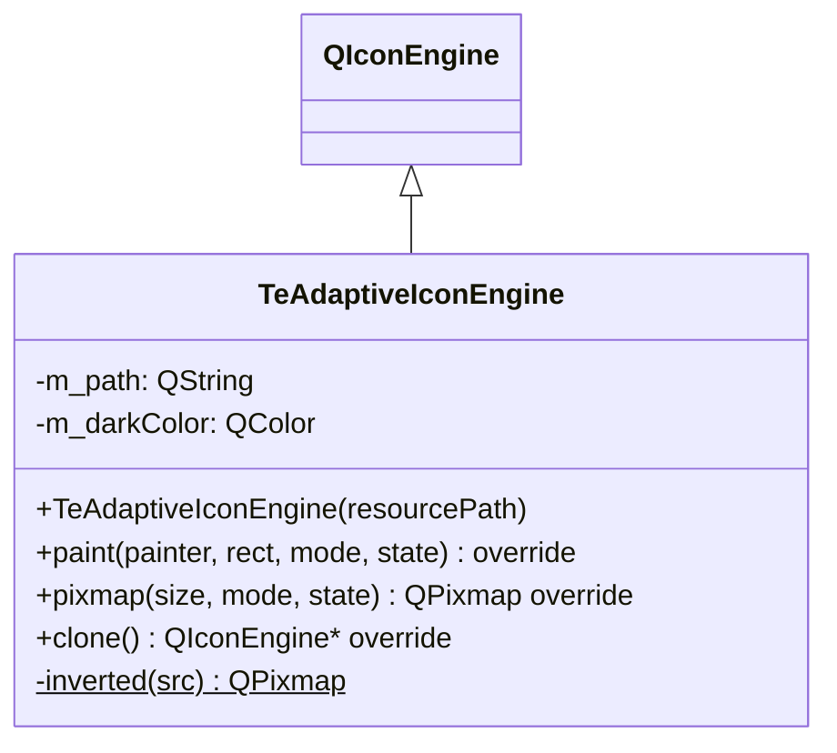

# TeAdaptiveIconEngine

## Overview

`TeAdaptiveIconEngine` は OS のカラーモード（ライト / ダーク）に応じてアイコンの色を自動的に調整する `QIconEngine` サブクラスです。  
Qt リソースパスを受け取り、ダークモード時はピクセルマップの RGB チャンネルを反転（デフォルトカラー `#c8c8c8`）して返します。  
アルファチャンネルはそのまま保持されるため、元画像の形状グラデーションが維持されます。

---

## Class Definition



---

## 動作

| OS カラーモード | 動作 |
|---|---|
| ライトモード | リソースの元ピクセルマップをそのまま返す |
| ダークモード | `inverted()` で RGB を反転した `m_darkColor` 色調のピクセルマップを返す |

---

## 使用方法

```cpp
// QIconEngine* を受け取る QIcon コンストラクタ経由で使用する
QIcon icon(new TeAdaptiveIconEngine(":/TableEngine/icons/newFile.png"));
toolButton->setIcon(icon);
```

`QIcon` はエンジンの所有権を取得します。  
`paint()` / `pixmap()` が呼ばれるたびに現在の OS カラーモードを評価するため、  
起動後にユーザーがダーク/ライトを切り替えた場合も正しく反映されます。

---

## inverted()（内部）

```cpp
static QPixmap inverted(const QPixmap& src);
```

ピクセルマップの各ピクセルの R/G/B チャンネルを `255 - value` に反転します。  
アルファチャンネルは変更しないため、透明部分はそのまま維持されます。

---

## See Also

- [`TeFolderAppearance`](TeFolderAppearance.md)
