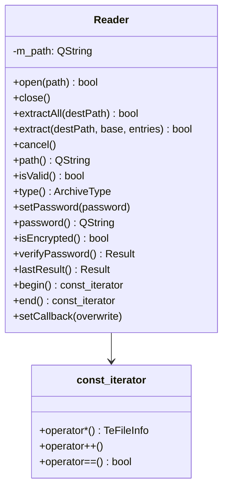

# TeArchive

## Overview

`TeArchive` はアーカイブファイルの読み書きを提供する名前空間です。  
外部ライブラリ（libarchive）をラップし、  
ZIP / 7zip / tar 等の形式を統一インタフェースで扱えるようにします。

---

## ArchiveType Enum

| 値 | 意味 |
|---|---|
| `AR_NONE` | 不明なファイル形式 |
| `AR_ZIP` | Zip アーカイブ |
| `AR_7ZIP` | 7-zip アーカイブ |
| `AR_TAR` | Tar アーカイブ（非圧縮） |
| `AR_TAR_GZIP` | Tar + gzip 圧縮 |
| `AR_TAR_BZIP2` | Tar + bzip2 圧縮 |

---

## Reader::Result Enum

`open()` / `verifyPassword()` の結果を表します（`Reader::lastResult()` で取得）。

| 値 | 意味 |
|---|---|
| `RESULT_OK` | 操作成功 |
| `RESULT_FORMAT_ERROR` | 不明・非対応のアーカイブ形式 |
| `RESULT_PASSWORD_REQUIRED` | 暗号化されておりパスワードが必要 |
| `RESULT_WRONG_PASSWORD` | 指定パスワードが誤り |
| `RESULT_FATAL` | 回復不能なエラー（I/O・ファイル未検出等） |

---

## TeArchive::Reader

アーカイブの読み取り（展開・一覧取得）を担うクラスです。  
`QObject` を継承し、シグナル/スロット機構を通じて進捗を通知します。

### Class Diagram

### Methods

| メソッド | 説明 |
|---|---|
| `open(path)` | アーカイブファイルを開く。成功すれば `true`、失敗すれば `false` |
| `close()` | アーカイブを閉じてリソースを解放する |
| `extractAll(destPath)` | アーカイブ内の全エントリを `destPath` に展開する |
| `extract(destPath, base, entries)` | `entries` に含まれる指定エントリのみ展開する |
| `cancel()` | 実行中の展開処理をキャンセルする（非同期・即時返却） |
| `isValid()` | アーカイブが正常に開けた状態かどうかを返す |
| `type()` | `ArchiveType` を返す |
| `setPassword(password)` | 暗号化アーカイブの展開に使用するパスワードを設定する（空文字でクリア） |
| `password()` | 現在保持しているパスワードを返す |
| `isEncrypted()` | 開いたアーカイブが暗号化エントリを含むかどうかを返す |
| `verifyPassword()` | 保持中パスワードがアーカイブを復号できるか検証し `Result` を返す |
| `lastResult()` | 直近の `open()` / `verifyPassword()` の結果（`Result`）を返す |

### Signals

| シグナル | 説明 |
|---|---|
| `maximumValue(int)` | 処理対象バイト数の最大値（アーカイブファイルサイズ、単位 1KB）を通知 |
| `valueChanged(int)` | 読み取り済みバイト数（単位 1KB）を通知。最大値に到達しないことがある |
| `currentFileInfoChanged(TeFileInfo)` | 現在展開中のファイル情報を通知 |
| `finished()` | 展開処理完了を通知 |
| `error(QString)` | 回復不能なアーカイブエラー発生時にメッセージを通知 |

### const_iterator

アーカイブ内エントリを `for (auto& info : reader)` の形でイテレートするための入力イテレータです。  
イテレータが返す値は `TeFileInfo` 構造体で、パス・サイズ・更新日時・パーミッション情報を含みます。

### Overwrite Callback

`setCallback(overwrite)` で上書き確認コールバックを登録できます。  
展開先に同名ファイルが存在するとき、コールバックが `true` を返した場合のみ上書きします。

### Encryption / Password (Reader)

暗号化アーカイブを展開する場合は、`open()` の前後で `setPassword()` によりパスワードを設定します。

- `open()` 後、`isEncrypted()` が `true` ならアーカイブは暗号化エントリを含みます。
- ヘッダ暗号化方式（例: 7zip）では、パスワード無し・誤りの場合に `open()` 自体が失敗し、
  `lastResult()` が `RESULT_PASSWORD_REQUIRED` / `RESULT_WRONG_PASSWORD` を返します。
- データのみ暗号化する方式（ZIP AES）では `open()` は成功するため、`verifyPassword()` で
  パスワードの正否を事前検証できます。

| 状況 | `verifyPassword()` の戻り値 |
|---|---|
| 正しいパスワード | `RESULT_OK` |
| 誤ったパスワード | `RESULT_WRONG_PASSWORD` |
| パスワード未設定 | `RESULT_PASSWORD_REQUIRED` |

---

## TeArchive::Writer

アーカイブへのファイル追加・圧縮を担うクラスです（詳細な仕様は `TeArchive::Reader` に準じる）。

### Encryption / Password (Writer)

`setPassword()` でパスワードを設定すると、暗号化アーカイブを作成します。

- 暗号化対応形式は **ZIP（AES-256）** のみです。非対応形式ではパスワードは無視されます。
- 空文字を設定すると暗号化は無効になります。

> **ビルド依存に関する注意**  
> ZIP 書き込み暗号化は、リンクする libarchive が crypto バックエンド付きでビルドされている
> 場合にのみ機能します。本プロジェクトでは vcpkg の **overlay port**
> （[vcpkg-overlays/libarchive](../../../vcpkg-overlays/libarchive/portfile.cmake) で `ENABLE_CNG=ON`）により
> Windows CNG (bcrypt) を有効化し、AES-256 暗号化を利用可能にしています。submodule `support/vcpkg`
> は変更しません（overlay は [vcpkg-configuration.json](../../../vcpkg-configuration.json) の `overlay-ports` で配線）。  
> crypto 未対応ビルドでは `archive_write_set_options("zip:encryption=aes256")`
> が `"encryption not supported"` を返し、暗号化されない通常 ZIP が生成されます。  
> このため、暗号化を検証するユニットテスト（`archive_password_*`）は、実行時に暗号化生成可否を
> 判定し、未対応ビルドでは自動的にスキップされます。

---

## Dependencies

`TeArchive::Reader` / `Writer` は libarchive に依存します。  
現行の CMake ビルドでは `find_package(LibArchive REQUIRED)` と `LibArchive::LibArchive` でリンクされ、
依存ライブラリは vcpkg（`x64-windows-static-md`）経由で解決されます。

補足:
- qmake 用の旧設定（`src/lib.pri`）には `support_package` 参照が残っています
- ただし本プロジェクトの推奨ビルドは CMake であり、qmake は非サポートです
- ZIP の書き込み暗号化（AES-256）には libarchive の crypto バックエンドが必要なため、vcpkg の
  overlay port（`vcpkg-overlays/libarchive`, `ENABLE_CNG=ON`）で有効化しています。`support/vcpkg`
  submodule は無変更です
