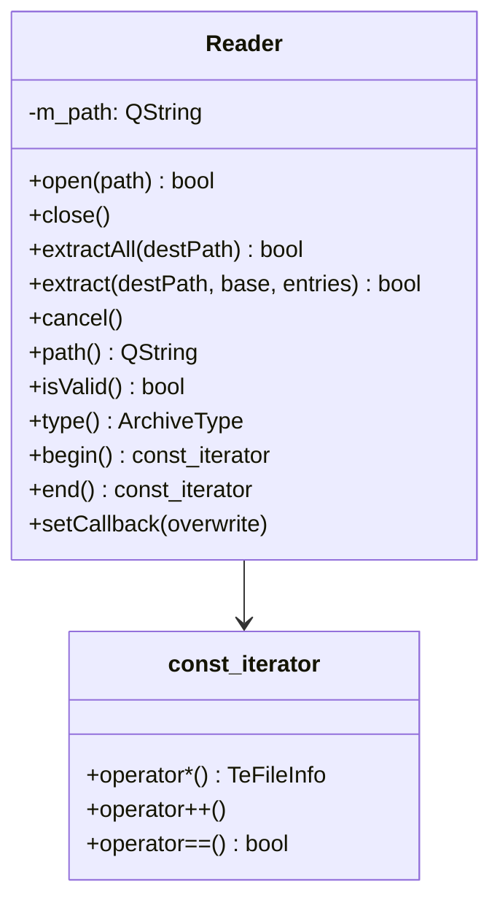

# TeArchive

## Overview

`TeArchive` はアーカイブファイルの読み書きを提供する名前空間です。  
外部ライブラリ（libarchive）をラップし、  
ZIP / 7zip / tar 等の形式を統一インタフェースで扱えるようにします。

---

## ArchiveType Enum

| 値 | 意味 |
|---|---|
| `AR_NONE` | 不明なファイル形式 |
| `AR_ZIP` | Zip アーカイブ |
| `AR_7ZIP` | 7-zip アーカイブ |
| `AR_TAR` | Tar アーカイブ（非圧縮） |
| `AR_TAR_GZIP` | Tar + gzip 圧縮 |
| `AR_TAR_BZIP2` | Tar + bzip2 圧縮 |

---

## TeArchive::Reader

アーカイブの読み取り（展開・一覧取得）を担うクラスです。  
`QObject` を継承し、シグナル/スロット機構を通じて進捗を通知します。

### Class Diagram

### Methods

| メソッド | 説明 |
|---|---|
| `open(path)` | アーカイブファイルを開く。成功すれば `true`、失敗すれば `false` |
| `close()` | アーカイブを閉じてリソースを解放する |
| `extractAll(destPath)` | アーカイブ内の全エントリを `destPath` に展開する |
| `extract(destPath, base, entries)` | `entries` に含まれる指定エントリのみ展開する |
| `cancel()` | 実行中の展開処理をキャンセルする（非同期・即時返却） |
| `isValid()` | アーカイブが正常に開けた状態かどうかを返す |
| `type()` | `ArchiveType` を返す |

### Signals

| シグナル | 説明 |
|---|---|
| `maximumValue(int)` | 処理対象バイト数の最大値（アーカイブファイルサイズ、単位 1KB）を通知 |
| `valueChanged(int)` | 読み取り済みバイト数（単位 1KB）を通知。最大値に到達しないことがある |
| `currentFileInfoChanged(TeFileInfo)` | 現在展開中のファイル情報を通知 |
| `finished()` | 展開処理完了を通知 |

### const_iterator

アーカイブ内エントリを `for (auto& info : reader)` の形でイテレートするための入力イテレータです。  
イテレータが返す値は `TeFileInfo` 構造体で、パス・サイズ・更新日時・パーミッション情報を含みます。

### Overwrite Callback

`setCallback(overwrite)` で上書き確認コールバックを登録できます。  
展開先に同名ファイルが存在するとき、コールバックが `true` を返した場合のみ上書きします。

---

## TeArchive::Writer

アーカイブへのファイル追加・圧縮を担うクラスです（詳細な仕様は `TeArchive::Reader` に準じる）。

---

## Dependencies

`TeArchive::Reader` / `Writer` は libarchive に依存します。  
現行の CMake ビルドでは `find_package(LibArchive REQUIRED)` と `LibArchive::LibArchive` でリンクされ、
依存ライブラリは vcpkg（`x64-windows-static-md`）経由で解決されます。

補足:
- qmake 用の旧設定（`src/lib.pri`）には `support_package` 参照が残っています
- ただし本プロジェクトの推奨ビルドは CMake であり、qmake は非サポートです
