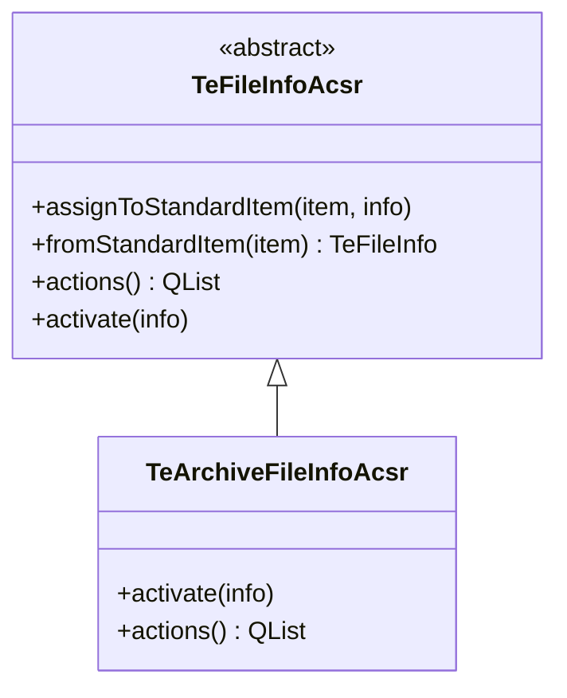

# TeArchiveFileInfoAcsr

## Overview

`TeArchiveFileInfoAcsr` はアーカイブ内ファイルエントリのアクセサクラスです。  
`TeFileInfoAcsr` を継承し、`activate()` をアーカイブエントリ向けにオーバーライドします。

---

## Class Hierarchy

---

## Role

`TeFileInfoAcsr` の実装サブクラスは、`QStandardItem` の `UserRole` に自身のポインタを埋め込むことで、  
「アイテムに対してどんな操作ができるか」をモデルから切り離して管理します。

`TeArchiveFileInfoAcsr` はこの仕組みをアーカイブエントリに特化した形で実装します：

- `activate(info)`: アーカイブ内ファイルがダブルクリックされたときに呼ばれます。  
  ファイルをアーカイブから一時ディレクトリに展開し、対応するビューアで開くアクションを実行します。
- `actions()`: コンテキストメニューやツールバーから利用できるアクションのリストを返します（純粋仮想）。

---

## Usage

`TeArchiveFolderView` がアーカイブエントリを `QStandardItemModel` に追加するとき、  
`TeArchiveFileInfoAcsr::assignToStandardItem()` を通じてアクセサをアイテムに関連付けます。

ユーザーがアイテムを操作する際は `fromStandardItem()` でアクセサを取得し、  
`activate()` や `actions()` を呼ぶことでアーカイブを意識せずに操作が行えます。
