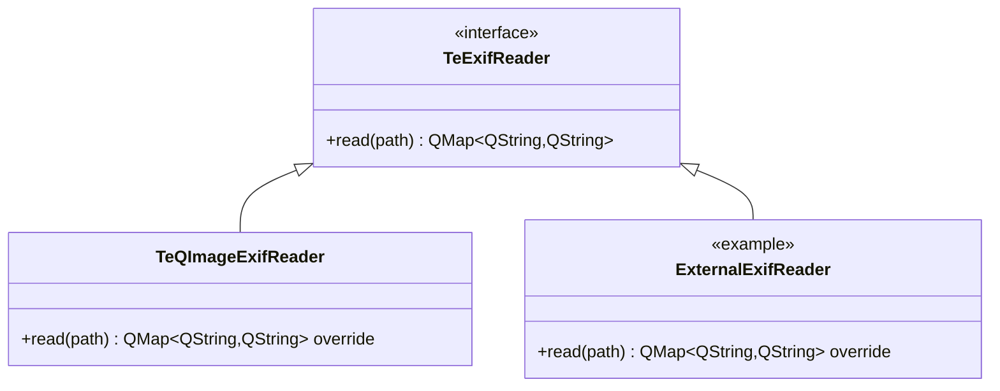

# TeExifReader / TeQImageExifReader

## Overview

`TeExifReader` は画像ファイルから EXIF / メタデータを読み出す **ストラテジーインタフェース** です。  
`TeQImageExifReader` はデフォルト実装で、外部ライブラリを使用せずに `QImageReader` と独自の JPEG EXIF バイナリパーサーを組み合わせてメタデータを取得します。

---

## Class Definition



---

## TeExifReader（インタフェース）

```cpp
virtual QMap<QString, QString> read(const QString& path) const = 0;
```

`path` の絶対ファイルパスからメタデータを読み込み、英語のキーと値のマップを返します。  
ファイルにパース可能なメタデータがない場合は空マップを返します。

### ストラテジーパターンの活用

`TeDetailExifSection::setExifReader()` で実装を差し替えられます：

```cpp
// exiv2 バックエンドに切り替える例
section->setExifReader(std::make_unique<Exiv2ExifReader>());
```

---

## TeQImageExifReader

外部ライブラリを使わずに動作するデフォルト実装です。2つのアプローチを組み合わせます：

### アプローチ 1: QImageReader

- `QImageReader::size()` — 画像の縦横ピクセル数
- `QImageReader::text()` — フォーマット非依存のメタデータ（PNG `tEXt` チャンク等）

### アプローチ 2: JPEG EXIF バイナリパーサー

ファイル先頭 64 KB を読み込み、JPEG APP1 セグメントを探して TIFF IFD を解析します。  
リトルエンディアン（`II`）とビッグエンディアン（`MM`）の両方に対応します。

---

## 返却するキー一覧

| キー | 説明 |
|---|---|
| `Width` | 画像横幅（ピクセル） |
| `Height` | 画像高さ（ピクセル） |
| `Make` | カメラメーカー |
| `Model` | カメラモデル |
| `Orientation` | 回転方向 |
| `DateTime` | 撮影日時 |
| `DateTimeOriginal` | 元の撮影日時 |
| `ExposureTime` | 露出時間 |
| `FNumber` | F 値 |
| `ISO` | ISO 感度 |
| `FocalLength` | 焦点距離 |
| `PixelXDimension` | 有効画像幅 |
| `PixelYDimension` | 有効画像高さ |

> 各キーはファイルが対応情報を持つ場合のみ返却されます。

---

## 実装上の制約

- JPEG のみ IFD パーサーが動作します（PNG/BMP/GIF 等は `QImageReader::text()` のみ）
- ファイル先頭 **64 KB** のみ読み込むため、APP1 がそれ以降にある異常ファイルは部分取得になります

---

## See Also

- [`TeDetailExifSection`](../widgets/TeDetailSection.md)
