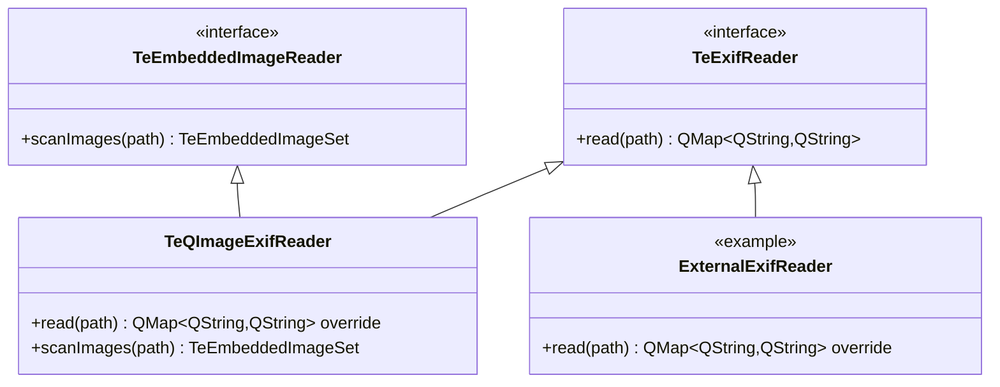

# TeExifReader / TeQImageExifReader

## Overview

`TeExifReader` は画像ファイルから EXIF / メタデータを読み出す **ストラテジーインタフェース** です。  
`TeQImageExifReader` はデフォルト実装で、外部ライブラリを使用せずに `QImageReader` と独自の JPEG EXIF バイナリパーサーを組み合わせてメタデータを取得します。また `TeEmbeddedImageReader` を実装し、JPEG 内の符号化済み画像へ遅延アクセスできます。

---

## Class Definition


```mermaid
classDiagram
    class TeExifReader {
        <<interface>>
        +read(path) QMap~QString,QString~
    }
    class TeQImageExifReader {
        +read(path) QMap~QString,QString~ override
        +scanImages(path) TeEmbeddedImageSet
    }
    class TeEmbeddedImageReader {
        <<interface>>
        +scanImages(path) TeEmbeddedImageSet
    }
    class ExternalExifReader {
        <<example>>
        +read(path) QMap~QString,QString~ override
    }

    TeExifReader <|-- TeQImageExifReader
    TeEmbeddedImageReader <|-- TeQImageExifReader
    TeExifReader <|-- ExternalExifReader
```

---

## TeExifReader（インタフェース）

```cpp
virtual QMap<QString, QString> read(const QString& path) const = 0;
```

`path` の絶対ファイルパスからメタデータを読み込み、英語のキーと値のマップを返します。  
ファイルにパース可能なメタデータがない場合は空マップを返します。

### ストラテジーパターンの活用

`TeDetailExifSection::setExifReader()` で実装を差し替えられます：

```cpp
// exiv2 バックエンドに切り替える例
section->setExifReader(std::make_unique<Exiv2ExifReader>());
```

---

## TeQImageExifReader

外部ライブラリを使わずに動作するデフォルト実装です。2つのアプローチを組み合わせます：

### アプローチ 1: QImageReader

- `QImageReader::size()` — 画像の縦横ピクセル数
- `QImageReader::text()` — フォーマット非依存のメタデータ（PNG `tEXt` チャンク等）

### アプローチ 2: JPEG EXIF バイナリパーサー

SOI から SOS まで JPEG セグメントを seek 走査し、すべての APP1 セグメントから TIFF IFD を解析します。
リトルエンディアン（`II`）とビッグエンディアン（`MM`）の両方に対応します。

---

## 返却するキー一覧

| キー | 説明 |
|---|---|
| `Width` | 画像横幅（ピクセル） |
| `Height` | 画像高さ（ピクセル） |
| `Make` | カメラメーカー |
| `Model` | カメラモデル |
| `Orientation` | 回転方向 |
| `DateTime` | 撮影日時 |
| `DateTimeOriginal` | 元の撮影日時 |
| `ExposureTime` | 露出時間 |
| `FNumber` | F 値 |
| `ISO` | ISO 感度 |
| `FocalLength` | 焦点距離 |
| `PixelXDimension` | 有効画像幅 |
| `PixelYDimension` | 有効画像高さ |

> 各キーはファイルが対応情報を持つ場合のみ返却されます。

---

## 実装上の制約

- JPEG のみ IFD パーサーが動作します（PNG/BMP/GIF 等は `QImageReader::text()` のみ）
- JPEG セグメント長、TIFF オフセット、MPF 範囲はファイル境界内であることを検証します

---

## TeEmbeddedImageReader

```cpp
TeEmbeddedImageSet images = reader.scanImages(path);
for (const TeEmbeddedImageInfo& image : images.images()) {
    std::unique_ptr<QIODevice> device = images.openImageDevice(image.id);
}
```

`scanImages()` は主 JPEG、Exif IFD1 thumbnail、MPF 追加画像を返します。各 `TeEmbeddedImageInfo` はセット内 ID、SOF サイズ、符号化サイズ、形式、種別、出所、向き（利用可能な場合）を持ちます。

`openImageDevice()` は独立した `TeFileSliceDevice` を返します。この read-only device は検出済み範囲を超えて read/seek せず、スキャン後に元ファイルのサイズまたは更新時刻が変わった場合は open に失敗します。

---

## See Also

- [`TeDetailExifSection`](../widgets/TeDetailSection.md)
