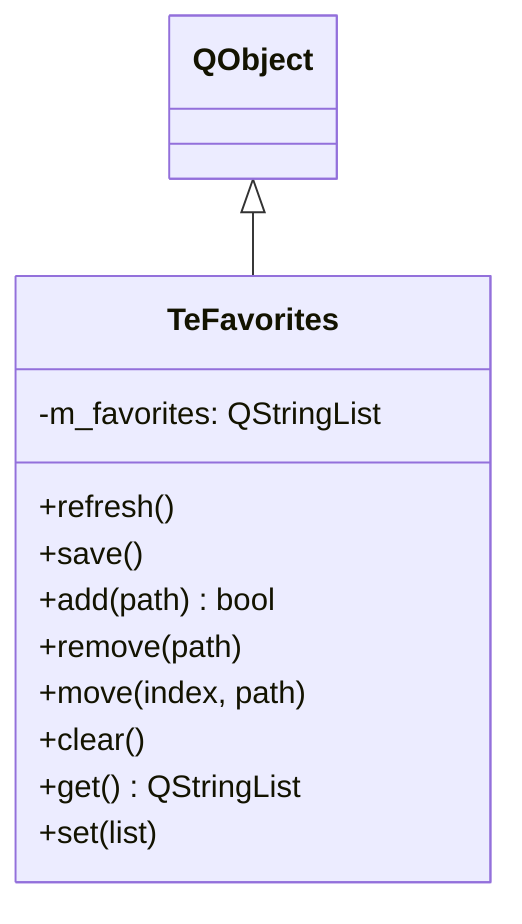

# TeFavorites

## Overview

`TeFavorites` はユーザーがお気に入り登録したディレクトリパスの **順序付きリスト** を管理します。  
リストは `QSettings` に永続化され、`refresh()` で再読み込み、`save()` で書き戻しが行えます。  
追加・削除・並び替え等の変更操作は `save()` が呼ばれるまでメモリ内にのみ保持されます。

---

## Class Definition



---

## Methods

| メソッド | 説明 |
|---|---|
| `refresh()` | `QSettings` からお気に入りリストを再読み込みする |
| `save()` | 現在のメモリ内リストを `QSettings` に書き込む |
| `add(path)` | `path` がリストにない場合のみ末尾に追加する。追加した場合 `true` を返す |
| `remove(path)` | リストから `path` を削除する |
| `move(index, path)` | `index` 位置のエントリのパスを `path` に変更する（並び替え用） |
| `clear()` | 全エントリを削除する（保存はしない） |
| `get()` | 現在のメモリ内リストを返す |
| `set(list)` | メモリ内リストを `list` に置き換える（保存はしない） |

---

## 永続化

`QSettings` の `"favorites"` キーに `QStringList` として格納されます。  
設定の読み書きタイミングは呼び出し元が明示的に制御します（自動保存なし）。

---

## Usage

```cpp
TeFavorites favs;
favs.refresh();                       // 設定から読み込み

favs.add("/home/user/Documents");     // 追加
favs.add("/home/user/Pictures");

// UI で並び替えた結果を反映
favs.set(reorderedList);

favs.save();                          // 設定に書き戻し
```

---

## See Also

- [`TeUtils`](TeUtils.md) — `getFavorites()` / `updateFavorites()` グローバル関数
- [`TeDriveBar`](../widgets/TeDriveBar.md) — クイックアクセスセクションでお気に入りを表示
