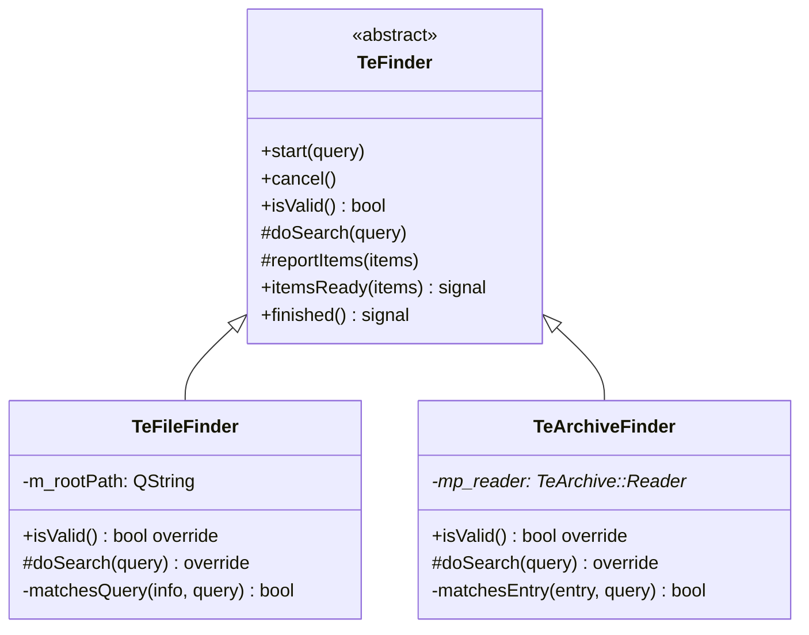

# TeFileFinder / TeArchiveFinder

## Overview

`TeFileFinder` と `TeArchiveFinder` はそれぞれローカルファイルシステムとアーカイブファイル内を非同期検索する `TeFinder` の具体実装です。  
どちらも `TeFolderView::makeFinder()` ファクトリを通じて生成され、コマンド側は実装の違いを意識しません。

詳細な `TeFinder` の設計（非同期スレッド、シグナル/スロット）については [`TeFinder.md`](TeFinder.md) を参照してください。

---

## Class Definition



---

## TeFileFinder

### 概要

ローカルディレクトリツリーを `QDirIterator` で再帰走査し、`TeSearchQuery` に一致するエントリを収集します。

### コンストラクタ

```cpp
explicit TeFileFinder(const QString& path, QObject* parent = nullptr);
```

`path` は検索のルートとなる絶対ディレクトリパスです。

### isValid()

ルートパスが存在してディレクトリであるとき `true` を返します。

### doSearch()

`QDirIterator::Subdirectories` フラグで再帰走査し、各エントリを `matchesQuery()` で評価します。  
一定件数ごとに `reportItems()` を呼び出し、`itemsReady` シグナルを発行します。

---

## TeArchiveFinder

### 概要

`TeArchive::Reader` でアーカイブを開き、全エントリを `TeSearchQuery` に対して照合します。

### コンストラクタ

```cpp
explicit TeArchiveFinder(const QString& path, QObject* parent = nullptr);
```

`path` はアーカイブファイルの絶対パスです。

### isValid()

アーカイブが正常に開けた場合に `true` を返します（`TeArchive::Reader::isValid()` に委譲）。

### doSearch()

`TeArchive::Reader` のイテレータで全エントリを走査し、`matchesEntry()` で評価します。  
アーカイブにはファイルシステムと異なり `QDirIterator` は使用できないため、独自のイテレータを使います。

---

## 使い分け

| 状況 | 使用クラス |
|---|---|
| `TeFileFolderView` で検索（ローカル FS） | `TeFileFinder` |
| `TeArchiveFolderView` で検索（ZIP/7z/tar） | `TeArchiveFinder` |

`TeFolderView::makeFinder()` がビュー種別に応じて適切なクラスを生成して返すため、コマンド側は切り替え不要です。

---

## See Also

- [`TeFinder`](TeFinder.md)
- [`TeSearchQuery`](TeSearchQuery.md)
- [`TeArchive`](TeArchive.md)
- [`TeFolderView`](../widgets/TeFolderView.md)
