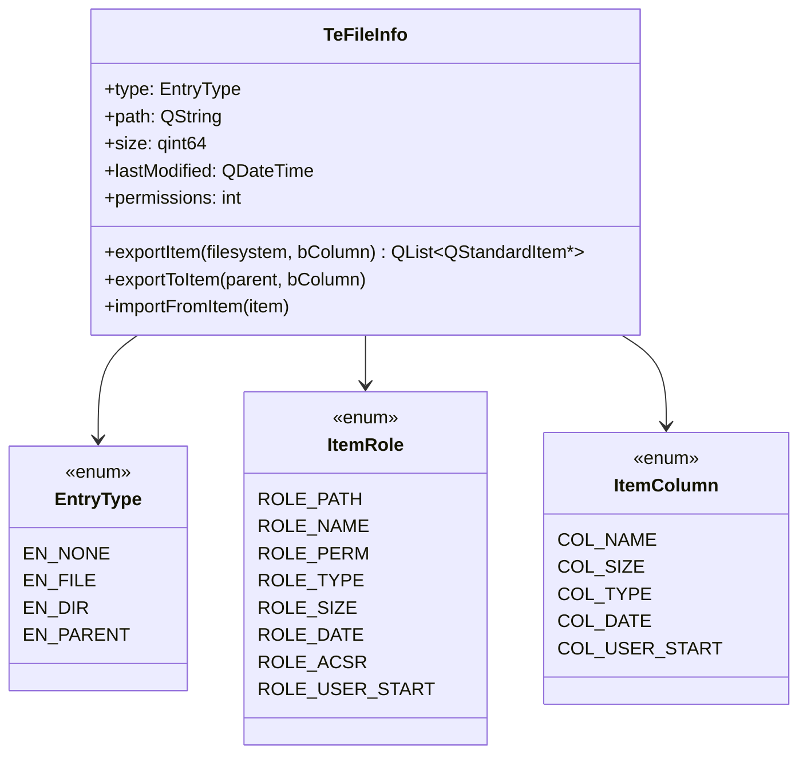

# TeFileInfo

## Overview

`TeFileInfo` はファイルシステムおよびアーカイブエントリの属性を保持する POD 的なデータ転送オブジェクトです。  
`TeArchive::Reader`、`TeFinder` 系クラス、`TeArchiveFolderView` の間で統一的なファイル情報の受け渡しに使用します。

---

## Class Definition



---

## EntryType Enum

| 値 | 意味 |
|---|---|
| `EN_NONE` | 不明なエントリ種別 |
| `EN_FILE` | 通常ファイル |
| `EN_DIR` | ディレクトリ |
| `EN_PARENT` | 親ディレクトリ（`..`）を表す合成エントリ |

---

## ItemRole Enum

`QStandardItem` のカスタムロールとして `TeFileInfo` の各フィールドを格納するためのロール定数です。

| 定数 | 用途 |
|---|---|
| `ROLE_PATH` | 絶対パス文字列 |
| `ROLE_NAME` | 表示名 |
| `ROLE_PERM` | パーミッションビットマスク |
| `ROLE_TYPE` | `EntryType` 値 |
| `ROLE_SIZE` | ファイルサイズ（バイト） |
| `ROLE_DATE` | 最終更新日時（`QDateTime`） |
| `ROLE_ACSR` | `TeFileInfoAcsr` ポインタ |
| `ROLE_USER_START` | サブクラス用拡張ロール開始値 |

---

## ItemColumn Enum

複数カラムの `QStandardItemModel` で使用するカラムインデックスです。

| 定数 | カラム |
|---|---|
| `COL_NAME` | ファイル名 |
| `COL_SIZE` | ファイルサイズ |
| `COL_TYPE` | エントリ種別 |
| `COL_DATE` | 最終更新日時 |
| `COL_USER_START` | サブクラス用拡張カラム開始値 |

---

## Methods

| メソッド | 説明 |
|---|---|
| `exportItem(filesystem, bColumn)` | このエントリをモデル行として表現する `QStandardItem` リストを生成する。`filesystem=true` でファイルシステム向けデコレーションロールも設定する |
| `exportToItem(parent, bColumn)` | 既存の `QStandardItem` にこのエントリのデータをロールとして書き込む |
| `importFromItem(item)` | `QStandardItem` のカスタムロールからこのエントリにデータを読み込む |

---

## Usage

```cpp
TeFileInfo info;
info.type = TeFileInfo::EN_FILE;
info.path = "/path/to/file.txt";
info.size = 1024;
info.lastModified = QDateTime::currentDateTime();

// モデルに登録
QList<QStandardItem*> row = info.exportItem();
model->appendRow(row);
```

---

## See Also

- [`TeArchive::Reader`](TeArchive.md)
- [`TeFinder`](TeFinder.md)
- [`TeFileInfoAcsr`](TeFileInfoAcsr.md)
