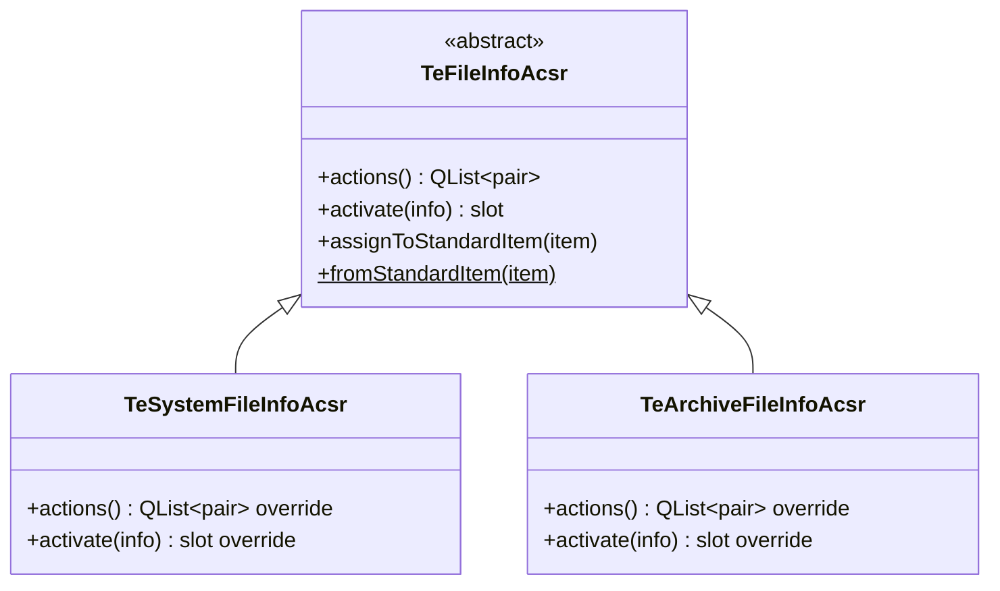

# TeFileInfoAcsr / TeSystemFileInfoAcsr

## Overview

`TeFileInfoAcsr` はファイルアイテムにコンテキストメニューアクションとアクティベーション処理を付加する **抽象インタフェース** です。  
具体サブクラスが `actions()` でアクション一覧を返し、`activate()` でダブルクリック時の動作を実装します。  
インスタンスは `assignToStandardItem()` で `QStandardItem` に紐付けられ、後から `fromStandardItem()` で取得できます。

`TeSystemFileInfoAcsr` はローカルファイルシステム向けの具体実装で、OS のデフォルトアプリケーションでファイルを開きます。

---

## Class Definition



---

## TeFileInfoAcsr

### 責務

ファイルアイテム（`QStandardItem`）に関連付けてコンテキストメニューとアクティベーション動作を提供するインタフェースです。  
アクセサーは `TeFileInfo::ROLE_ACSR` ロールを介して `QStandardItem` に格納されます。

### メソッド

| メソッド | 説明 |
|---|---|
| `actions()` | 利用可能なコンテキストメニューアクションのリストを返す。各要素は（表示名, 関数ポインタ）のペア |
| `activate(info)` | ユーザーがアイテムをダブルクリックまたは開いたときに呼ばれる |
| `assignToStandardItem(item)` | このアクセサーを `item` に紐付ける。所有権は item 側に移る |
| `fromStandardItem(item)` | `item` に紐付いたアクセサーを取得する（静的メソッド） |

### ActionFunc 型

```cpp
typedef void(*ActionFunc)(TeDispatchable* dispatcher,
                          TeTypes::WidgetType type,
                          const QList<TeFileInfo>& infos);
```

コンテキストメニューアクションのコールバック型です。選択中のファイルリストが `infos` として渡されます。

---

## TeSystemFileInfoAcsr

ローカルファイルシステム上のエントリ向けの具体実装です。

### 提供するアクション

| アクション名 | 動作 |
|---|---|
| Open | OS のデフォルトアプリケーションでファイルを開く |
| Open With | アプリケーション選択ダイアログを開く |
| Properties | OS のファイルプロパティダイアログを開く |

### activate()

`QDesktopServices::openUrl()` を通じて OS デフォルトハンドラでファイルまたはディレクトリを開きます。

---

## Usage

```cpp
// QStandardItem にアクセサーを付加する例
auto* acsr = new TeSystemFileInfoAcsr(parent);
acsr->assignToStandardItem(item);

// 取得する
auto* retrieved = TeFileInfoAcsr::fromStandardItem(item);
if (retrieved) {
    // コンテキストメニューにアクション追加
    for (auto& [name, func] : retrieved->actions()) {
        auto* action = menu->addAction(name);
        connect(action, &QAction::triggered, [func, dispatcher, type, infos]() {
            func(dispatcher, type, infos);
        });
    }
}
```

---

## See Also

- [`TeFileInfo`](TeFileInfo.md)
- [`TeArchiveFileInfoAcsr`](TeArchiveFileInfoAcsr.md)
- [`TePathFolderView`](../widgets/TePathFolderView.md)
