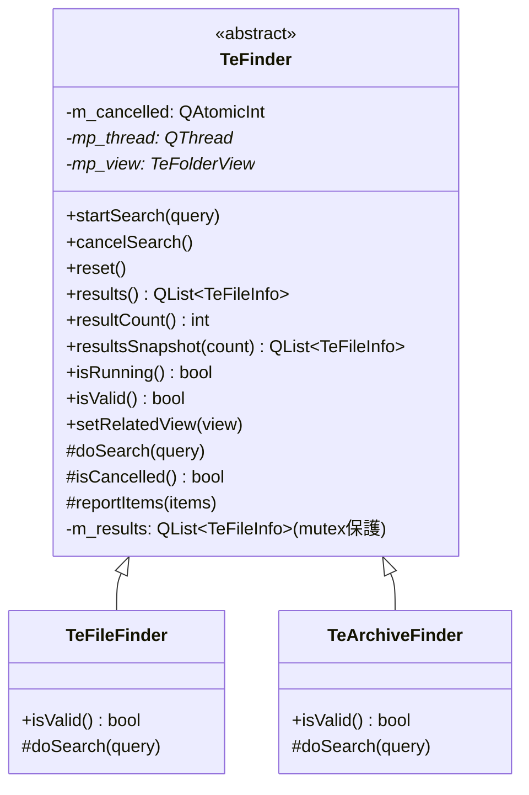
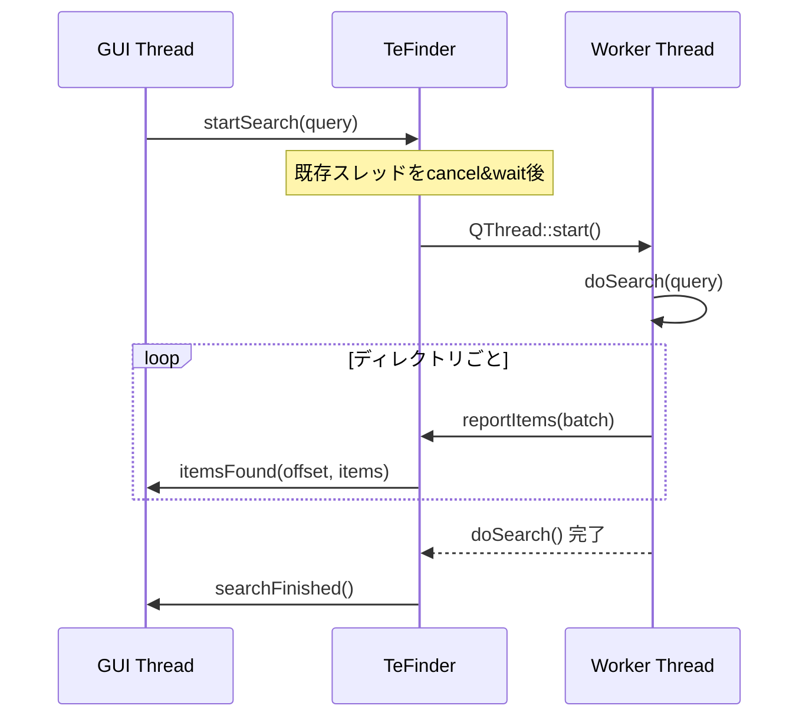

# TeFinder

## Overview

`TeFinder` はファイル / アーカイブの **非同期検索処理** の抽象基底クラスです。  
ワーカースレッドで検索を実行し、結果をスレッドセーフなリストに蓄積しながら、  
GUI スレッドへ `itemsFound()` シグナルで定期的に通知します。

---

## Class Diagram



---

## Thread Lifecycle



---

## Key Methods

| メソッド | スレッド | 説明 |
|---|---|---|
| `startSearch(query)` | GUI | 非同期検索を開始する。実行中の検索がある場合はキャンセルして待機してから再開始 |
| `cancelSearch()` | GUI | キャンセル要求を送る。即時返却。完了確認は `searchCancelled()` シグナルで行う |
| `reset()` | GUI | `m_results` をクリアする。検索が停止している状態でのみ安全に呼べる |
| `results()` | Any | ミューテックス保護されたすべての結果リストのコピーを返す |
| `resultCount()` | Any | ミューテックス保護された結果件数を返す |
| `resultsSnapshot(count)` | GUI | スナップショット取得と同時に件数を `count` に記録する（競合防止用）|

---

## doSearch() Contract

派生クラスが実装する `doSearch()` はワーカースレッドで呼ばれます。  
以下のルールを守る必要があります：

1. **`isCancelled()` を定期的にポーリングし、`true` の場合は早期リターン**  
   長時間ブロックする処理（ファイルI/O）の合間に必ず確認してください
2. **マッチしたエントリを `reportItems(batch)` で都度報告**  
   `reportItems()` は `m_results` に追加後、`itemsFound` シグナルをキューイングします
3. **`m_results` を直接操作しない**  
   スレッドセーフな `reportItems()` のみを通じて結果を追加してください

---

## resultsSnapshot Race Condition Prevention

`TeFindFolderView` が `addSearchEntry()` 実行時に取るべき正しい接続手順：

```
1. connect(finder, &TeFinder::itemsFound, this, &TeFindFolderView::onItemsFound)
2. auto initial = finder->resultsSnapshot(m_snapshotCount)  // スナップショット取得
3. リスト表示を initial で初期化
// onItemsFound が届いたとき：
// offset < m_snapshotCount なら重複なのでスキップ
// offset >= m_snapshotCount なら新しいバッチとして追加
```

シグナル接続 → スナップショット取得の順序を守ることで、  
間に届いた `itemsFound` を見逃さずに処理できます。

---

## relatedView

`setRelatedView(view)` でこの `TeFinder` と関連付けられた `TeFolderView` を設定します。  
`TeFindFolderView` がどの `TeFolderView` から開始された検索かを追跡するために使用します。
