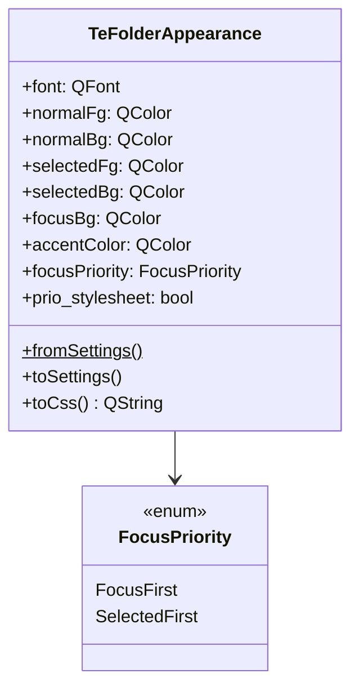

# TeFolderAppearance

## Overview

`TeFolderAppearance` は `QSettings` に保存されたフォルダービューの外観設定を読み込み、Qt スタイルシート文字列に変換するためのヘルパー構造体です。  
`buildStyleSheetFromSettings()` が唯一のエントリポイントとして `TeViewStore::applyStyleSheet()` から呼び出されます。

---

## 設計方針

フォルダービューの外観（フォント・色など）は `TeOptionSetting` ダイアログで設定され、`QSettings` に永続化されます。  
設定されていないフィールドは CSS に出力されないため、テーマ/システムデフォルトにフォールバックできます。

新しい外観カテゴリ（例：ヘッダーバー設定）を追加する場合は：
1. 新しい設定構造体を追加して `fromSettings()` / `toSettings()` / `toCss()` を実装する
2. `buildStyleSheetFromSettings()` で `toCss()` を呼び出すよう追加する

---

## Class Definition



---

## フィールド

| フィールド | 型 | 説明 |
|---|---|---|
| `font` | `QFont` | アイテムの共通フォント。デフォルト構築 = 未設定 |
| `normalFg` / `normalBg` | `QColor` | 通常状態のテキスト色 / 背景色。`isValid()==false` = 未設定 |
| `selectedFg` / `selectedBg` | `QColor` | 選択状態のテキスト色 / 背景色 |
| `focusBg` | `QColor` | フォーカス状態の背景色 |
| `accentColor` | `QColor` | リストモード選択マーカーの色 |
| `focusPriority` | `FocusPriority` | `:selected` と `:focus` のどちらの CSS ルールを後に出力するか |
| `prio_stylesheet` | `bool` | `true` の場合、基本スタイルシートの **後** に適用する優先スタイル |

---

## FocusPriority

CSS はカスケード順（後書き優先）で解決されます。同一特異度のルールでは後で書かれたブロックが勝ちます。

| 値 | CSS 出力順 | フォーカスと選択が同時に有効なとき |
|---|---|---|
| `FocusFirst`（デフォルト） | `:selected` → `:focus` | `:focus` の色が優先 |
| `SelectedFirst` | `:focus` → `:selected` | `:selected` の色が優先 |

---

## Methods

| メソッド | 説明 |
|---|---|
| `fromSettings()` | `QSettings` の `"folder/appearance"` グループから読み込んで構造体を返す（静的） |
| `toSettings()` | 全フィールドを `QSettings` に書き込む（`#rrggbb` 形式） |
| `toCss()` | 有効なフィールドのみを CSS ルールとして出力する。`QTreeView::item` と `QListView::item` の両方をターゲットにする |

---

## buildStyleSheetFromSettings()

```cpp
QString buildStyleSheetFromSettings();
```

すべての外観構造体の `toCss()` を集約して完全なスタイルシート文字列を返す単一エントリポイントです。  
`TeViewStore::applyStyleSheet()` から呼ばれ、生成された文字列が `QApplication::setStyleSheet()` に渡されます。

---

## See Also

- [`TeAdaptiveIconEngine`](TeAdaptiveIconEngine.md)
- `TeViewStore::applyStyleSheet()`（05_viewstore.md）
