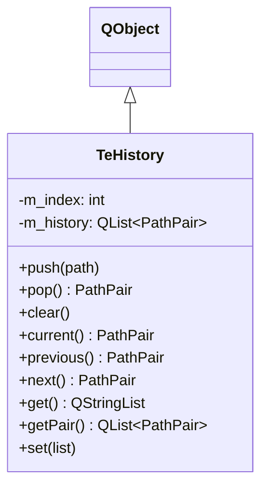

# TeHistory

## Overview

`TeHistory` は `TeFolderView` のナビゲーション履歴を管理します。  
（ルートパス, カレントパス）のペアをリストとカーソルインデックスで保持し、  
ブラウザの「戻る / 進む」に相当する操作を提供します。

---

## Class Definition



---

## PathPair

```cpp
using PathPair = std::pair<QString, QString>;  // (root path, current path)
```

ルートパスとカレントパスのペアです。`TeFolderView::setRootPath()` / `setCurrentPath()` に対応します。

---

## 履歴モデル

```
index:  0       1       2       3
        [A]  →  [B]  →  [C]  →  [D]
                                  ↑ cursor
```

- `push(E)` → `[D]` 以降が破棄されて `[A][B][C][D][E]` になり、カーソルが `[E]` を指す
- `previous()` → カーソルを一つ戻して `[D]` を返す
- `next()` → カーソルを一つ進めて `[E]` を返す

---

## Methods

| メソッド | 説明 |
|---|---|
| `push(path)` | 新エントリを追加してカーソルを進める。カーソルより後にある「未来」のエントリは破棄される |
| `pop()` | カーソル位置のエントリを取り出して返す |
| `clear()` | 全エントリを削除する |
| `current()` | カーソル位置のエントリを返す（移動なし） |
| `previous()` | カーソルを一つ後退させてエントリを返す。先頭の場合は空ペアを返す |
| `next()` | カーソルを一つ前進させてエントリを返す。末尾の場合は空ペアを返す |
| `get()` | 全カレントパス文字列を返す（デバッグ・永続化用） |
| `getPair()` | 全 `PathPair` を返す |
| `set(list)` | 履歴を `list` で置き換え、カーソルを先頭にリセットする |

---

## See Also

- [`TeFolderView`](../widgets/TeFolderView.md)
- [`TePathFolderView`](../widgets/TePathFolderView.md)
