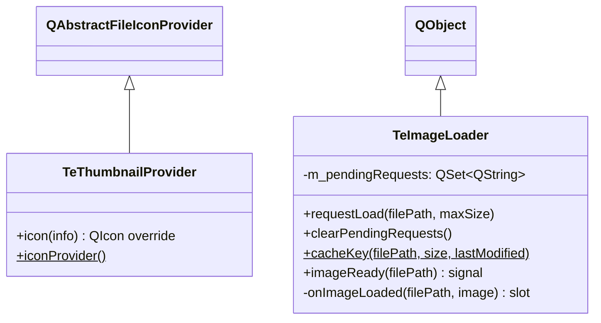

# TeImageLoader / TeThumbnailProvider

## Overview

`TeImageLoader` と `TeThumbnailProvider` は、ファイル一覧ビューでのサムネイル表示を担う2つのユーティリティクラスです。

- **`TeImageLoader`** — `QThreadPool` を介して非同期に画像をデコードし、完了時に `imageReady` シグナルを発行します。
- **`TeThumbnailProvider`** — Windows シェルのサムネイルキャッシュ（`IShellItemImageFactory`）から OS がキャッシュ済みのサムネイルを取得する `QAbstractFileIconProvider` サブクラスです。

---

## Class Definition



---

## TeImageLoader

### 責務

`requestLoad()` で `TeImageLoadTask` を `QThreadPool::globalInstance()` に投入します。  
タスク完了後、`onImageLoaded()` がキューイング接続で呼ばれ、`imageReady(filePath)` を発行します。

デコードされた `QImage` は `QPixmapCache` に `cacheKey()` をキーとして格納されるため、  
次回アクセス時はキャッシュから即座に取得できます。

### 重複リクエスト抑制

`m_pendingRequests` セットで同一パスへの重複リクエストを抑制します。  
ビューのスクロール中に大量のリクエストが来ても、未完のタスクは一つに絞られます。

### cacheKey()

```cpp
static QString cacheKey(const QString& filePath,
                         const QSize& size,
                         const QDateTime& lastModified);
```

（パス, サイズ, 更新日時）のトリプルから一意のキャッシュキー文字列を生成します。  
ファイルが更新されたとき（`lastModified` 変化）はキャッシュがヒットしないため、  
古いサムネイルが表示され続けることはありません。

### Methods

| メソッド | 説明 |
|---|---|
| `requestLoad(filePath, maxSize)` | 非同期デコードを要求する。既に未完タスクがある場合は無視する |
| `clearPendingRequests()` | 未完リクエストをすべてキャンセルする |
| `cacheKey(...)` | `QPixmapCache` 用のキー文字列を生成する（静的） |

### Signals

| シグナル | 説明 |
|---|---|
| `imageReady(filePath)` | デコード完了を通知する。受信側はキャッシュからピクセルマップを取得できる |

---

## TeThumbnailProvider

### 責務

`QFileSystemModel` に設定する `QAbstractFileIconProvider` の実装で、  
Windows シェルのサムネイルキャッシュ（`IShellItemImageFactory`）から既存キャッシュを取得します。  
キャッシュが存在しない場合はデフォルト実装のアイコンにフォールバックします。

> **注意**: OS が既にサムネイルをキャッシュしていない場合はシェルに生成を依頼しないため、
> 大量ファイルを一度に開いてもフリーズしません。

### iconProvider()

```cpp
static QAbstractFileIconProvider* iconProvider();
```

アプリ全体で共有するシングルトンインスタンスを返します。  
複数のモデルが同一インスタンスを共有することでリソースを節約します。

### Methods

| メソッド | 説明 |
|---|---|
| `icon(info)` | OS シェルキャッシュからサムネイルアイコンを返す |
| `iconProvider()` | 共有シングルトンを返す（静的） |

---

## 連携フロー

```
TeFileSortProxyModel::data(FilePixmap)
  → QPixmapCache::find(key) → ヒット: return cached pixmap
  → Miss: TeImageLoader::requestLoad()
      → QThreadPool
          → TeImageLoadTask::run() → QImage 読み込み
          → imageReady シグナル
  → TeFileSortProxyModel::onImageReady()
      → QPixmapCache::insert(key, pixmap)
      → dataChanged シグナル → ビュー再描画
```

---

## See Also

- [`TeFileSortProxyModel`](../widgets/TeFileSortProxyModel.md)
- [`TeDetailThumbnailSection`](../widgets/TeDetailSection.md)
