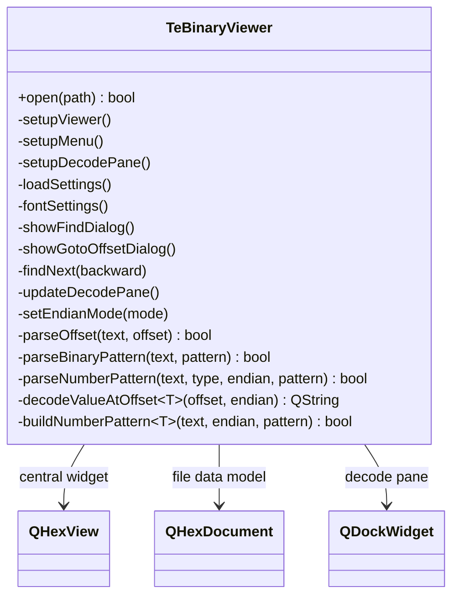
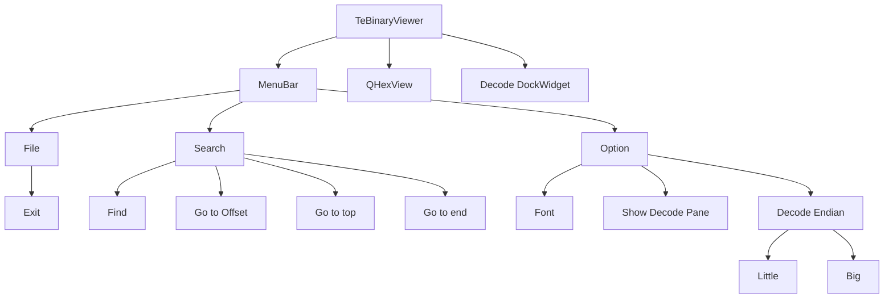
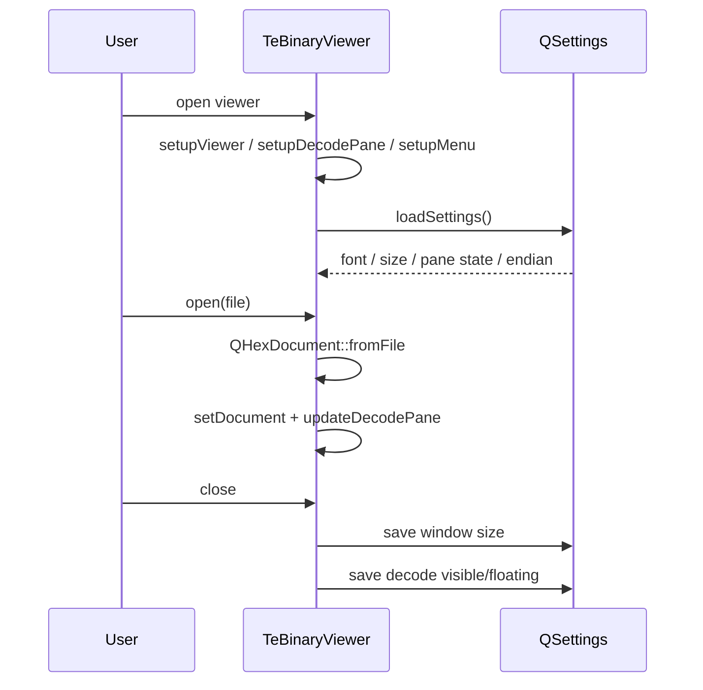

# TeBinaryViewer

## Overview

`TeBinaryViewer` はバイナリファイル閲覧用の `QMainWindow` です。  
`QHexView` を中心に据え、以下の機能を提供します。

| 機能 | 概要 |
|---|---|
| Hex 表示 | `QHexDocument` を読み込み、`QHexView` で16進表示 |
| 検索 | 文字列 / バイナリ(16進) / 数値 の3モード検索 |
| ジャンプ | オフセット指定移動、先頭/末尾移動 |
| 表示設定 | フォント設定、Decode pane 表示/非表示 |
| Decode pane | カーソル位置の値を `int8..uint64` でデコード表示 |
| 永続化 | ウィンドウサイズ、フォント、Decode pane 状態、エンディアン |

---

## Class Structure

---

## Window Layout

---

## Search Design

`showFindDialog()` で検索ダイアログを生成し、`findNext(backward)` で実検索を行います。

| モード | 入力 | 検索実装 | 備考 |
|---|---|---|---|
| Text | 任意文字列 | `QHexFindMode::Text` | Case sensitive オプション対応 |
| Binary | 16進バイト列 (`DE AD BE EF`) | `QHexFindMode::Hex` | 空白除去後、偶数桁・16進妥当性を検証 |
| Number | 10進数値 + 型選択 | `QHexFindMode::Hex` | 型(`int8`〜`uint64`)とエンディアンでバイト列化 |

検索方向は `Forward` / `Backward` をサポートし、現在選択範囲の前後から次ヒットを探索します。

---

## Goto Design

`showGotoOffsetDialog()` で入力されたオフセットを `parseOffset()` で解析します。

| 入力形式 | 例 | 基数 |
|---|---|---|
| 10進 | `1234` | 10 |
| 16進 | `0x4D2` | 16 |

解析後、範囲チェック (`0 <= offset < length`) を通過した場合のみカーソルを移動します。

---

## Decode Pane Design

Decode pane は `QDockWidget` で実装され、`setupDecodePane()` で生成されます。

| 項目 | 仕様 |
|---|---|
| 表示値 | `int8`, `uint8`, `int16`, `uint16`, `int32`, `uint32`, `int64`, `uint64` |
| 更新契機 | `QHexView::positionChanged` |
| レイアウト | 4行2列 (signed/unsigned 横並び) |
| 値表示UI | 入力欄風 (`StyledPanel` + `Sunken`) |
| 末尾不足時 | `N/A` を表示 |

### Endian Handling

`m_endianMode` に応じて `qFromLittleEndian` / `qFromBigEndian` で解釈します。  
1byte (`int8` / `uint8`) はエンディアンの影響を受けません。

---

## Settings Persistence

`QSettings` キーは `TeBinaryViewerSettings.h` に定義されています。

| キー | 内容 |
|---|---|
| `binary_viewer/layout/window_width` | メインウィンドウ幅 |
| `binary_viewer/layout/window_height` | メインウィンドウ高 |
| `binary_viewer/font/family` | 表示フォントファミリ |
| `binary_viewer/font/size` | 表示フォントサイズ |
| `binary_viewer/decode/pane_visible` | Decode pane 表示状態 |
| `binary_viewer/decode/pane_floating` | Decode pane の floating 状態 |
| `binary_viewer/decode/endian` | `little` / `big` |

---

## Startup / Close Flow

---

## Related Files

| ファイル | 役割 |
|---|---|
| `src/viewer/binary/TeBinaryViewer.h` | クラス宣言 |
| `src/viewer/binary/TeBinaryViewer.cpp` | 実装本体 |
| `src/viewer/binary/TeBinaryViewerSettings.h` | `QSettings` キー宣言 |
| `src/viewer/binary/TeBinaryViewerSettings.cpp` | `QSettings` キー定義 |
| `doc/markdown/13_viewer.md` | Viewer 全体概要 |
