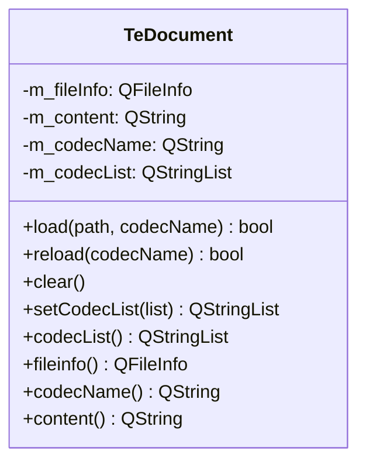

# TeDocument

## Overview

`TeDocument` はドキュメントビューアのデータモデルクラスです。  
ファイルの読み込み・文字コード変換・内容の保持を担い、  
`TeDocViewer` から参照されます。

---

## Class Definition

---

## Q_PROPERTY

| プロパティ | 型 | 説明 |
|---|---|---|
| `content` | `QString` | 現在読み込まれているファイルの全テキスト内容 |

`content` は `QWebEngineView` 経由で `TeMarkupPage` に渡され、マークアップレンダリングに使用されます。  
テキストモード（`TeTextView`）では直接 `setPlainText()` に渡されます。

---

## load() and reload()

`load(path, codecName)` の処理フロー：

1. ファイルを読み込み `m_fileInfo` に記録する
2. `codecName` が空の場合は `TeUtils::detectTextCodec()` で文字コードを自動検出する
3. `QTextCodec` でファイルバイト列を QString に変換して `m_content` に格納する
4. `codecName` が変更されていれば `codecChanged()` シグナルを発行する

`reload(codecName)` は既に読み込んだファイルを別の文字コードで再読み込みします。  
`load()` とほぼ同じ処理ですが、`m_fileInfo.filePath()` を再利用します。

---

## Codec List

`setCodecList(list)` でユーザーに提示する文字コード候補リストを設定します。  
リストが変更されると `codecListChanged()` シグナルが発行されます。  
`TeDocViewer` はこのシグナルを受けてコーデック選択 UI を更新します。

---

## Signals

| シグナル | タイミング |
|---|---|
| `codecChanged(codecName)` | `load()` / `reload()` で文字コードが変わったとき |
| `codecListChanged(list)` | `setCodecList()` でリストが変わったとき |
