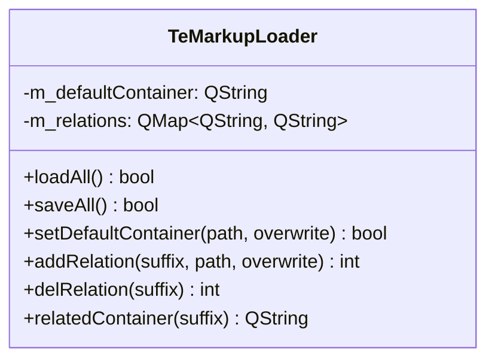

# TeMarkupLoader

## Overview

`TeMarkupLoader` はマークアップファイル（Markdown / HTML 等）を表示するための  
**コンテナ HTML テンプレートとファイル拡張子の対応関係** を管理するクラスです。

`TeDocViewer` がマークアップモードで開くとき、  
拡張子に対応するコンテナを `relatedContainer()` で取得し、  
`QWebEngineView` にそのコンテナを読み込みます。  
コンテナ HTML はコンテンツを表示するためのスタイルや JavaScript を含んでいます。

---

## Class Definition



---

## Container Architecture

マークアップビューでは以下の構成でファイルを表示します：

```
QWebEngineView
  └── コンテナ HTML（例: markdown_container.html）
        ├── JavaScript（Markdown パーサ等）
        ├── スタイルシート
        └── Qt WebChannel を通じて TeDocument.content を受け取り描画
```

コンテナ HTML は `support_package/` や設定ディレクトリに格納されます。

---

## Methods

| メソッド | 説明 |
|---|---|
| `loadAll()` | 設定ファイル（QSettings または JSON）から拡張子→コンテナのマッピングを読み込む |
| `saveAll()` | 現在のマッピングを設定ファイルに保存する |
| `setDefaultContainer(path, overwrite)` | デフォルトコンテナ（未対応拡張子に使うもの）を設定する。`overwrite=false` の場合、既に設定済みなら変更しない |
| `addRelation(suffix, path, overwrite)` | 拡張子（`.md` 等）とコンテナパスの対応を追加。成功した関連付け数を返す |
| `delRelation(suffix)` | 指定拡張子の対応を削除 |
| `relatedContainer(suffix)` | 拡張子に対応するコンテナパスを返す。対応がない場合はデフォルトコンテナを返す |

---

## Data Storage

マッピングは `m_relations: QMap<QString, QString>` に格納されます。

| キー | 値 |
|---|---|
| `.md` | `markdown_container.html` のパス |
| `.html` / `.htm` | `html_container.html` のパス |
| （デフォルト） | `m_defaultContainer` |

`loadAll()` / `saveAll()` でアプリ設定（QSettings）に永続化されます。

---

## Usage in TeDocViewer

```
1. TeDocViewer 起動時に mp_markupLoader->loadAll() を呼ぶ
2. ファイルを開く際に suffix = QFileInfo(path).suffix()
3. container = mp_markupLoader->relatedContainer(suffix)
4. container が空でなければ QWebEngineView にコンテナをロード
5. Qt WebChannel 経由で TeDocument.content をコンテナに送信して描画
```
