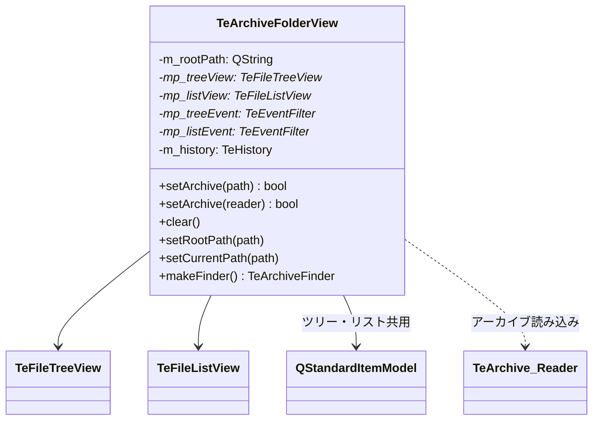

# TeArchiveFolderView

## Overview

`TeArchiveFolderView` はアーカイブファイル（ZIP / 7zip / tar 等）の内部を、  
ファイルシステムと同様のツリービュー + リストビューの構成で閲覧するビューです。

`TeFileFolderView` と同じ `TeFolderView` インタフェースを実装しているため、  
コマンド側からはファイルシステムビューと区別なく操作できます。

---

## Internal Structure

---

## Model Design: QStandardItemModel

`TeFileFolderView` が `QFileSystemModel` を使うのに対し、  
`TeArchiveFolderView` は `QStandardItemModel` を使用します。  
アーカイブはファイルシステムではないため、Qt 標準のファイルシステムモデルを利用できないためです。

アーカイブ読み込み時に `TeArchive::Reader` の全エントリを走査し、  
`internalAddEntry()` / `internalAddDirEntry()` で `QStandardItemModel` に手動でアイテムを構築します。

---

## Path Representation

アーカイブ内のパスは以下の URI 形式で表現されます：

| URI プレフィックス | 定数 | 用途 |
|---|---|---|
| `ar_read:` | `URI_READ` | 読み取り専用でアーカイブを開いた場合 |
| `ar_write:` | `URI_WRITE` | 書き込み可能でアーカイブを開いた場合 |

例: `ar_read:/path/to/archive.zip`

`rootPath()` は上記 URI 付きのアーカイブパスを返します。  
`currentPath()` は現在表示中のアーカイブ内ディレクトリを返します。

---

## Tree Structure Building

アーカイブのエントリを `QStandardItemModel` のツリーに展開する処理：

1. `TeArchive::Reader::open()` でアーカイブを開く
2. 全エントリを走査し、`internalAddEntry()` でファイルエントリを追加
3. 親ディレクトリが未作成の場合は `mkpath()` で再帰的に作成
4. `findChild()` で既存ノードを探してから、なければ追加する

### Item Sort Order

`TeArchiveFolderView` は `QStandardItem` を継承した `TeStandardFileItem` を使用します。  
`operator<` をオーバーライドし、以下の優先順位でソートします：

1. `ROLE_TYPE`（ディレクトリ > ファイル > 親ディレクトリ）
2. 同じ種別の場合はデフォルトの `sortRole` の値で比較

---

## Navigation

アーカイブビューの「移動」はアーカイブ内のディレクトリ移動です。  
`updatePath()` が現在表示パスを更新し、`m_history` に履歴を積みます。  
前後移動は `TeFileFolderView` と同様に `TeHistory` で管理されます。

---

## Item Activation

`itemActivated()` スロットはユーザーがアイテムをダブルクリックしたときに呼ばれます。

- ディレクトリの場合 → `setCurrentPath()` でそのディレクトリに移動
- ファイルの場合 → `TeFileInfoAcsr::activate()` を呼んでアクションを実行（展開・表示等）
