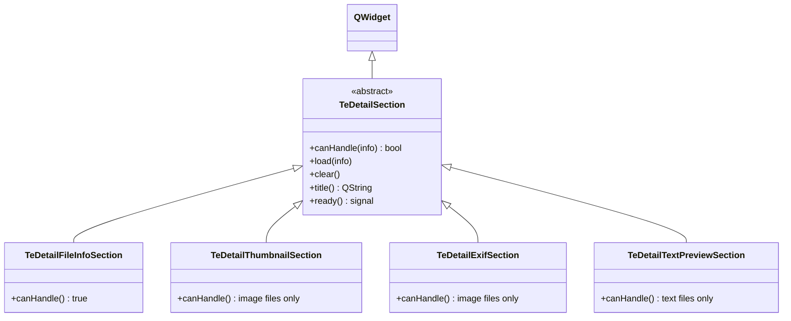

# TeDetailSection（詳細パネルセクション群）

## Overview

`TeDetailSection` は `TeDetailView` に格納される情報ブロックの **抽象基底クラス** です。  
各具体サブクラスがファイル種別ごとに特化したメタデータ表示を担います。

---

## Class Hierarchy



---

## TeDetailSection（抽象基底）

### インタフェース

| メソッド | 説明 |
|---|---|
| `canHandle(info)` | このセクションが `info` に対して表示可能なコンテンツを持つか判定する |
| `load(info)` | `info` のメタデータをウィジェットに設定する。非同期実装では完了後 `ready()` を発行する |
| `clear()` | 表示内容をクリアする |
| `title()` | 折りたたみヘッダーに表示するセクション名を返す |

### Signals

| シグナル | 説明 |
|---|---|
| `ready()` | 非同期ロードが完了し、コンテンツが表示可能になったことを通知する |

---

## TeDetailFileInfoSection

### 概要

すべてのファイルに対して基本的なファイルシステム情報を同期表示します。

### 表示内容

| フィールド | 内容 |
|---|---|
| **Name** | ファイル名 |
| **Type** | MIME タイプ / 拡張子 |
| **Size** | ファイルサイズ（KB/MB 単位に整形） |
| **Modified** | 最終更新日時（`QLocale::ShortFormat`） |
| **Path** | 絶対パス |

- ラベル（Name/Type/Size/Modified/Path）は太字で表示されます
- `canHandle()` は常に `true` を返します
- `load()` は同期的で `ready()` シグナルは発行しません

---

## TeDetailThumbnailSection

### 概要

画像ファイルの 192×192 px サムネイルをパネル最上部に表示します。

### 表示フロー

```
load(info)
  │
  ├─ QPixmapCache::find(key) → ヒット: 即時表示
  │
  ├─ miss: OS アイコン（TeThumbnailProvider）をプレースホルダ表示
  │
  └─ TeImageLoader::requestLoad() → 非同期デコード
        onImageReady() → QPixmapCache → ラベル更新 → ready()
```

- `canHandle()`: `QImageReader::imageFormat()` が空でない場合に `true`
- サムネイルサイズ: `192 × 192` px（`kThumbSize` 定数）
- 縦横比を保持してスケールします

---

## TeDetailExifSection

### 概要

JPEG などの画像ファイルから EXIF / メタデータを非同期で取得してフォームレイアウトで表示します。

### 表示するフィールド

Width / Height / Make / Model / Orientation / DateTime / DateTimeOriginal / ExposureTime / FNumber / ISO / FocalLength / PixelXDimension / PixelYDimension

データが存在するフィールドのみ表示し、存在しないフィールドは非表示になります。

### 非同期処理

```
load(info)
  └─ TeExifReaderTask を QThreadPool に投入
        → TeExifReader::read() （バックグラウンドスレッド）
        → exifReady シグナル（Qt::QueuedConnection）
        → onExifReady() → フォーム更新 → ready()
```

### ストラテジー差し替え

```cpp
// デフォルト: TeQImageExifReader
// exiv2 バックエンドに切り替える例
section->setExifReader(std::make_unique<Exiv2ExifReader>());
```

- `canHandle()`: `QImageReader::imageFormat()` が空でない場合に `true`

---

## TeDetailTextPreviewSection

### 概要

テキストファイルの先頭 20 行を `QPlainTextEdit` にプレビュー表示します。

### エンコーディング自動検出

`detectTextCodec()` で以下のコーデックを順に試みます：

1. UTF-8
2. EUC-JP
3. Shift_JIS
4. ISO-2022-JP
5. UTF-16LE
6. UTF-16BE

### 非同期処理

```
load(info)
  └─ TeTextPreviewTask を QThreadPool に投入
        → ファイル先頭 16 KB を読み込み
        → detectTextCodec() でコーデック検出
        → 先頭 20 行を抽出
        → previewReady シグナル（Qt::QueuedConnection）
        → onPreviewReady() → QPlainTextEdit 更新 → ready()
```

- `canHandle()`: `getFileType() == TE_FILE_TEXT` の場合に `true`
- 最大読み込みサイズ: 16 KB（`kMaxBytes`）
- 最大表示行数: 20 行（`kMaxLines`）

---

## See Also

- [`TeDetailView`](TeDetailView.md) — セクションを管理するコンテナ
- [`TeExifReader`](../utils/TeExifReader.md)
- [`TeImageLoader`](../utils/TeImageLoader.md)
- [`TeUtils`](../utils/TeUtils.md) — `detectTextCodec()`, `getFileType()`
