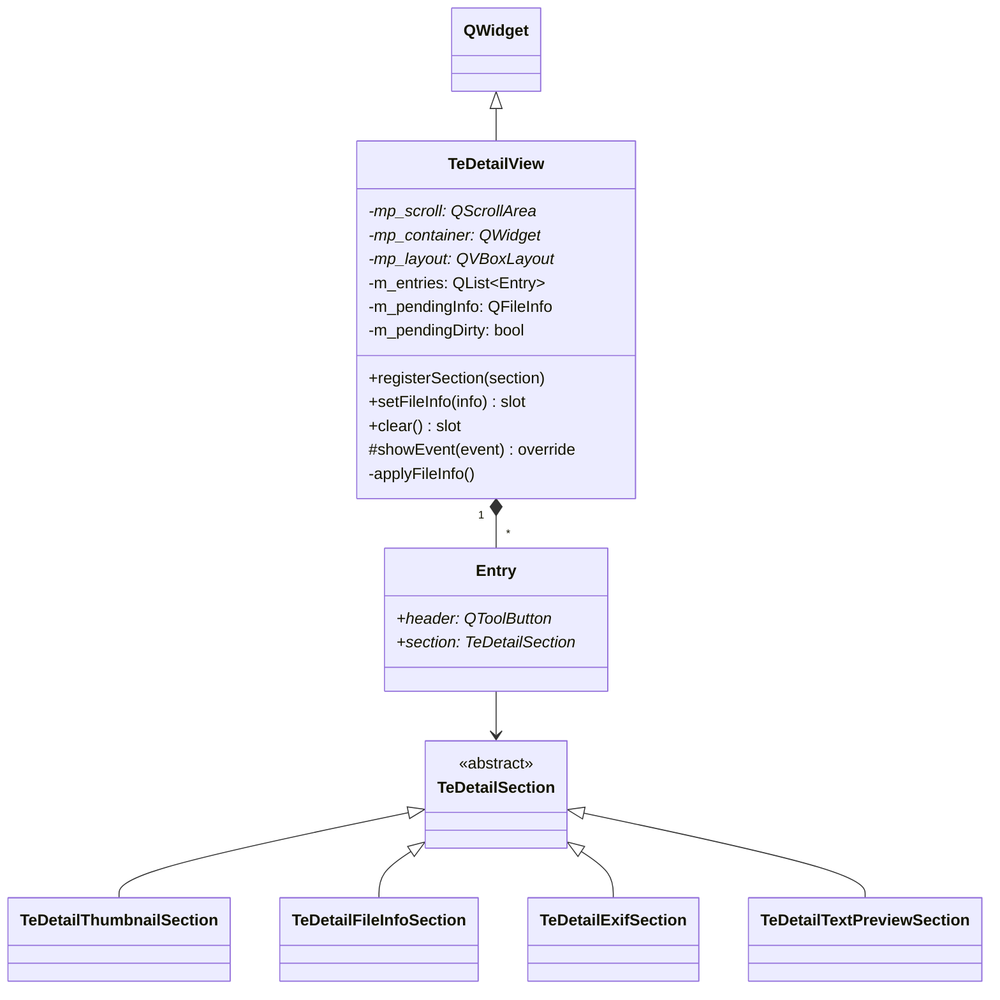

# TeDetailView

## Overview

`TeDetailView` は現在選択中のファイルのメタデータを表示する **右ペインの詳細パネル** です。  
`QScrollArea` の中に複数の `TeDetailSection` を縦積みし、それぞれを折りたたみ可能なヘッダーで制御します。  
セクションは `registerSection()` で追加でき、ファイルの種別に応じて表示/非表示が切り替わります。

**遅延ロード**: パネルが非表示の間はファイル情報の収集を行いません。表示状態に遷移した時点で未処理のリクエストを実行します。

---

## Class Definition



---

## 推奨セクション登録順

`TeViewStore::initialize()` での登録順序です：

| 順序 | クラス | 役割 |
|---|---|---|
| 1 | `TeDetailThumbnailSection` | サムネイル（192×192px） |
| 2 | `TeDetailFileInfoSection` | 基本ファイル情報 |
| 3 | `TeDetailExifSection` | EXIF / 画像メタデータ |
| 4 | `TeDetailTextPreviewSection` | テキストプレビュー（先頭20行） |

---

## Methods / Slots

| メソッド | 説明 |
|---|---|
| `registerSection(section)` | セクションをパネルに追加する。`TeDetailView` が所有権を取得する |
| `setFileInfo(info)` | 表示対象ファイルを更新する。非表示時は情報を保持するのみ |
| `clear()` | 全セクションをクリアしてペンディング状態をリセットする |

---

## 遅延ロード設計

```
setFileInfo(info)
  │
  ├─ m_pendingInfo ← info
  ├─ m_pendingDirty ← true
  │
  └─ isVisible() ?
      YES → applyFileInfo()    ← 即時ロード
      NO  → return             ← showEvent() まで保留

showEvent(event)
  │
  └─ m_pendingDirty ?
      YES → applyFileInfo()    ← 表示タイミングでロード
      NO  → return
```

`applyFileInfo()` は各セクションの `canHandle()` を評価し、true のセクションのみ `load()` を呼びます。

---

## ヘッダー折りたたみ

各セクションの上部には `QToolButton`（チェッカブル）のヘッダーが配置されます：
- **チェック ON（展開）**: セクションウィジェットを表示する
- **チェック OFF（折りたたみ）**: セクションウィジェットを非表示にする
- ヘッダーには矢印インジケーターとセクションタイトルが表示される

---

## TeViewStore との統合

```cpp
// TeViewStore::initialize()
mp_detailView = new TeDetailView(mp_mainWindow);
mp_detailView->registerSection(new TeDetailThumbnailSection);
mp_detailView->registerSection(new TeDetailFileInfoSection);
mp_detailView->registerSection(new TeDetailExifSection);
mp_detailView->registerSection(new TeDetailTextPreviewSection);
mp_split->addWidget(mp_detailView);
mp_detailView->hide();  // デフォルト非表示

// TeViewStore::createFolderView()
connect(folderView, &TeFolderView::currentFileChanged,
        mp_detailView, &TeDetailView::setFileInfo);
```

---

## See Also

- [`TeDetailSection`](TeDetailSection.md) — 各セクションの詳細
- [`TeFolderView`](TeFolderView.md) — `currentFileChanged` シグナル
- [05_viewstore.md](../05_viewstore.md) — レイアウト内の位置づけ
