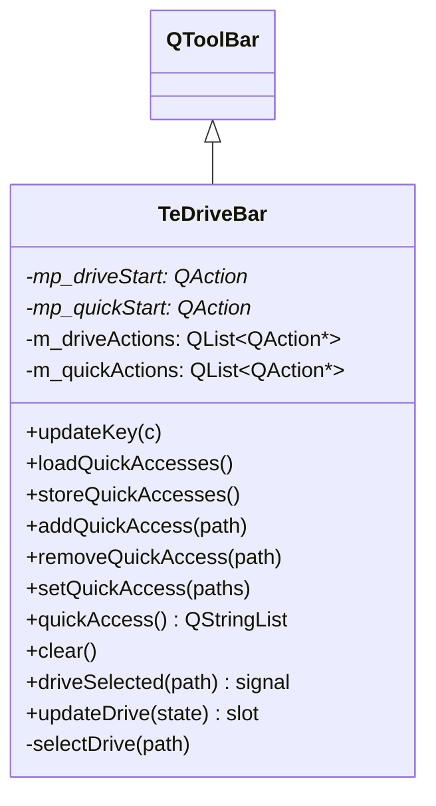

# TeDriveBar

## Overview

`TeDriveBar` はローカルドライブとユーザー定義のクイックアクセスパスをクリッカブルなボタンとして一覧表示する `QToolBar` サブクラスです。  
ユーザーがボタンをクリックすると `driveSelected` シグナルが発行され、アクティブなフォルダービューが対応パスへ移動します。

---

## Class Definition



---

## ツールバー構成

ツールバーは2つのセクションで構成され、セパレーター（`mp_driveStart`, `mp_quickStart`）で区切られます：

```
[ C: ] [ D: ] [ E: ]  |  [ /home/user/Documents ] [ /home/user/Pictures ]
  ↑ ドライブセクション       ↑ クイックアクセスセクション
```

---

## Methods

| メソッド | 説明 |
|---|---|
| `updateKey(c)` | ドライブ文字 `c` に対応するドライブボタンを更新する |
| `loadQuickAccesses()` | `QSettings` からクイックアクセスリストを読み込んでボタンを再構築する |
| `storeQuickAccesses()` | 現在のクイックアクセスリストを `QSettings` に保存する |
| `addQuickAccess(path)` | `path` をクイックアクセスリストの末尾に追加する |
| `removeQuickAccess(path)` | `path` をクイックアクセスリストから削除する |
| `setQuickAccess(paths)` | クイックアクセスリスト全体を `paths` で置き換える |
| `quickAccess()` | 現在のクイックアクセスリストを返す |
| `clear()` | 全ボタン（ドライブ + クイックアクセス）を削除する |

---

## Signals / Slots

| シグナル / スロット | 説明 |
|---|---|
| `driveSelected(path)` signal | ユーザーがドライブまたはクイックアクセスボタンをクリックした際に発行 |
| `updateDrive(state)` slot | 利用可能なドライブ一覧を再スキャンしてドライブセクションを再構築する |

`updateDrive()` は `QFileSystemWatcher::directoryChanged` シグナルと接続することで、  
USB ドライブのマウント/アンマウントを自動検知できます。

---

## 接続例

```cpp
// TeViewStore::initialize() での接続イメージ
connect(mp_driveBar, &TeDriveBar::driveSelected,
        this, [this](const QString& path) {
            if (auto* view = currentFolderView())
                view->setCurrentPath(path);
        });
```

---

## See Also

- [`TeFolderView`](TeFolderView.md)
- [`TeFavorites`](../utils/TeFavorites.md)
