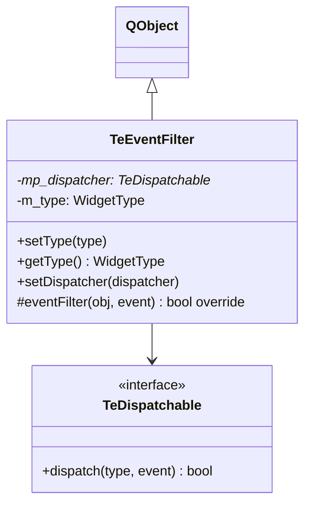

# TeEventFilter

## Overview

`TeEventFilter` は `QAbstractItemView`（`TeFileTreeView` / `TeFileListView`）に `installEventFilter()` でインストールされるイベントフィルタです。  
ウィジェットに届いたイベントを受け取り、対応する `TeDispatchable` にディスパッチします。  
各インスタンスには `setType()` でウィジェット種別タグ（`TeTypes::WidgetType`）が設定され、  
フォワードされるすべてのイベントにそのタグが付与されます。

---

## Class Definition



---

## 責務

1. ウィジェット上で発生したキーイベント等を捕捉する
2. `m_type` を使ってウィジェット種別を特定する
3. `mp_dispatcher->dispatch(m_type, event)` を呼び出してコマンドディスパッチチェーンに乗せる
4. `eventFilter()` は常に `false` を返し、イベントをウィジェット本体にも渡す

---

## Methods

| メソッド | 説明 |
|---|---|
| `setType(type)` | このフィルタが監視するウィジェットの種別タグを設定する |
| `getType()` | 設定されたウィジェット種別タグを返す |
| `setDispatcher(dispatcher)` | イベントをフォワードする `TeDispatchable` を設定する |

---

## ウィジェット種別タグ（TeTypes::WidgetType）

| 値 | 対象ウィジェット |
|---|---|
| `WIDGET_TREE` | `TeFileTreeView`（左ペインツリー） |
| `WIDGET_LIST` | `TeFileListView`（右ペインリスト） |

`TeFolderView` がコンストラクタで2つの `TeEventFilter` インスタンスを生成し、  
それぞれ `WIDGET_TREE` と `WIDGET_LIST` を設定してから対応するビューに `installEventFilter()` します。

---

## イベントフローの概要

```
[ユーザー操作]
    ↓ キーイベント等
[TeFileTreeView / TeFileListView]
    ↓ installEventFilter
[TeEventFilter::eventFilter()]
    ↓ dispatch(WIDGET_TREE, event)
[TeFolderView::dispatch()]
    ↓ isDispatchable() でフィルタリング
[TeDispatcher::dispatch()]
    ↓ コマンドルックアップ
[コマンド実行]
```

---

## See Also

- [`TeFolderView`](TeFolderView.md) — フィルタのオーナー
- [06_dispatcher_command.md](../06_dispatcher_command.md) — ディスパッチャーの設計
