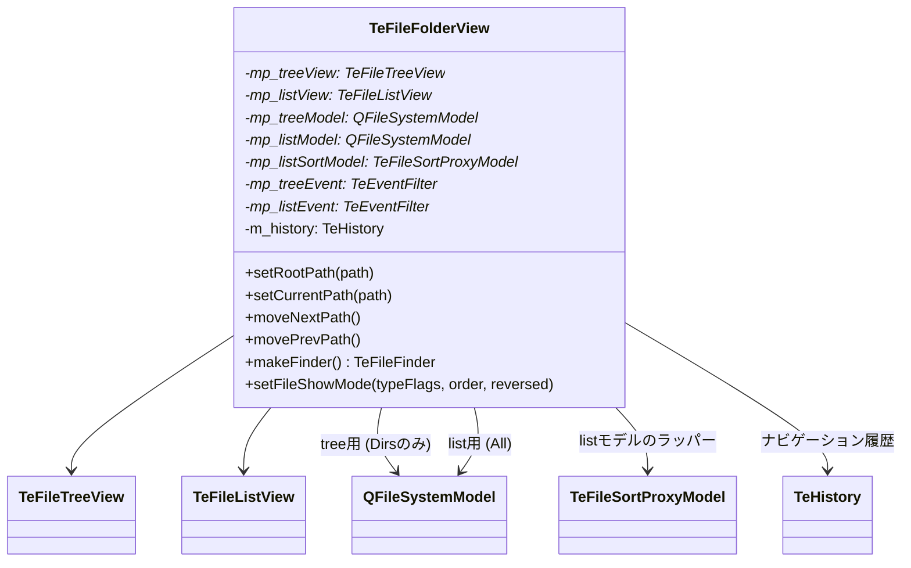

# TeFileFolderView

## Overview

`TeFileFolderView` は通常のファイルシステムを表示する `TeFolderView` の具体実装です。  
Qt の `QFileSystemModel` を 2 つ（ツリー用 / リスト用）保持し、  
`TeFileSortProxyModel` でソートとフィルタリングを行います。

---

## Internal Structure

---

## Two QFileSystemModel Design

`TeFileFolderView` はツリービューとリストビューに **別々の** `QFileSystemModel` を使用します。

| モデル | フィルタ | 用途 |
|---|---|---|
| `mp_treeModel` | `QDir::Dirs \| QDir::NoDotAndDotDot` | ディレクトリのみ表示するツリービュー用 |
| `mp_listModel` | `QDir::Drives \| QDir::AllDirs \| QDir::Files \| QDir::NoDot` | ファイルとフォルダを表示するリストビュー用 |

モデルを分ける理由：
- ツリービューはディレクトリ構造のナビゲーション専用であり、ファイルを表示する必要がない
- リストビューはファイルとフォルダの両方を表示する必要がある
- 1 つのモデルを共有すると片方のフィルタ変更がもう片方に影響する

`mp_listModel` の上に `TeFileSortProxyModel` を重ね、ソート基準・ファイル種別フィルタを適用します。

---

## Navigation and History

移動履歴は `TeHistory` が管理します。  
`TeHistory` は `(rootPath, currentPath)` のペアを保持します。

- `setRootPath()` / `setCurrentPath()` → `updatePath()` を呼び、内部で履歴を更新
- `movePrevPath()` → `m_history.previous()` を呼んで前の状態に戻る
- `moveNextPath()` → `m_history.next()` を呼んで次の状態に進む

---

## Context Menu

`TeFileFolderView` はツリービュー / リストビューの右クリックに応じてコンテキストメニューを表示します。

| メニュー種別 | 表示条件 | 内容 |
|---|---|---|
| システムコンテキストメニュー | 通常の右クリック | OS のネイティブコンテキストメニュー（`platform_util.h` の `showFilesContext()` を使用） |
| ユーザーコンテキストメニュー | `TeSettings` のメニュー設定を参照 | `TeCommandFactory` のメニュー定義に基づいたカスタムメニュー |

---

## File Show Mode

`setFileShowMode(typeFlags, order, reversed)` を `TeViewStore` からのシグナルで受信し、  
`TeFileSortProxyModel` のフィルタ条件とソート順を更新します。

| パラメータ | 説明 |
|---|---|
| `typeFlags` | 表示するファイル種別（隠しファイル / システムファイル） |
| `order` | ソート基準（名前 / サイズ / 拡張子 / 更新日時） |
| `reversed` | ソートの昇順 / 降順 |
