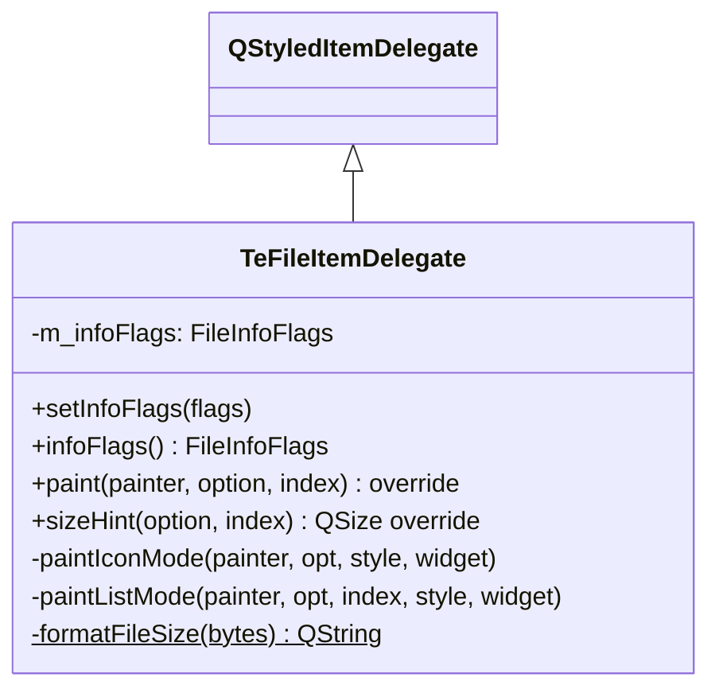

# TeFileItemDelegate

## Overview

`TeFileItemDelegate` は `TeFileListView` でファイルアイテムを描画する `QStyledItemDelegate` サブクラスです。  
アイコンモード（大アイコン + ファイル名）とリスト/詳細モード（小アイコン + 属性カラム）の2つのレイアウトを提供します。  
アクティブな属性カラム（サイズ・日時等）は `setInfoFlags()` で制御します。

---

## Class Definition



---

## 描画モード

`QListView::ViewMode` に連動して描画ロジックが切り替わります：

| ViewMode | 描画メソッド | レイアウト |
|---|---|---|
| `QListView::IconMode` | `paintIconMode()` | 大アイコン + ファイル名（折り返しあり） |
| `QListView::ListMode` | `paintListMode()` | 小アイコン + ファイル名 + 属性カラム |

---

## InfoFlags（属性カラム制御）

`TeTypes::FileInfoFlags` のビットマスクで表示する属性カラムを制御します：

| フラグ | 表示内容 |
|---|---|
| `FILEINFO_NONE` | ファイル名のみ |
| `FILEINFO_SIZE` | ファイルサイズ |
| `FILEINFO_DATE` | 最終更新日時 |
| `FILEINFO_TYPE` | ファイル種別 |
| `FILEINFO_ATTR` | ファイル属性 |

---

## Methods

| メソッド | 説明 |
|---|---|
| `setInfoFlags(flags)` | 詳細モードで表示する属性カラムのビットマスクを設定する |
| `infoFlags()` | 現在の属性フラグを返す |
| `paint(...)` | アイコンモードまたはリストモードで描画する。状態装飾（選択ハイライト等）は QStyle に委ねる |
| `sizeHint(...)` | アイテムセルの推奨サイズを返す |

---

## formatFileSize()（内部）

```cpp
static QString formatFileSize(qint64 bytes);
```

バイト数を人間が読みやすい形式（例: `1.2 MB`、`512 KB`）に変換します。

---

## See Also

- [`TeFileListView`](TeFileListView.md)
- [`TeFileSortProxyModel`](TeFileSortProxyModel.md)
