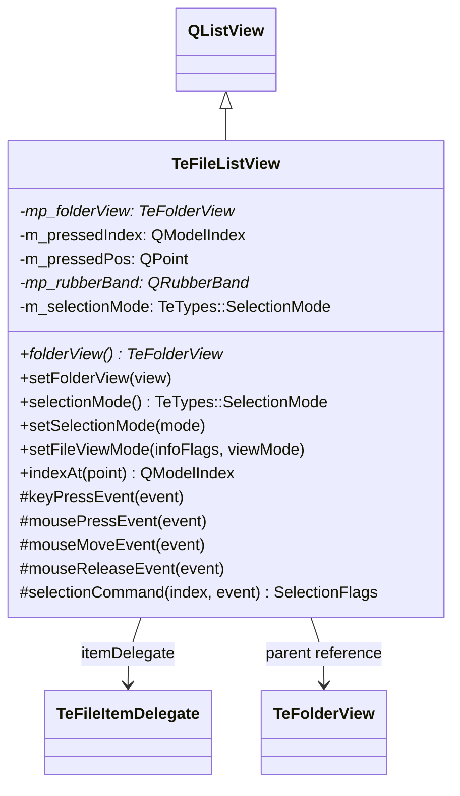
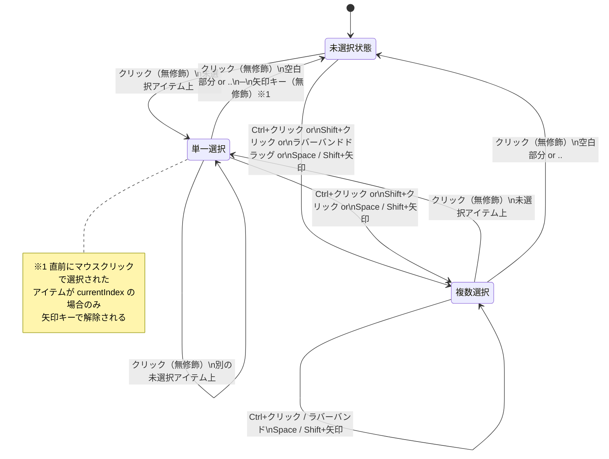

# TeFileListView

## Overview

`TeFileListView` はファイル一覧を表示する `QListView` の派生クラスです。  
`TeFolderView` の右ペインとして使用され、アイコン表示・詳細リスト表示の両形式をサポートします。

特徴的な機能として **TableEngine 選択モード** を実装しており、  
カーソル移動と選択状態を完全に分離した、ファイラ特化の操作体系を提供します。

---

## Class Definition



---

## Selection Modes

`TeTypes::SelectionMode` によって選択方式を切り替えます。

| モード | 値 | 概要 |
|---|---|---|
| `SELECTION_NONE` | 0 | 選択不可。`QAbstractItemView::NoSelection` に設定。 |
| `SELECTION_EXPLORER` | 1 | Windows エクスプローラ互換。`QAbstractItemView::ExtendedSelection` に設定し、Qt 標準の選択動作に委譲。 |
| `SELECTION_TABLE_ENGINE` | 2 | TableEngine 独自選択モード。`QAbstractItemView::NoSelection` に設定しつつ、独自のイベントハンドラで選択を制御。 |

切り替えは `setSelectionMode()` スロット経由で行います。  
コマンド `CMDID_SYSTEM_EDIT_SELECTION_STYLE_EXPLORER` / `CMDID_SYSTEM_EDIT_SELECTION_STYLE_TABLEENGINE` で  
ユーザーがリアルタイムに切り替えられます。

---

## TableEngine 選択モード — 詳細仕様

### 設計方針

Explorer 互換モードとの最大の違いは **カーソル位置と選択状態の分離** です。

| 操作 | Explorer モード | TableEngine モード |
|---|---|---|
| 矢印キー | カーソル移動＋選択変更 | カーソル移動のみ（選択は変わらない） |
| Space キー | 未使用 | 現在アイテムの選択トグル＋カーソル前進 |
| Shift+矢印 | 範囲選択 | カーソル移動元のアイテムをトグル |
| クリック（無修飾） | そのアイテムのみ選択 | そのアイテムのみ選択（同様） |
| 選択済みアイテムクリック | 何もしない（維持） | 選択を維持（ラバーバンド開始しない） |
| ドラッグ | 範囲選択 | ラバーバンド内アイテムをトグル |

この設計により、ファイラ操作で一般的な「矢印キーで一覧を眺めながら、Space や Ctrl+クリックで複数選択」という  
ワークフローを自然に実現します。

---

### メンバ変数の役割

| 変数 | 型 | 役割 |
|---|---|---|
| `m_pressedIndex` | `QModelIndex` | マウスで最後にクリックした（未選択）アイテムのインデックス。選択状態の二重適用防止と、矢印キーの単一選択解除判定に使用。 |
| `m_pressedPos` | `QPoint` | ラバーバンド開始座標（スクロールオフセット込みの絶対座標）。 |
| `mp_rubberBand` | `QRubberBand*` | ドラッグ選択の矩形表示。 |

`m_pressedIndex` は以下のタイミングでリセット（`QModelIndex()`）されます：

- 選択済みアイテムをクリックしたとき（ラバーバンド開始しない）
- 矢印 / Space / その他ほぼすべてのキー押下時（Shift / Ctrl / Alt を除く）

---

### マウスアクション仕様

#### mousePressEvent（`selectionCommand` 経由の動作を含む）

`selectionCommand()` は `QAbstractItemView` の選択フラグを決定する仮想関数であり、  
実際の選択変更はここが返す `QItemSelectionModel::SelectionFlags` によって実行されます。

| 操作 | クリック対象 | 選択変化 | `m_pressedIndex` |
|---|---|---|---|
| 無修飾クリック | 未選択アイテム | そのアイテムのみ選択（既存選択は全解除） | そのアイテムに設定 |
| 無修飾クリック | 選択済みアイテム | 変化なし（維持） | `QModelIndex()`（ラバーバンドなし） |
| 無修飾クリック | 空白部分 / `..` | 全選択解除 | そのまま |
| Ctrl+クリック | 任意アイテム | そのアイテムの選択をトグル | そのアイテムに設定 |
| Shift+クリック | 有効アイテム | そのアイテムを選択に追加（SelectCurrent） | そのアイテムに設定 |
| Shift+クリック | 空白部分 | 変化なし（Select フラグのみ） | そのまま |

> **`..` エントリ保護**：`..`（親ディレクトリ参照）は決して選択状態にならないよう、  
> `mousePressEvent` および `mouseReleaseEvent` の末尾で強制的に `Deselect` されます。

#### mouseMoveEvent（ラバーバンドドラッグ）

`m_pressedIndex` に有効なインデックスが設定されているとき（未選択アイテムを押した場合）、  
`isSelectionRectVisible()` が真であればラバーバンドを表示します。

ドラッグ中、ラバーバンド矩形内に入ったアイテムに対して `selectionCommand` が呼ばれます：

| 修飾キー | 選択変化 |
|---|---|
| なし | ラバーバンド内アイテムをトグル（`ToggleCurrent`） |
| Shift | ラバーバンド内アイテムを選択に追加（`SelectCurrent`） |

#### mouseReleaseEvent

ラバーバンドを非表示にします。  
`..` エントリの強制解除を再実行します。

---

### キーアクション仕様

以下は `SELECTION_TABLE_ENGINE` モード時の動作です。  
`QListView::keyPressEvent` を呼ぶ前後でカスタム処理を追加しています。

#### 矢印キー（Up / Down / Left / Right）

```
[QListView::keyPressEvent の呼び出し前]
  if Shift 修飾のみ:
    if m_pressedIndex ≠ currentIndex:
      → currentIndex の選択をトグル（Toggle）
  else (Ctrl または無修飾):
    if m_pressedIndex == currentIndex
       AND currentIndex が選択済み
       AND 選択数 == 1:
      → currentIndex の選択をトグル（解除）
  m_pressedIndex をリセット（QModelIndex()）

[QListView::keyPressEvent]
  → カーソルを方向に移動

[QListView::keyPressEvent の呼び出し後]
  → 何もしない（矢印キーは選択に関して追加処理なし）
```

**各ケースの選択変化まとめ：**

| 操作 | 移動元アイテムの状態 | 条件 | 移動元の変化 | 移動先の変化 |
|---|---|---|---|---|
| 矢印（無修飾） | 未選択 | — | なし | なし |
| 矢印（無修飾） | 選択済み・複数選択の一部 | — | なし | なし |
| 矢印（無修飾） | 唯一の選択済みアイテム、かつ直前にマウスクリック | m_pressedIndex == currentIndex | **解除** | なし |
| Shift+矢印 | どの状態でも | m_pressedIndex ≠ currentIndex（通常は常に真） | **トグル** | なし |
| Ctrl+矢印 | — | — | なし | なし |

> **矢印単独での選択移動は発生しません。**  
> カーソルは選択状態とは独立して移動します。

**Shift+矢印の連続操作例（全て未選択の状態から）：**

```
初期: カーソル = C（未選択）, 選択なし

Shift+Down: C をトグル → C が選択される, カーソル → D
Shift+Down: D をトグル → D が選択される, カーソル → E
Shift+Down: E をトグル → E が選択される, カーソル → F

→ C, D, E が選択済み, カーソルは F
```

**Shift+矢印の戻り操作（既に選択済みのアイテムを通る場合）：**

```
初期: C, D, E が選択済み, カーソル = F（未選択）

Shift+Up: F をトグル → F が選択される, カーソル → E
Shift+Up: E をトグル → E が解除される, カーソル → D
Shift+Up: D をトグル → D が解除される, カーソル → C

→ C, F が選択済み
```

> Shift+矢印は「移動元アイテムのトグル」であるため、同じ位置を行き来すると ON/OFF が切り替わります。

---

#### Space キー

```
[QListView::keyPressEvent の呼び出し前]
  if m_pressedIndex ≠ currentIndex:
    → currentIndex の選択をトグル
  m_pressedIndex をリセット（QModelIndex()）

[QListView::keyPressEvent]
  → QListView のデフォルト処理（NoSelection モードのため選択変化なし）

[QListView::keyPressEvent の呼び出し後]
  if 無修飾 or Ctrl:
    → currentIndex を row+1 に移動（選択変化なし）
  if Shift:
    → currentIndex を row-1 に移動（選択変化なし）
```

**Space キーの動作まとめ：**

| 操作 | 現在アイテムの変化 | カーソルの移動 |
|---|---|---|
| Space（無修飾） | 選択をトグル | 1つ前進（下へ） |
| Shift+Space | 選択をトグル | 1つ後退（上へ） |

**Space キーによる連続選択の例：**

```
初期: カーソル = A（未選択）, 選択なし

Space: A をトグル → A 選択, カーソル → B
Space: B をトグル → B 選択, カーソル → C
Space: C をトグル → C 選択, カーソル → D

→ A, B, C が選択済み, カーソルは D
```

**Space キーによる選択解除の例：**

```
初期: A, B, C が選択済み, カーソル = A

Space: A をトグル → A 解除, カーソル → B
Space: B をトグル → B 解除, カーソル → C
Space: C をトグル → C 解除, カーソル → D

→ 選択なし
```

---

#### その他のキー

| キー | 動作 |
|---|---|
| Shift / Ctrl / Alt 単独 | `m_pressedIndex` をリセットしない（修飾キーとして次のキー入力へ持越し） |
| その他すべてのキー | `m_pressedIndex` をリセット後、`QListView::keyPressEvent` に委譲 |

---

### 選択状態遷移の全体図



---

## `indexAt()` のマージン処理

標準 `QListView::indexAt()` はアイテムの矩形領域全体をヒット判定に使用しますが、  
`TeFileListView` ではアイテム間の空白でも「アイテム外クリック」と判定できるよう、  
内側に 2px ずつ縮小した矩形を使用しています。

```cpp
QRect rect = visualRect(index);
rect.adjust(2, 2, -2, -2);  // 上下左右に 2px のマージン
if (!rect.contains(point)) {
    return QModelIndex();    // アイテム外扱い
}
```

これにより、アイテムが密接している場合でも空白領域クリックで  
「全選択解除」が発動しやすくなります。

---

## View Modes

`setFileViewMode(infoFlags, viewMode)` で表示形式を切り替えます。  
`TeTypes::FileViewMode` の各値に対する `QListView` 設定：

| FileViewMode | ViewMode | Flow | アイコンサイズ | 折り返し |
|---|---|---|---|---|
| `FILEVIEW_SMALL_ICON` | ListMode | TopToBottom | なし | あり |
| `FILEVIEW_LARGE_ICON` | IconMode | LeftToRight | 64×64 | あり |
| `FILEVIEW_HUGE_ICON` | IconMode | LeftToRight | 192×192 | あり |
| `FILEVIEW_DETAIL_LIST` | ListMode | TopToBottom | なし | なし |

`infoFlags`（`TeTypes::FileInfoFlags`）は `TeFileItemDelegate::setInfoFlags()` に渡され、  
各アイテムの描画時に表示する情報（サイズ・更新日時等）を制御します。

---

## 関連クラス

| クラス | 関係 |
|---|---|
| `TeFolderView` | `mp_folderView` 参照先。フォーカスやディスパッチの起点。 |
| `TeFileItemDelegate` | アイテムの描画担当。コンストラクタで自動設定。 |
| `TeFileSortProxyModel` | `TeFileListView` のモデルとして設定されるプロキシモデル。 |
| `TeTypes::SelectionMode` | 選択モードを定義する enum。 |
