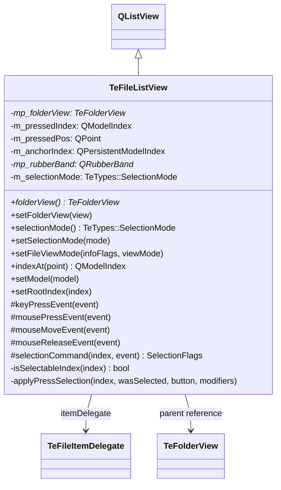
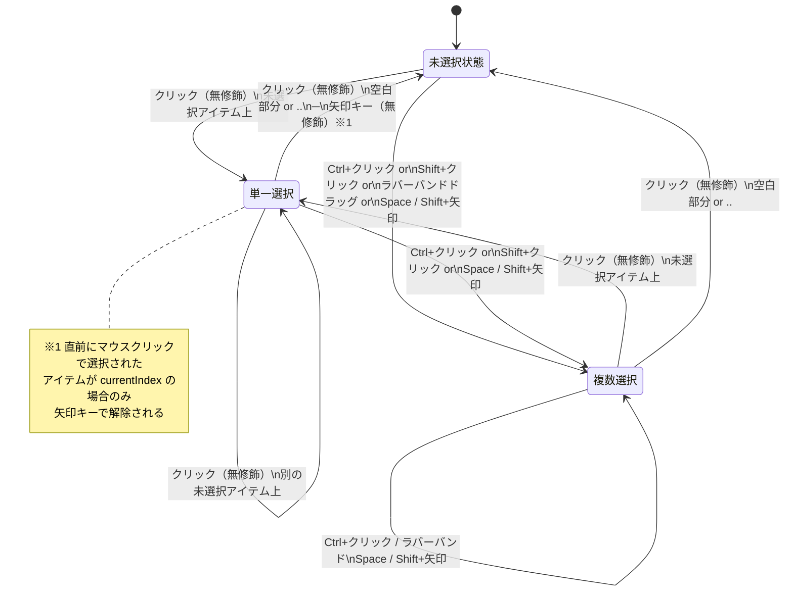

# TeFileListView

## Overview

`TeFileListView` はファイル一覧を表示する `QListView` の派生クラスです。  
`TeFolderView` の右ペインとして使用され、アイコン表示・詳細リスト表示の両形式をサポートします。

特徴的な機能として **TableEngine 選択モード** を実装しており、  
カーソル移動と選択状態を完全に分離した、ファイラ特化の操作体系を提供します。

---

## Class Definition


```mermaid
classDiagram
    class TeFileListView {
        +folderView() TeFolderView*
        +setFolderView(view)
        +selectionMode() TeTypes::SelectionMode
        +setSelectionMode(mode)
        +setFileViewMode(infoFlags, viewMode)
        +indexAt(point) QModelIndex
        +setModel(model)
        +setRootIndex(index)
        #keyPressEvent(event)
        #mousePressEvent(event)
        #mouseMoveEvent(event)
        #mouseReleaseEvent(event)
        #selectionCommand(index, event) SelectionFlags
        -isSelectableIndex(index) bool
        -applyPressSelection(index, wasSelected, button, modifiers)
        -mp_folderView: TeFolderView*
        -m_pressedIndex: QModelIndex
        -m_pressedPos: QPoint
        -m_anchorIndex: QPersistentModelIndex
        -mp_rubberBand: QRubberBand*
        -m_selectionMode: TeTypes::SelectionMode
    }
    class QListView
    class TeFileItemDelegate
    class TeFolderView

    QListView <|-- TeFileListView
    TeFileListView --> TeFileItemDelegate : itemDelegate
    TeFileListView --> TeFolderView : parent reference
```

---

## Selection Modes

`TeTypes::SelectionMode` によって選択方式を切り替えます。

| モード | 値 | 概要 |
|---|---|---|
| `SELECTION_NONE` | 0 | 選択不可。`QAbstractItemView::NoSelection` に設定。 |
| `SELECTION_EXPLORER` | 1 | Windows エクスプローラ互換。`QAbstractItemView::ExtendedSelection` に設定し、Qt 標準の選択動作に委譲。 |
| `SELECTION_TABLE_ENGINE` | 2 | TableEngine 独自選択モード。`QAbstractItemView::NoSelection` に設定しつつ、独自のイベントハンドラで選択を制御。 |

切り替えは `setSelectionMode()` スロット経由で行います。  
コマンド `CMDID_SYSTEM_EDIT_SELECTION_STYLE_EXPLORER` / `CMDID_SYSTEM_EDIT_SELECTION_STYLE_TABLEENGINE` で  
ユーザーがリアルタイムに切り替えられます。

---

## TableEngine 選択モード — 詳細仕様

### 設計方針

Explorer 互換モードとの最大の違いは **カーソル位置と選択状態の分離** です。

| 操作 | Explorer モード | TableEngine モード |
|---|---|---|
| 矢印キー | カーソル移動＋選択変更 | カーソル移動のみ（選択は変わらない） |
| Space キー | 未使用 | 現在アイテムの選択トグル＋カーソル前進 |
| Shift+矢印 | 範囲選択 | カーソル移動元のアイテムをトグル |
| 文字キー（インライン検索） | カーソル移動のみ | カーソル移動のみ（Shift 併用でも選択は変わらない） |
| クリック（無修飾） | そのアイテムのみ選択 | そのアイテムのみ選択（同様） |
| 選択済みアイテムクリック | 何もしない（維持） | 選択を維持（ラバーバンド開始しない） |
| ドラッグ | 範囲選択 | ラバーバンド内アイテムをトグル |

この設計により、ファイラ操作で一般的な「矢印キーで一覧を眺めながら、Space や Ctrl+クリックで複数選択」という  
ワークフローを自然に実現します。

---

### メンバ変数の役割

| 変数 | 型 | 役割 |
|---|---|---|
| `m_pressedIndex` | `QModelIndex` | マウスで最後にクリックした（未選択）アイテムのインデックス。選択状態の二重適用防止と、矢印キーの単一選択解除判定に使用。 |
| `m_pressedPos` | `QPoint` | ラバーバンド開始座標（スクロールオフセット込みの絶対座標）。 |
| `m_anchorIndex` | `QPersistentModelIndex` | 範囲選択（Shift 系操作）の起点。Qt 内部のアンカー機構には依存せず、明示的に管理される「sticky anchor」。 |
| `mp_rubberBand` | `QRubberBand*` | ドラッグ選択の矩形表示。 |

`m_pressedIndex` は以下のタイミングでリセット（`QModelIndex()`）されます：

- 選択済みアイテムをクリックしたとき（ラバーバンド開始しない）
- 矢印 / Space / その他ほぼすべてのキー押下時（Shift / Ctrl / Alt を除く）

`m_anchorIndex` は以下のタイミングで更新・無効化されます：

- 無修飾クリックで有効アイテムをクリックしたとき → クリックしたアイテムに設定（新しい起点）
- 無修飾クリックで空白部分 / `..` をクリックしたとき → 無効化
- Shift / Ctrl+Shift クリック時 → **変更しない**（同じ起点から連続して範囲選択できる、いわゆる sticky anchor）
- Ctrl クリック時 → **変更しない**
- 矢印 / Space / インライン検索など、修飾なしのカーソル移動を伴うキー操作 → 移動後の `currentIndex()` に設定（無効アイテムなら無効化）
- Shift / Ctrl / Alt 単独のキー押下 → 変更しない
- `setModel()` / `setRootIndex()` 呼び出し時 → 無効化（モデルやルートが変わった時点で古いアンカーは意味を失うため）

---

### マウスアクション仕様

#### mousePressEvent と `applyPressSelection()`

`selectionCommand()` は TABLE_ENGINE モードでは常に `NoUpdate` を返し（`MouseMove` を除く）、  
Qt の内部アンカー機構には一切依存しません。実際の選択変更は `QListView::mousePressEvent()` 呼び出し後に  
`applyPressSelection()` が `m_anchorIndex` と押下対象を元に明示的に適用します。

| 操作 | クリック対象 | 選択変化 | `m_anchorIndex` |
|---|---|---|---|
| 無修飾クリック | 未選択アイテム | そのアイテムのみ選択（既存選択は全解除） | そのアイテムに設定 |
| 無修飾クリック | 選択済みアイテム | 変化なし（維持） | そのアイテムに設定 |
| 無修飾クリック | 空白部分 / `..` | 全選択解除 | 無効化 |
| Ctrl+クリック | 有効アイテム | そのアイテムの選択をトグル | 変更しない |
| Ctrl+クリック | 空白部分 / `..` | 変化なし | 変更しない |
| Shift+クリック | 有効アイテム | `m_anchorIndex`〜対象の範囲を選択（`ClearAndSelect`） | 変更しない（起点として保持） |
| Ctrl+Shift+クリック | 有効アイテム | `m_anchorIndex`〜対象の範囲を既存選択に追加（`Select`） | 変更しない |
| Shift(+Ctrl)+クリック | 空白部分 / `..` | 変化なし | 変更しない |
| 右クリック | 未選択アイテム | そのアイテムのみ選択 | 変更しない |
| 右クリック | 選択済みアイテム / 空白 / `..` | 変化なし | 変更しない |

> **範囲選択の起点**：Shift+クリックの範囲は、有効な `m_anchorIndex` が存在し、かつ現在選択が  
> 空でない場合に限り `m_anchorIndex` を起点とします。それ以外（初回や選択解除後）はクリック対象自身を  
> 新しい起点として範囲選択を開始します。連続する Shift+クリックは同じ起点から範囲を再計算するため、  
> 前回の Shift+クリック先には影響されません（sticky anchor）。

> **`..` エントリ保護**：`..`（親ディレクトリ参照）は決して選択状態にならないよう、  
> `applyPressSelection()` が無効ターゲットとして扱うことに加え、`mousePressEvent` /  
> `mouseReleaseEvent` の末尾で先頭行が `..` の場合に強制的に `Deselect` します。

#### mouseMoveEvent（ラバーバンドドラッグ）

`m_pressedIndex` に有効なインデックスが設定されているとき（未選択アイテムを押した場合）、  
`isSelectionRectVisible()` が真であればラバーバンドを表示します。

ドラッグ中、ラバーバンド矩形内に入ったアイテムに対しては `selectionCommand()` が唯一 `NoUpdate` 以外を  
返す経路（`MouseMove`）を通り、Qt 標準の範囲選択機構に委譲します：

| 修飾キー | 返すフラグ | 選択変化 |
|---|---|---|
| なし | `ToggleCurrent` | ラバーバンド内アイテムをトグル |
| Shift | `SelectCurrent` | ラバーバンド内アイテムを選択に追加 |

#### mouseReleaseEvent

ラバーバンドを非表示にします。  
`..` エントリの強制解除を再実行します。

---

### キーアクション仕様

以下は `SELECTION_TABLE_ENGINE` モード時の動作です。  
`QListView::keyPressEvent` を呼ぶ前後でカスタム処理を追加しています。

#### 矢印キー（Up / Down / Left / Right）

```
[QListView::keyPressEvent の呼び出し前]
  if Shift 修飾のみ:
    if m_pressedIndex ≠ currentIndex:
      → currentIndex の選択をトグル（Toggle）
  else (Ctrl または無修飾):
    if m_pressedIndex == currentIndex
       AND currentIndex が選択済み
       AND 選択数 == 1:
      → currentIndex の選択をトグル（解除）
  m_pressedIndex をリセット（QModelIndex()）

[QListView::keyPressEvent]
  → カーソルを方向に移動

[QListView::keyPressEvent の呼び出し後]
  → 何もしない（矢印キーは選択に関して追加処理なし）
```

**各ケースの選択変化まとめ：**

| 操作 | 移動元アイテムの状態 | 条件 | 移動元の変化 | 移動先の変化 |
|---|---|---|---|---|
| 矢印（無修飾） | 未選択 | — | なし | なし |
| 矢印（無修飾） | 選択済み・複数選択の一部 | — | なし | なし |
| 矢印（無修飾） | 唯一の選択済みアイテム、かつ直前にマウスクリック | m_pressedIndex == currentIndex | **解除** | なし |
| Shift+矢印 | どの状態でも | m_pressedIndex ≠ currentIndex（通常は常に真） | **トグル** | なし |
| Ctrl+矢印 | — | — | なし | なし |

> **矢印単独での選択移動は発生しません。**  
> カーソルは選択状態とは独立して移動します。

**Shift+矢印の連続操作例（全て未選択の状態から）：**

```
初期: カーソル = C（未選択）, 選択なし

Shift+Down: C をトグル → C が選択される, カーソル → D
Shift+Down: D をトグル → D が選択される, カーソル → E
Shift+Down: E をトグル → E が選択される, カーソル → F

→ C, D, E が選択済み, カーソルは F
```

**Shift+矢印の戻り操作（既に選択済みのアイテムを通る場合）：**

```
初期: C, D, E が選択済み, カーソル = F（未選択）

Shift+Up: F をトグル → F が選択される, カーソル → E
Shift+Up: E をトグル → E が解除される, カーソル → D
Shift+Up: D をトグル → D が解除される, カーソル → C

→ C, F が選択済み
```

> Shift+矢印は「移動元アイテムのトグル」であるため、同じ位置を行き来すると ON/OFF が切り替わります。

---

#### Space キー

```
[QListView::keyPressEvent の呼び出し前]
  if m_pressedIndex ≠ currentIndex:
    → currentIndex の選択をトグル
  m_pressedIndex をリセット（QModelIndex()）

[QListView::keyPressEvent]
  → QListView のデフォルト処理（NoSelection モードのため選択変化なし）

[QListView::keyPressEvent の呼び出し後]
  if 無修飾 or Ctrl:
    → currentIndex を row+1 に移動（選択変化なし）
  if Shift:
    → currentIndex を row-1 に移動（選択変化なし）
```

**Space キーの動作まとめ：**

| 操作 | 現在アイテムの変化 | カーソルの移動 |
|---|---|---|
| Space（無修飾） | 選択をトグル | 1つ前進（下へ） |
| Shift+Space | 選択をトグル | 1つ後退（上へ） |

**Space キーによる連続選択の例：**

```
初期: カーソル = A（未選択）, 選択なし

Space: A をトグル → A 選択, カーソル → B
Space: B をトグル → B 選択, カーソル → C
Space: C をトグル → C 選択, カーソル → D

→ A, B, C が選択済み, カーソルは D
```

**Space キーによる選択解除の例：**

```
初期: A, B, C が選択済み, カーソル = A

Space: A をトグル → A 解除, カーソル → B
Space: B をトグル → B 解除, カーソル → C
Space: C をトグル → C 解除, カーソル → D

→ 選択なし
```

---

#### その他のキー

| キー | 動作 |
|---|---|
| Shift / Ctrl / Alt 単独 | `m_pressedIndex` をリセットしない（修飾キーとして次のキー入力へ持越し） |
| その他すべてのキー | `m_pressedIndex` をリセット後、`QListView::keyPressEvent` に委譲 |

---

#### インクリメンタル検索（インライン検索）

文字キーを入力すると、`QAbstractItemView::keyboardSearch()`（Qt 標準のインライン検索）が起動し、  
入力文字列に前方一致する最初のアイテムへカーソルが動的に移動します。  
**この移動は選択状態を一切変更しません。**

| 操作 | カーソル | 選択変化 |
|---|---|---|
| Shift+文字キー | 一致アイテムへ移動 | **なし**（移動元・移動先とも選択されない） |
| クリック一時選択中に Shift+文字キー | 一致アイテムへ移動 | **クリックで生じた一時単体選択を解除** |

> **無修飾の文字キーについて**  
> Shift を伴わない文字キーは、ビューに届く前にアプリケーションの `Dispatcher`  
> （コマンド処理）へ振り分けられるため、最終的な動作は `Dispatcher` の設定に依存し、  
> ビュー単体では確定しません。したがって、インライン検索として確定的に扱えるのは  
> **Shift+文字キー**の経路です（テストもこのケースのみを対象とします）。  
> なお `keyPressEvent` 側の解除判定自体は無修飾文字でも成立しますが、上記の理由で  
> 無修飾経路は仕様・テストの対象外とします。

> **クリック一時選択の解除**  
> 無修飾クリックで生じた「一時単体選択」（`m_pressedIndex == currentIndex` かつ選択数 1）は、  
> 後続のカーソル移動で解除される設計です。インライン検索もカーソル移動の一種であるため、  
> 矢印キーと同様に一時選択を解除します。解除判定は `keyPressEvent` の最初の `switch` の  
> `default:` で行い、**印字可能文字（`QChar::isPrint()`）かつ Ctrl/Alt/Meta なし**のキー  
> （＝Qt が `keyboardSearch` を起動する条件）に限定します。`setCurrentIndex()` / `select()` で  
> 付与された永続的な選択（`m_pressedIndex` が無効）は解除されません。

> **背景（不具合と修正）**  
> `keyboardSearch()` は内部で `QAbstractItemView::setCurrentIndex(index)` を呼び、  
> これが `selectionCommand(index, nullptr)`（`event == nullptr`）を発行します。  
> 旧実装はこの `event == nullptr` 経路で「Shift 押下なら `SelectCurrent`」を返していたため、  
> Shift を押しながら文字を打つと一致アイテムが選択されてしまっていました  
> （Shift+矢印の選択動作とオーバーラップ）。  
>
> 現在の実装では、TABLE_ENGINE モードの `selectionCommand()` は `MouseMove` を除く  
> すべてのイベント種別（`MouseButtonPress` / `MouseButtonRelease` / `MouseButtonDblClick` /  
> `KeyPress`、および `event == nullptr` のプログラム的な current 変更）で無条件に `NoUpdate`  
> を返します。選択はこの経路には一切依存せず、`mousePressEvent()` から呼ばれる  
> `applyPressSelection()`（`m_anchorIndex` ベース）と `keyPressEvent()` の明示的な  
> `Toggle` 呼び出しのみが選択を変更します。そのためインライン検索・Shift+クリックの  
> いずれの経路でも `selectionCommand()` 自体が選択に影響することはありません。

---


### 選択状態遷移の全体図


```mermaid
stateDiagram-v2
    [*] --> 未選択状態

    未選択状態 --> 単一選択 : クリック（無修飾）\n未選択アイテム上
    未選択状態 --> 複数選択 : Ctrl+クリック or\nShift+クリック or\nラバーバンドドラッグ or\nSpace / Shift+矢印

    単一選択 --> 単一選択 : クリック（無修飾）\n別の未選択アイテム上
    単一選択 --> 未選択状態 : クリック（無修飾）\n空白部分 or ..\n─\n矢印キー（無修飾）※1
    単一選択 --> 複数選択 : Ctrl+クリック or\nShift+クリック or\nSpace / Shift+矢印

    複数選択 --> 単一選択 : クリック（無修飾）\n未選択アイテム上
    複数選択 --> 未選択状態 : クリック（無修飾）\n空白部分 or ..
    複数選択 --> 複数選択 : Ctrl+クリック / ラバーバンド\nSpace / Shift+矢印

    note right of 単一選択
        ※1 直前にマウスクリックで選択された
        アイテムが currentIndex の場合のみ
        矢印キーで解除される
    end note
```

---

## `indexAt()` のマージン処理

標準 `QListView::indexAt()` はアイテムの矩形領域全体をヒット判定に使用しますが、  
`TeFileListView` ではアイテム間の空白でも「アイテム外クリック」と判定できるよう、  
内側に 2px ずつ縮小した矩形を使用しています。

```cpp
QRect rect = visualRect(index);
rect.adjust(2, 2, -2, -2);  // 上下左右に 2px のマージン
if (!rect.contains(point)) {
    return QModelIndex();    // アイテム外扱い
}
```

これにより、アイテムが密接している場合でも空白領域クリックで  
「全選択解除」が発動しやすくなります。

---

## View Modes

`setFileViewMode(infoFlags, viewMode)` で表示形式を切り替えます。  
`TeTypes::FileViewMode` の各値に対する `QListView` 設定：

| FileViewMode | ViewMode | Flow | アイコンサイズ | 折り返し |
|---|---|---|---|---|
| `FILEVIEW_SMALL_ICON` | ListMode | TopToBottom | なし | あり |
| `FILEVIEW_LARGE_ICON` | IconMode | LeftToRight | 64×64 | あり |
| `FILEVIEW_HUGE_ICON` | IconMode | LeftToRight | 192×192 | あり |
| `FILEVIEW_DETAIL_LIST` | ListMode | TopToBottom | なし | なし |

`infoFlags`（`TeTypes::FileInfoFlags`）は `TeFileItemDelegate::setInfoFlags()` に渡され、  
各アイテムの描画時に表示する情報（サイズ・更新日時等）を制御します。

---

## 関連クラス

| クラス | 関係 |
|---|---|
| `TeFolderView` | `mp_folderView` 参照先。フォーカスやディスパッチの起点。 |
| `TeFileItemDelegate` | アイテムの描画担当。コンストラクタで自動設定。 |
| `TeFileSortProxyModel` | `TeFileListView` のモデルとして設定されるプロキシモデル。 |
| `TeTypes::SelectionMode` | 選択モードを定義する enum。 |
