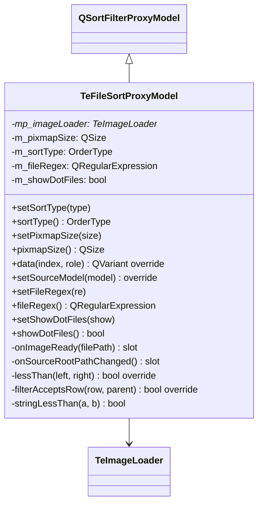

# TeFileSortProxyModel

## Overview

`TeFileSortProxyModel` は `QFileSystemModel` と `TeFileListView` の間に置く `QSortFilterProxyModel` サブクラスです。  
自然順ソート・フォルダ優先並び替え・非同期サムネイルロード・ファイル名正規表現フィルタの4つの機能を提供します。

---

## Class Definition

---

## 機能詳細

### 1. 自然順ソート

`lessThan()` で `stringLessThan()` を使用し、数字部分を数値として比較します。  
例: `file2.txt` < `file10.txt`（辞書順では `file10` < `file2` になる問題を回避）

### 2. 型別順序（FOLDER_FIRST）

`OrderType::FOLDER_FIRST` が設定された場合、ディレクトリは常にファイルの前に並びます。

| `setSortType()` 値 | 動作 |
|---|---|
| `FOLDER_FIRST` | ディレクトリ → ファイルの順で、各グループ内は自然順 |
| その他 | 種別を無視して自然順のみ |

### 3. 非同期サムネイルロード

`data(index, FilePixmap)` が呼ばれたとき：
1. `TeImageLoader::cacheKey()` で `QPixmapCache` を検索する
2. ヒット → キャッシュからピクセルマップを返す
3. ミス → `TeImageLoader::requestLoad()` でバックグラウンドデコードを要求し、`QVariant()` を返す
4. デコード完了 → `onImageReady()` で `dataChanged` を発行 → ビューが再描画

### 4. ファイル名正規表現フィルタ

`setFileRegex(re)` で設定した `QRegularExpression` にマッチしないファイルは非表示になります。  
ディレクトリには適用されません（フォルダ自体は常に表示）。

### 5. ドットファイル非表示

`setShowDotFiles(false)` で名前が `'.'` で始まるファイル/ディレクトリを非表示にします。  
> **注意**: `QFileInfo::isHidden()` は使用せず、ファイル名先頭文字のみで判定します（クロスプラットフォーム一貫性のため）。

---

## カスタムロール

| ロール | 値 | 内容 |
|---|---|---|
| `FilePixmap` | `Qt::UserRole + 50` | デコード済みサムネイルの `QPixmap` |

---

## Methods

| メソッド | 説明 |
|---|---|
| `setSortType(type)` | ソート基準を設定する |
| `setPixmapSize(size)` | サムネイルサイズを設定する |
| `data(index, role)` | `FilePixmap` ロールの場合にサムネイルロードを起動する |
| `setSourceModel(model)` | ソースモデルを設定し `onSourceRootPathChanged` を接続する |
| `setFileRegex(re)` | ファイル名フィルタ正規表現を設定する |
| `setShowDotFiles(show)` | ドットファイルの表示/非表示を切り替える |

---

## See Also

- [`TeFileItemDelegate`](TeFileItemDelegate.md)
- [`TeImageLoader`](../utils/TeImageLoader.md)
- [`TeFileListView`](TeFileListView.md)
