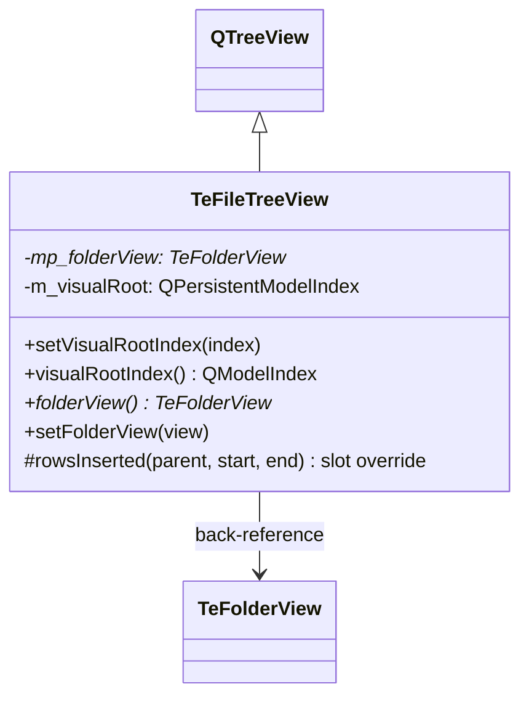

# TeFileTreeView

## Overview

`TeFileTreeView` は `TeFolderView` の左ペインに使用するディレクトリナビゲーションツリービューです。  
`QTreeView` を継承し、**ビジュアルルートインデックス** の概念を追加しています。  
これにより、モデルのルートとは独立してツリーの表示起点を設定でき、指定インデックス配下のサブツリーのみをユーザーに見せることができます。

---

## Class Definition



---

## ビジュアルルートインデックス

`setVisualRootIndex(index)` を呼ぶと、`index` より上位のノードが非表示になり、`index` がツリーの最上位ノードとして表示されます。  
内部的には、表示起点より上のアイテムを `setRowHidden()` で隠すことで実現します。

```
実際のモデル構造:       ビジュアルルートを C:\ に設定後:
  /                       C:\
  ├── C:\                 ├── Users\
  │   ├── Users\          │   └── ...
  │   └── Windows\        └── Windows\
  └── D:\                 (D:\ は非表示)
```

---

## TeFolderView バックリファレンス

各 `TeFileTreeView` は所有する `TeFolderView` へのポインタを保持します。  
`TeEventFilter` がこのバックリファレンスを通じてウィジェット種別タグを解決し、ディスパッチターゲットを特定します。

---

## Methods

| メソッド | 説明 |
|---|---|
| `setVisualRootIndex(index)` | ツリーの表示起点となるモデルインデックスを設定する |
| `visualRootIndex()` | 現在のビジュアルルートインデックスを返す |
| `folderView()` | 所有している `TeFolderView` を返す |
| `setFolderView(view)` | 所有 `TeFolderView` バックリファレンスを設定する |

---

## rowsInserted() オーバーライド

新しい行がモデルに追加された際（ドライブ/ディレクトリの動的追加）、  
ビジュアルルートより上位に挿入された行を自動的に非表示にして整合性を維持します。

---

## See Also

- [`TeFolderView`](TeFolderView.md)
- [`TeEventFilter`](TeEventFilter.md)
- [`TeFileListView`](TeFileListView.md)
