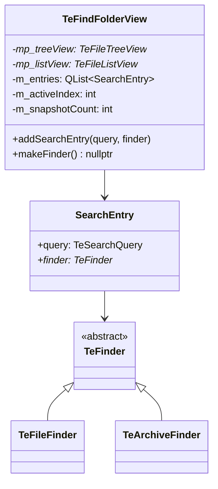

# TeFindFolderView

## Overview

`TeFindFolderView` はファイル検索の結果を表示する専用のフォルダビューです。  
複数の検索エントリ（`TeFinder` インスタンス）を管理し、  
各検索が非同期で結果を返すたびにリストビューにアイテムをリアルタイムで追加します。

`TeViewStore::findFolderView()` で取得できるシングルトン的なビューで、  
`TeCmdFind` コマンドが新しい検索を追加するたびにツリービューにエントリが追加されます。

---

## Internal Structure

---

## SearchEntry

`TeFindFolderView` は `SearchEntry` のリスト（`m_entries`）を保持します。

| フィールド | 説明 |
|---|---|
| `query` | 検索条件（`TeSearchQuery`）。ツリービューの表示名として使用 |
| `finder` | 実際に検索を実行する `TeFinder` 派生クラスのインスタンス |

ツリービュー（左ペイン）の各ノードが 1 つの `SearchEntry` に対応します。  
ツリーノードを選択すると `m_activeIndex` が更新され、対応する `finder` の結果がリストビューに表示されます。

---

## Async Result Reception

`TeFinder` が検索結果を `itemsFound(offset, newItems)` シグナルで通知します。  
`TeFindFolderView::onItemsFound()` がこれを受信し、`m_entries[m_activeIndex]` の検索結果のみリストビューに追加します。

### Race Condition Prevention

検索開始直後に `resultsSnapshot()` を呼んでスナップショットを取得し、  
スナップショット取得後に届いた `itemsFound` シグナルはオフセットで重複を排除します。  
`m_snapshotCount` にスナップショット時点の件数を記録し、`offset < m_snapshotCount` の場合はスキップします。

---

## TeFolderView Interface Implementation

`TeFindFolderView` は `TeFolderView` のインタフェースを以下のように実装します。

| メソッド | 実装内容 |
|---|---|
| `setRootPath(path)` | 検索対象のルートパスを設定（表示上のルートとして使用） |
| `rootPath()` | 空文字または検索対象パスを返す |
| `setCurrentPath(path)` | 特に意味なし（検索結果ビューにはカレントパスの概念がない） |
| `moveNextPath()` / `movePrevPath()` | 何もしない（履歴ナビゲーション非対応） |
| `getPathHistory()` | 空リストを返す |
| `makeFinder()` | `nullptr` を返す（`TeFindFolderView` 自体が検索結果ビューであり、ここで検索を開始しない） |

---

## Notes

- `TeFindFolderView` は `TeViewStore` 内でシングルトン的に管理されます（`mp_findView` メンバ）。
- 一度タブから閉じても、次に `TeViewStore::findFolderView()` が呼ばれると再度タブに追加されます。
- `addSearchEntry()` に渡した `TeFinder` の所有権は `TeFindFolderView` に移譲されます（`m_entries` の `SearchEntry` として保持）。
