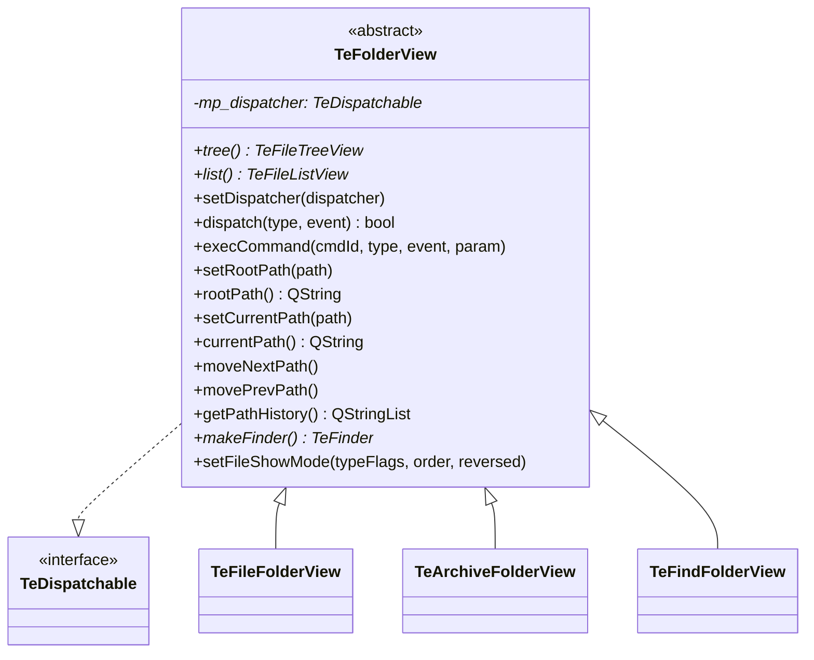

# TeFolderView

## Overview

`TeFolderView` はフォルダの内容を表示するビューウィジェットの **抽象基底クラス** です。  
左ペイン（ツリービュー）と右ペイン（リストビュー）の 2 ペイン構成を規定し、  
ナビゲーション・ファイル表示設定・`TeDispatcher` へのイベント転送の統一インタフェースを提供します。

`TeViewStore` が管理するタブの各ページが `TeFolderView` の派生クラスのインスタンスです。

---

## Class Definition

---

## Responsibilities

### 1. Event Dispatch Bridge

`TeFolderView::dispatch()` は `TeEventFilter` から呼ばれ、  
`FocusIn` イベントを受け取ると `focusIn()` シグナルを発行し、  
それ以外のイベントはフィルタリング後に `TeDispatcher::dispatch()` に転送します。

フィルタリング（`isDispatchable()`）は以下のキーのみを転送します：
- ファンクションキー（F1〜F12）
- 英数字キー（A〜Z、0〜9）
- Backspace / Delete / Tab
- Ctrl 修飾または Shift 修飾との組み合わせ

> 矢印キーや Enter 等の通常ナビゲーションキーは `QTreeView` / `QListView` のデフォルト動作に委ねるため、
> ディスパッチ対象から除外されています。

### 2. Navigation Interface

`setRootPath()` / `setCurrentPath()` / `moveNextPath()` / `movePrevPath()` は  
すべての派生クラスが実装しなければならないナビゲーションインタフェースです。  
`TeViewStore` やコマンドはこのインタフェースを通じてビューを操作します。

### 3. Finder Factory

`makeFinder()` は検索に使用する `TeFinder` の適切なサブクラスを生成して返します。  
`TeFileFolderView` は `TeFileFinder`、`TeArchiveFolderView` は `TeArchiveFinder` を返します。  
`TeCmdFind` コマンドはビューの種別を意識せずに `makeFinder()` を呼ぶだけで適切な検索実装を取得できます。

---

## Derived Classes

| 派生クラス | `rootPath` の意味 | `makeFinder` の戻り型 |
|---|---|---|
| `TeFileFolderView` | ファイルシステム上のルートパス | `TeFileFinder` |
| `TeArchiveFolderView` | アーカイブファイルのパス | `TeArchiveFinder` |
| `TeFindFolderView` | 空文字（検索結果のため固定パスなし） | `nullptr` |

---

## Signal: focusIn

`TeFolderView` がフォーカスを受け取ったとき（`FocusIn` イベント）に `focusIn()` シグナルを発行します。  
`TeViewStore` の `mp_focusEventEmitter` がこのシグナルを受信して「現在アクティブなフォルダビュー」を更新します。
