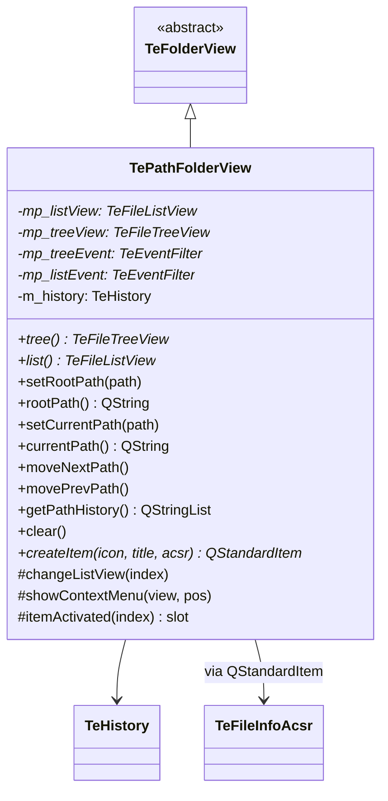

# TePathFolderView

## Overview

`TePathFolderView` は `TeFolderView` の具体実装のひとつで、実際のファイルシステムパスではなく  
**ユーザーが組み立てた仮想パスツリー** を表示するフォルダービューです。  
お気に入りや最近使ったパスなど、アプリ定義の仮想ディレクトリとして機能します。  
ナビゲーション履歴は `TeHistory` インスタンスで管理されます。

---

## Class Definition



---

## 実ファイルシステムとの違い

| 項目 | `TeFileFolderView` | `TePathFolderView` |
|---|---|---|
| データソース | `QFileSystemModel`（実FS） | `QStandardItemModel`（仮想ツリー） |
| アイテム追加 | 自動（OS から取得） | `createItem()` で手動追加 |
| ナビゲーション履歴 | 内部 `TeHistory` | 内部 `TeHistory` |
| `makeFinder()` | `TeFileFinder` を返す | 未実装（検索対象外） |
| 用途 | 通常のファイル操作ビュー | お気に入り・最近使ったファイル等 |

---

## createItem()

```cpp
QStandardItem* createItem(const QIcon& icon,
                          const QString& title,
                          TeFileInfoAcsr* p_acsr = nullptr);
```

仮想ツリーに追加するアイテムを生成します。  
`p_acsr` を指定すると、ダブルクリック時に `activate()` が呼ばれ、コンテキストメニューにアクションが表示されます。

---

## ナビゲーション

`TeHistory` でツリーとリストの選択位置（ルートパス, カレントパス）をスタック管理します。  
`movePrevPath()` / `moveNextPath()` で履歴をたどれます。

---

## カスタムロール

| ロール | 説明 |
|---|---|
| `ROLE_EXCHANGE`（= `TeFileInfo::ROLE_USER_START`） | `TeFileInfoAcsr` ポインタをアイテムに格納するためのロール |

---

## See Also

- [`TeFolderView`](TeFolderView.md)
- [`TeHistory`](../utils/TeHistory.md)
- [`TeFileInfoAcsr`](../utils/TeFileInfoAcsr.md)
- [`TeFileFolderView`](TeFileFolderView.md)
