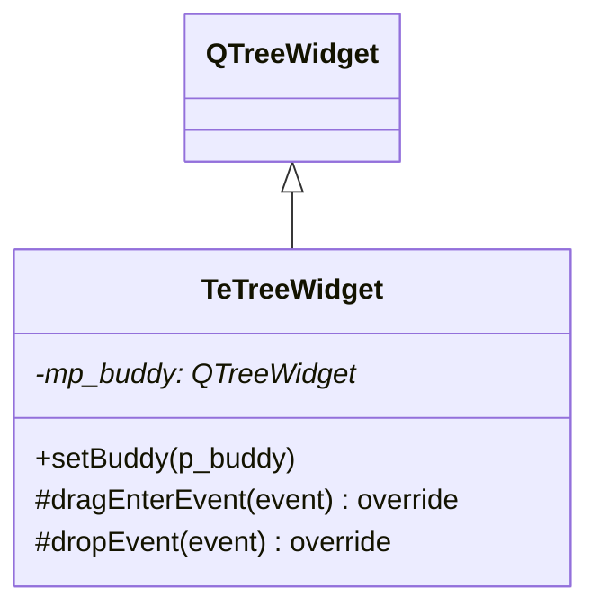

# TeTreeWidget

## Overview

`TeTreeWidget` はドラッグアンドドロップによるアイテム移動を **2つのツリーウィジェット間** でサポートする `QTreeWidget` サブクラスです。  
主にキーバインド設定ダイアログ（`TeKeySettingDialog` 等）の2ペイン編集 UI で使用され、  
「利用可能なコマンド」と「割り当てられたコマンド」の間でアイテムを D&D で移動できます。

---

## Class Definition



---

## バディ（Buddy）

```cpp
void setBuddy(QTreeWidget* p_buddy);
```

ドロップ先として連携するパートナーツリーウィジェットを設定します。  
ドロップイベントで「このウィジェットへのドロップ」か「バディへのドロップ」かを判定し、適切なウィジェットにアイテムを移動します。

---

## D&D 動作

### dragEnterEvent()

`QTreeWidgetItem` の MIME データを持つドラッグイベントのみ受け付けます（`AcceptProposedAction`）。

### dropEvent()

- このウィジェット自身へのドロップ：アイテムを並び替える
- バディウィジェットへのドロップ：アイテムをバディに移動する（元のウィジェットから削除）

---

## 使用例（2ペイン設定 UI）

```cpp
// 設定ダイアログのコンストラクタ
mp_availableTree = new TeTreeWidget(this);   // 利用可能コマンド
mp_assignedTree  = new TeTreeWidget(this);   // 割り当て済みコマンド

mp_availableTree->setBuddy(mp_assignedTree);
mp_assignedTree->setBuddy(mp_availableTree);
```

これにより、どちらのツリーからも相手側へのアイテム D&D 移動が可能になります。

---

## See Also

- [12_dialogs.md](../12_dialogs.md) — 使用するダイアログ
